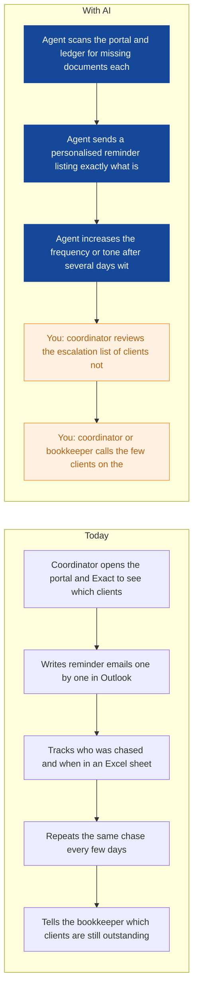
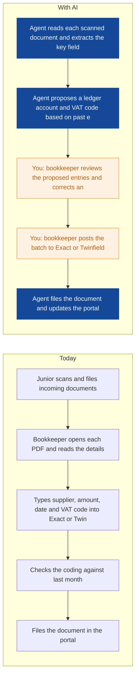
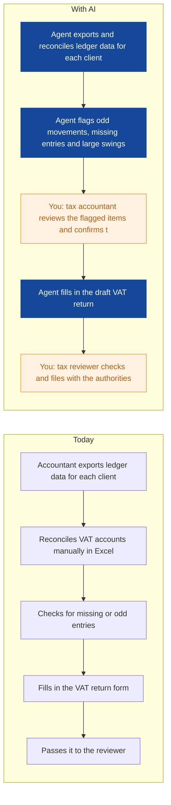
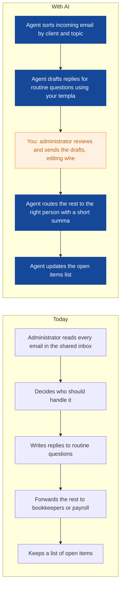
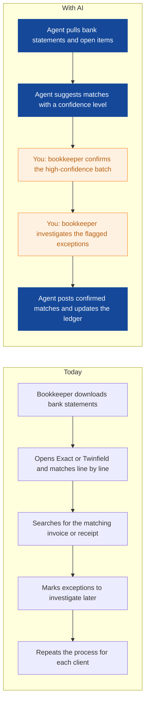
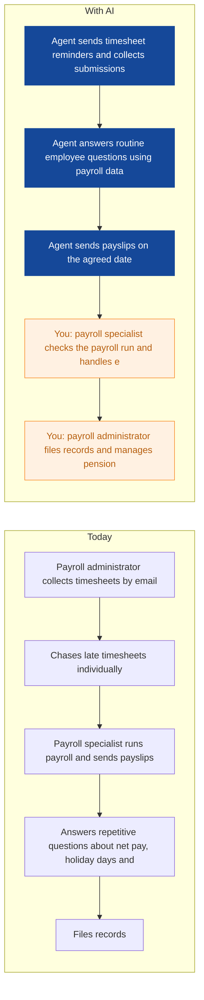
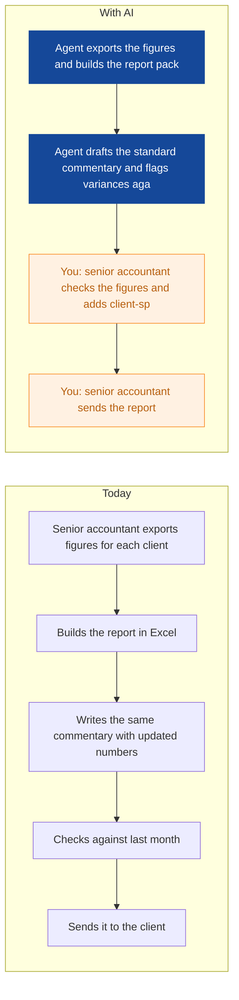
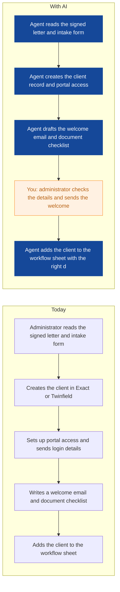
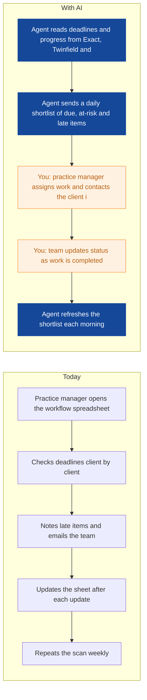

# AI Strategy for Brightwater Accountancy

> **Example report for a fictional company.** Generated by [CompleteAIStrategy](https://completeaistrategy.com) with the same research, strategy and pricing rules as a real report.
> **[Open the interactive report with charts →](https://completeaistrategy.com/example/brightwater-accountancy)**

| Hours saved per week | Value per year | Roles freed up | Opportunities |
|---:|---:|---:|---:|
| **49h** | **$112,700** | **1.2 FTE** | **9** |

## Summary
Brightwater Accountancy runs on a skilled team of 28 across bookkeeping, payroll, VAT and accounts, and client services. The biggest time sink is not the accounting work itself, it is chasing 400 clients for documents, typing invoice data, and answering routine questions. Your systems (Exact, Twinfield, the portal, Excel, Outlook) already hold the data an agent needs, so most wins come from connecting what you have rather than buying new software. We propose nine agents that remove the repetitive middle of your month: reminders, coding, reconciliation, VAT drafts, payslips, email triage, onboarding and deadline alerts. Realistic savings are around 49 hours a week across the firm, about 4 percent of total team hours, with a human always checking the output before it reaches a client or an authority.

## Company snapshot
- **Industry:** Accounting and bookkeeping services
- **What they do:** Brightwater Accountancy is a 28-person accounting and bookkeeping firm in Utrecht. You serve 400 small businesses with bookkeeping, VAT returns, annual accounts, and payroll. Your team uses Exact, Twinfield, Excel, and a client portal, and spends a lot of time chasing clients for documents every month.
- **Customers:** 400 small businesses, likely Dutch SMEs, sole traders, and owner-managed companies around Utrecht.
- **Team size:** 11-50 (estimate 28)
- **Tools:** Exact, Twinfield, Microsoft Excel, Client portal, Email, Microsoft 365 (typical for this size), PDF scanning and basic OCR (likely)
- **AI maturity:** 2/5, Early. You have solid accounting systems and a client portal, plus some scanning and OCR in place. AI use today is limited to basic document reading. There is no automated chasing, coding, or reporting, and most coordination still runs through Excel and Outlook by hand.

## Team and roles
| Department | People | Roles |
|---|---:|---|
| Bookkeeping and Client Accounting | 12 | Senior Bookkeeper / Accountant (3), Bookkeeper (6), Junior Bookkeeper / Assistant (3) |
| Payroll | 4 | Payroll Specialist (3), Payroll Administrator (1) |
| VAT and Annual Accounts | 5 | Tax Accountant / Accounts Preparer (3), Tax Reviewer / Manager (2) |
| Client Services and Administration | 4 | Client Coordinator (2), Office Administrator (2) |
| Practice Management and Operations | 3 | Director / Partner (1), Practice Manager (1), IT / Operations Support (1) |

## Opportunities
| # | Opportunity | Department | Hours/week | Impact | Effort |
|---:|---|---|---:|:-:|:-:|
| 1 | Missing documents chased automatically | Client Services and Administration | 14 | 5/5 | 2/5 |
| 2 | Invoice and receipt data entry drafted | Bookkeeping and Client Accounting | 11 | 5/5 | 3/5 |
| 3 | VAT return drafts ready for review | VAT and Annual Accounts | 5 | 4/5 | 3/5 |
| 4 | Client email triage and first replies | Client Services and Administration | 5 | 4/5 | 2/5 |
| 5 | Bank reconciliation match suggestions | Bookkeeping and Client Accounting | 4 | 4/5 | 3/5 |
| 6 | Payroll questions and payslip delivery handled | Payroll | 3 | 3/5 | 3/5 |
| 7 | Monthly management reports drafted | Bookkeeping and Client Accounting | 3 | 3/5 | 2/5 |
| 8 | New client onboarding pack assembled | Practice Management and Operations | 2 | 3/5 | 3/5 |
| 9 | Deadline and workload alerts across 400 clients | Practice Management and Operations | 2 | 3/5 | 2/5 |

### 1. Missing documents chased automatically
An agent checks the client portal each morning against the document list for each monthly bookkeeping run, then sends personalised reminders to clients who are missing receipts, invoices or bank statements. It escalates to a call list after a set number of days and stops as soon as the document arrives.

**Saves ~14h per week** · Roles: Client Coordinator, Junior Bookkeeper / Assistant, Bookkeeper · Tools: Client portal, Exact, Twinfield, Microsoft Outlook, Excel

### 2. Invoice and receipt data entry drafted
The agent reads scanned invoices and receipts, extracts supplier, amount, date and VAT, and proposes the ledger account and VAT code in Exact or Twinfield. Your bookkeeper checks and posts instead of typing everything from scratch.

**Saves ~11h per week** · Roles: Bookkeeper, Junior Bookkeeper / Assistant, Senior Bookkeeper / Accountant · Tools: Exact, Twinfield, Client portal, PDF scanning

### 3. VAT return drafts ready for review
The agent pulls the quarter's ledger data, checks it against the previous return, flags unusual movements and drafts the VAT return in the right format. Your tax accountant reviews the draft instead of building it from zero.

**Saves ~5h per week** · Roles: Tax Accountant / Accounts Preparer, Tax Reviewer / Manager · Tools: Exact, Twinfield, Excel, Belastingdienst portal

### 4. Client email triage and first replies
The agent reads incoming client email, sorts it by topic and client, drafts a reply for the common questions (document requests, portal access, invoice copies) and routes anything that needs a person. Your administrator sends or edits the draft instead of writing every reply from scratch.

**Saves ~5h per week** · Roles: Office Administrator, Client Coordinator · Tools: Microsoft Outlook, Client portal, Exact, Excel

### 5. Bank reconciliation match suggestions
The agent compares bank transactions to open invoices and receipts and suggests matches, leaving only the unclear ones for a person. Your bookkeeper confirms the batch and investigates the exceptions.

**Saves ~4h per week** · Roles: Bookkeeper, Senior Bookkeeper / Accountant · Tools: Exact, Twinfield, Bank feeds, Excel

### 6. Payroll questions and payslip delivery handled
An agent sends payslips on schedule, answers routine employee questions about payslips and holiday balances from your payroll system, and collects timesheets with automatic reminders. The payroll team only handles exceptions and judgement calls.

**Saves ~3h per week** · Roles: Payroll Specialist, Payroll Administrator · Tools: Payroll software, Microsoft Outlook, Excel

### 7. Monthly management reports drafted
The agent pulls the month's figures from Exact or Twinfield and drafts the standard commentary and variance notes for each client. Your senior accountant checks the numbers and adds the judgement.

**Saves ~3h per week** · Roles: Senior Bookkeeper / Accountant · Tools: Exact, Twinfield, Excel, Microsoft Outlook

### 8. New client onboarding pack assembled
The agent takes the signed engagement letter and client details, creates the client record, sets up portal access, and drafts the welcome email and document checklist. Your administrator reviews and confirms instead of setting everything up by hand.

**Saves ~2h per week** · Roles: Office Administrator, Practice Manager · Tools: Exact, Twinfield, Client portal, Microsoft Outlook, Excel

### 9. Deadline and workload alerts across 400 clients
The agent watches VAT, payroll and annual accounts deadlines for all clients and sends the practice manager a daily shortlist of what is due and what is late. It replaces the manual scan through spreadsheets.

**Saves ~2h per week** · Roles: Practice Manager, Director / Partner · Tools: Exact, Twinfield, Excel, Microsoft Outlook

## Roadmap
**Phase 1 (Month 1 to 2): Stop the document chase**
- Set up the document reminder agent against the client portal and Exact
- Turn on email triage so routine client questions get a drafted reply
- Start the daily deadline shortlist for the practice manager
- Agree who reviews agent output and how quickly

**Phase 2 (Month 3 to 5): Cut the manual data entry**
- Connect invoice and receipt coding in Exact and Twinfield
- Add bank reconciliation match suggestions
- Roll out VAT return drafts with accountant review
- Measure coding accuracy and adjust the confidence rules

**Phase 3 (Month 6 to 9): Run the practice with fewer manual steps**
- Add payslip delivery and routine payroll question handling
- Automate new client onboarding steps
- Draft monthly management reports for senior accountants
- Review hours saved per department and retire what did not work

## Risks
- **Client data privacy and GDPR compliance when agents read client documents and email**: Keep all data in EU hosting, sign processing agreements with every tool vendor, give agents the minimum access needed, and log what they read and send.
- **Wrong ledger coding, wrong VAT figures or wrong payslips reaching a client or authority**: No figure goes out without a named human review. Use confidence thresholds so anything uncertain is flagged for a person, and keep an audit trail of every change.
- **Clients irritated by automated reminders or replies**: Cap reminder frequency, write them in your normal tone, always include a way to reach a person, and let coordinators adjust the wording per client.
- **Team pushback or slow adoption because people fear the change**: Start with one painful process, train the people affected, show them the hours it saves, and be clear that agents draft while staff decide.
- **Limited API access in Exact, Twinfield or the portal blocks integration**: Check API access and export options before each build, and fall back to scheduled file imports or exports where no direct connection exists.

## KPIs
- Hours per week spent chasing missing client documents
- Percentage of invoices coded without a manual correction
- Average days to close a monthly bookkeeping run
- Percentage of routine client emails sent within one working day
- Number of late VAT and payroll filings per quarter
- Measured hours saved per week against the 49-hour plan

## Quote: phase 1
| Agent | Saves | Setup | Monthly |
|---|---:|---:|---:|
| Missing documents chased automatically | 14h/wk | $790 | $910 |
| Invoice and receipt data entry drafted | 11h/wk | $1,290 | $710 |
| Client email triage and first replies | 5h/wk | $790 | $320 |
| **Total** | **30h/wk** | **$2,870** | **$1,940** |

Setup is free when the agents run for 4 months. Full rollout of all 9 opportunities: $9,610 setup, $3,710/month.

---
Want this for your own company? **[Get your free AI strategy →](https://completeaistrategy.com)**
