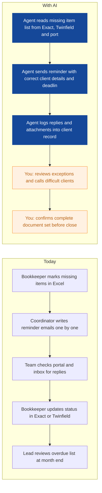
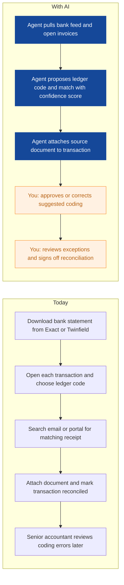
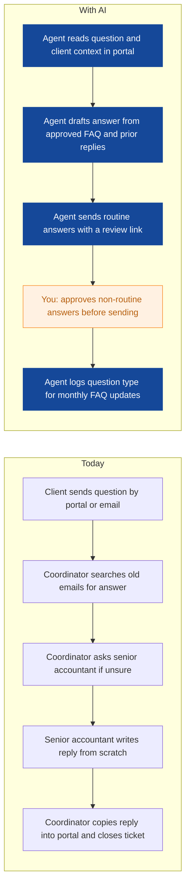
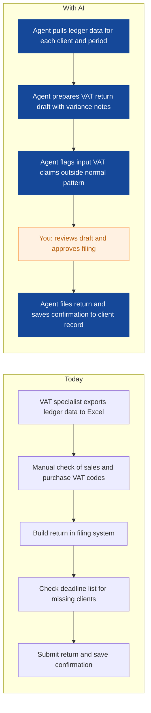
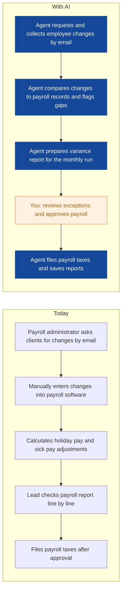
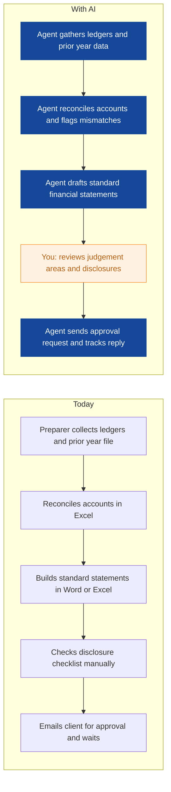
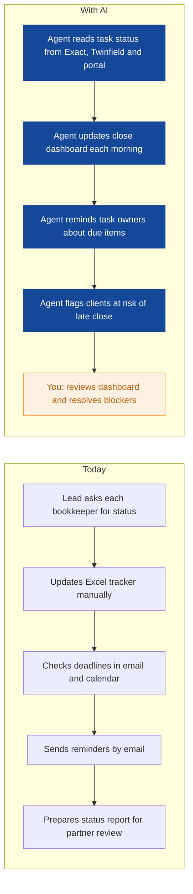
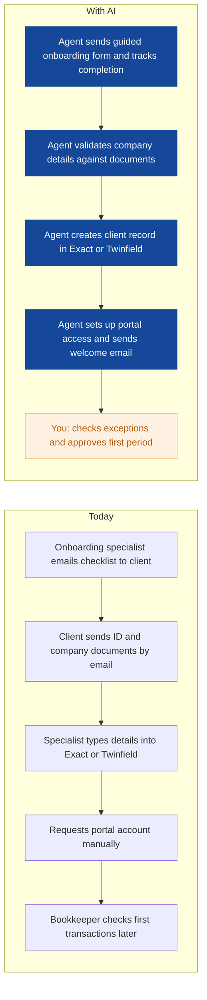
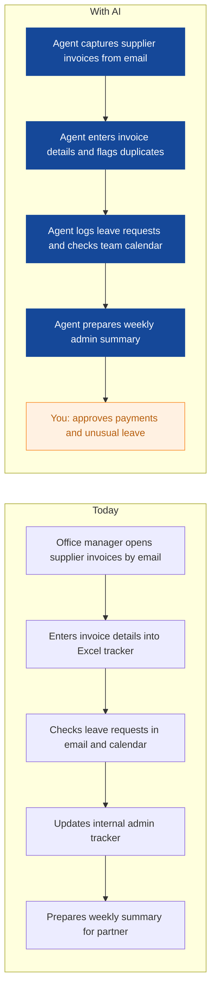

# AI Strategy for Brightwater Accountancy

> **Example report for a fictional company.** Generated by [CompleteAIStrategy](https://completeaistrategy.com) with the same research, strategy and pricing rules as a real report.
> **[Open the interactive report with charts →](https://completeaistrategy.com/example/brightwater-accountancy)**

| Hours saved per week | Value per year | Roles freed up | Opportunities |
|---:|---:|---:|---:|
| **79h** | **$181,700** | **2 FTE** | **9** |

## Our recommendation
**Start with three phase 1 agents: client document chasing, bank transaction coding and reconciliation, and routine client question answering, to cut manual admin and free your team for review work.**

Brightwater Accountancy is a 28-person firm in Utrecht serving about 400 small businesses with bookkeeping, VAT, annual accounts, and payroll. Your team runs on Exact, Twinfield, Excel, and a client portal, and still chases many clients for documents each month. The current way depends on manual email chasing and spreadsheet trackers, which creates deadline risk and pulls senior accountants into routine work. Clients expect faster answers, and any filing error or missed deadline carries compliance and reputation cost.

1. **Monthly document chasing and bank entry eat the most repetitive time** Your 11-person bookkeeping team and 3-person client services team carry most of the manual work. Document chasing, transaction coding, and routine client questions repeat for every client, every month. Senior accountants still correct coding and answer questions that follow the same patterns.
2. **Document chasing, transaction coding, and client questions are the best first agents** These three tasks are high volume, rule-based, and already supported by Exact, Twinfield, and your portal. They need limited integration and produce visible relief in the first month. Each one has a clear review step, so your team stays in control.
3. **Pilot with one client group, review outputs, then expand agent by agent** Start with 30 to 40 clients and a named reviewer for each agent. Measure accuracy, response rates, and hours returned before adding more clients. After the pilot, connect the remaining agents in the same way and train the team on exception handling.

**Phase 1 at a glance:** Client documents chased and tracked automatically · Bank transactions coded and matched automatically · Routine client questions answered from approved templates. About 46 hours a week back for $2,990/month (setup $2,870, free on a 4-month run).

## 1. Monthly document chasing and bank entry eat the most repetitive time
Your 11-person bookkeeping team and 3-person client services team carry most of the manual work. Document chasing, transaction coding, and routine client questions repeat for every client, every month. Senior accountants still correct coding and answer questions that follow the same patterns.

| Department | Hours saved / week | Share |
|---|---:|---:|
| Client Services and Support | 28 | 35% |
| Bookkeeping and Client Accounting | 27 | 34% |
| VAT and Compliance | 8 | 10% |
| Annual Accounts | 7 | 9% |
| Payroll | 6 | 8% |
| Operations and Administration | 3 | 4% |

## 2. Document chasing, transaction coding, and client questions are the best first agents
These three tasks are high volume, rule-based, and already supported by Exact, Twinfield, and your portal. They need limited integration and produce visible relief in the first month. Each one has a clear review step, so your team stays in control.

| # | Opportunity | Department | Hours/week | Impact | Effort | Phase |
|---:|---|---|---:|:-:|:-:|:-:|
| 1 | Client documents chased and tracked automatically | Client Services and Support | 16 | 5/5 | 2/5 | 1 |
| 2 | Bank transactions coded and matched automatically | Bookkeeping and Client Accounting | 22 | 5/5 | 3/5 | 1 |
| 3 | Routine client questions answered from approved templates | Client Services and Support | 8 | 4/5 | 2/5 | 1 |
| 4 | VAT returns pre-filled and checked before filing | VAT and Compliance | 8 | 4/5 | 3/5 | later |
| 5 | Payroll changes collected and checked automatically | Payroll | 6 | 4/5 | 3/5 | later |
| 6 | Year-end accounts compiled from standard checklists | Annual Accounts | 7 | 4/5 | 3/5 | later |
| 7 | Month-end close status tracked without chasing the team | Bookkeeping and Client Accounting | 5 | 3/5 | 2/5 | later |
| 8 | New clients onboarded with clean data entry | Client Services and Support | 4 | 3/5 | 3/5 | later |
| 9 | Office invoices and leave requests handled by rules | Operations and Administration | 3 | 2/5 | 2/5 | later |

### 1. Client documents chased and tracked automatically (phase 1)
An agent monitors missing document lists in Exact, Twinfield and the portal, sends personalized reminders, and logs replies. It escalates only clients who do not respond after two reminders.

**Saves ~16h per week** · Roles: Client Support Coordinator, Bookkeeping Specialist · Tools: Exact, Twinfield, Client portal, Email, Excel

### 2. Bank transactions coded and matched automatically (phase 1)
An agent reads bank feeds, proposes ledger codes and matches receipts and invoices to transactions. Your bookkeepers approve or correct suggestions in a review queue.

**Saves ~22h per week** · Roles: Bookkeeping Specialist, Senior Accountant · Tools: Exact, Twinfield, Document management, Email, Excel

### 3. Routine client questions answered from approved templates (phase 1)
An agent answers common portal and accounting questions using your approved FAQ and client records, and routes anything unusual to a senior accountant. Every answer is logged for review.

**Saves ~8h per week** · Roles: Client Support Coordinator, Senior Accountant · Tools: Client portal, Email, Exact, Twinfield, Excel

### 4. VAT returns pre-filled and checked before filing
An agent gathers ledger data for each VAT period, prepares the return draft, and flags unusual input VAT claims. Your VAT specialist reviews and submits.

**Saves ~8h per week** · Roles: VAT Specialist, Compliance Coordinator · Tools: Exact, Twinfield, Excel, Filing system, Email

### 5. Payroll changes collected and checked automatically
An agent collects monthly employee changes by email, checks them against payroll records, and prepares a variance report for the payroll run. The payroll lead reviews before submission.

**Saves ~6h per week** · Roles: Payroll Administrator, Payroll Lead · Tools: Payroll software, Email, Excel, Document management

### 6. Year-end accounts compiled from standard checklists
An agent compiles year-end figures into standard financial statements and checks disclosure requirements against a firm checklist. The review accountant handles judgement calls.

**Saves ~7h per week** · Roles: Annual Accounts Preparer, Review Accountant · Tools: Exact, Twinfield, Excel, Word, Document management

### 7. Month-end close status tracked without chasing the team
An agent tracks close tasks, client document status, and review points in one dashboard. It sends daily task reminders to owners and flags clients at risk of late close.

**Saves ~5h per week** · Roles: Bookkeeping Team Lead, Bookkeeping Specialist, Senior Accountant · Tools: Exact, Twinfield, Client portal, Excel, Email

### 8. New clients onboarded with clean data entry
An agent collects ID and company details through a guided form, creates the client record in Exact or Twinfield, and sets up portal access. The specialist checks exceptions.

**Saves ~4h per week** · Roles: Client Onboarding Specialist, Bookkeeping Specialist · Tools: Exact, Twinfield, Client portal, Email, Document management

### 9. Office invoices and leave requests handled by rules
An agent logs supplier invoices, tracks leave requests, and prepares a weekly admin summary. The office manager approves payments and unusual requests.

**Saves ~3h per week** · Roles: Office Manager, Operations Assistant · Tools: Email, Excel, Calendar, Document management

## 3. Pilot with one client group, review outputs, then expand agent by agent
Start with 30 to 40 clients and a named reviewer for each agent. Measure accuracy, response rates, and hours returned before adding more clients. After the pilot, connect the remaining agents in the same way and train the team on exception handling.

**Phase 1 (Weeks 1-6): Prove three agents with one client group**
- Connect document chase agent to Exact, Twinfield and portal for 40 clients
- Run bank coding agent in a review queue with two bookkeepers
- Launch routine question agent with approved FAQ for portal questions
- Measure accuracy, response rates, and hours returned each week
- Hold a Friday review to fix exceptions before expanding

**Phase 2 (Months 2-4): Add VAT, payroll and annual accounts support**
- Add VAT return draft agent for a first group of clients
- Add payroll change collection and variance agent
- Add annual accounts compilation agent with disclosure checklist
- Train named reviewers on exception handling for each agent
- Report monthly hours saved and error rates to the partner team

**Phase 3 (Months 5-9): Scale across all clients and train the team**
- Roll out proven agents to all 400 clients in weekly batches
- Add month-end status, onboarding, and office admin agents
- Move staff from manual entry to review, advice, and client calls
- Update procedures for agent audit logs and client consent
- Review KPI targets and retire agents that do not return value

**Risks**
- **Client data confidentiality and GDPR compliance**: Use EU hosting, strict access controls, data processing agreements, and human review before any client communication is sent.
- **Incorrect agent output causing filing errors**: Keep human approval before VAT, payroll, and annual accounts submissions, with exception queues and audit logs for every change.
- **Client resistance to automated reminders**: Use firm-branded messages, allow clients to request a human call, and escalate after two reminders.
- **Staff adoption and role change**: Train champions in each team, show weekly time returned, and reassign people to review and advisory work.
- **Tool integration limits with Exact and Twinfield**: Start with import and export plus portal APIs, test with a small client set, and keep manual fallback until accuracy is proven.

**KPIs**
- Weekly hours saved on document chasing and bank coding
- Percentage of bank transactions auto-coded with no correction
- Average days to collect missing client documents
- Client response rate to first reminder
- VAT and payroll filings submitted before deadline
- Routine client questions resolved without senior accountant

## Investment: phase 1 costs $2,990 a month and gives back $9,959 a month in time
| Agent | Saves | Setup | Monthly |
|---|---:|---:|---:|
| Client documents chased and tracked automatically | 16h/wk | $790 | $1,040 |
| Bank transactions coded and matched automatically | 22h/wk | $1,290 | $1,430 |
| Routine client questions answered from approved templates | 8h/wk | $790 | $520 |
| **Total** | **46h/wk** | **$2,870** | **$2,990** |

Setup is free when the agents run for 4 months. Full rollout of all 9 opportunities: $9,610 setup, $5,250/month.

## Appendix: background
- **Industry:** Accounting and bookkeeping
- **What they do:** Brightwater Accountancy is a 28-person accounting and bookkeeping firm in Utrecht. You serve about 400 small businesses with bookkeeping, VAT returns, annual accounts, and payroll. Your team uses Exact, Twinfield, Excel, and a client portal, and spends significant time chasing clients for documents each month.
- **Customers:** Small businesses in and around Utrecht, mainly owner-managed companies and local firms.
- **Team size:** 11-50 (estimate 28)
- **Tools:** Exact, Twinfield, Excel, Client portal, Email, Document management
- **AI maturity:** 2/5, Early. You use Exact, Twinfield and a portal, but most repetitive work is still manual email and Excel. There are no production AI agents today.

| Department | People | Roles |
|---|---:|---|
| Bookkeeping and Client Accounting | 11 | Bookkeeping Specialist (7), Senior Accountant (3), Bookkeeping Team Lead (1) |
| Payroll | 4 | Payroll Administrator (3), Payroll Lead (1) |
| VAT and Compliance | 4 | VAT Specialist (3), Compliance Coordinator (1) |
| Annual Accounts | 4 | Annual Accounts Preparer (3), Review Accountant (1) |
| Client Services and Support | 3 | Client Support Coordinator (2), Client Onboarding Specialist (1) |
| Operations and Administration | 2 | Office Manager (1), Operations Assistant (1) |

---
Want this for your own company? **[Get your free AI strategy →](https://completeaistrategy.com)**
