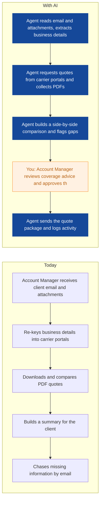
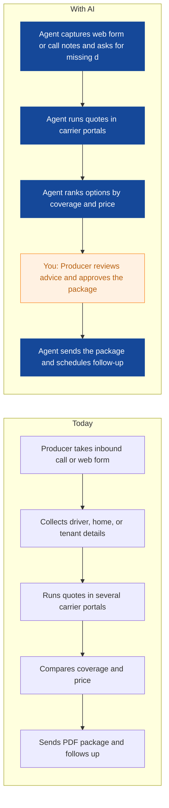
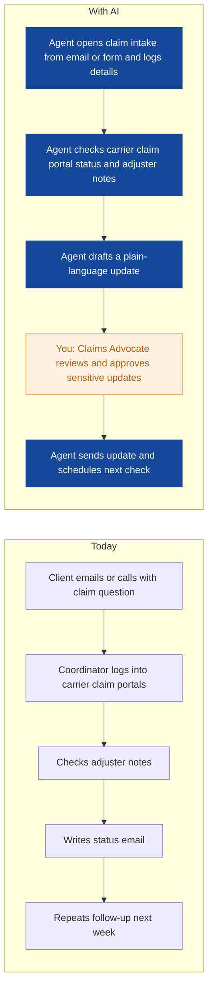
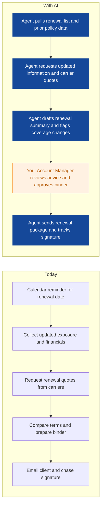
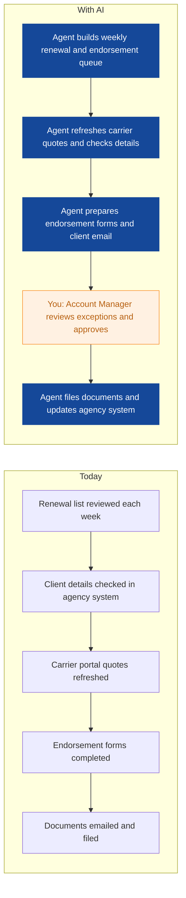
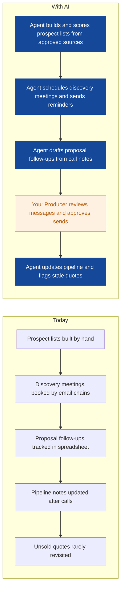
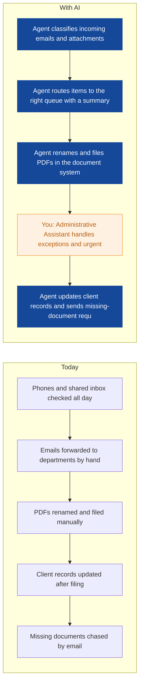
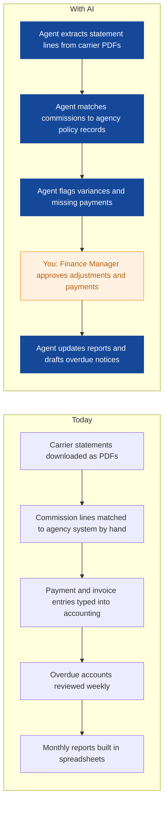
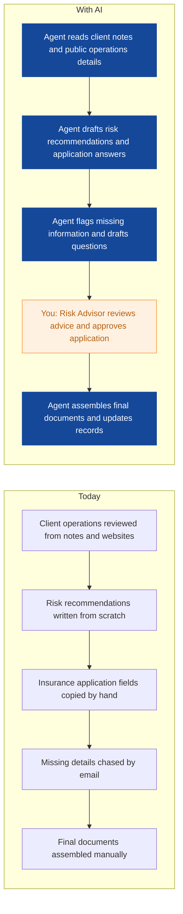

# AI Strategy for Clearpath Insurance Brokers

> **Example report for a fictional company.** Generated by [CompleteAIStrategy](https://completeaistrategy.com) with the same research, strategy and pricing rules as a real report.
> **[Open the interactive report with charts →](https://completeaistrategy.com/example/clearpath-insurance-brokers)**

| Hours saved per week | Value per year | Roles freed up | Opportunities |
|---:|---:|---:|---:|
| **135h** | **$310,500** | **3.4 FTE** | **9** |

## Our recommendation
**Start with quote intake, renewal preparation, and claims status updates as your first three agents to cut repetitive work, speed up client responses, and prove value before wider rollout.**

Clearpath Insurance Brokers is a 55-person independent brokerage in Toronto with strong carrier relationships, a busy commercial and personal lines book, and most client, quote, and claims work still handled through email, PDFs, carrier portals, and spreadsheets. As renewals and quote requests pile up, your team spends too much time retyping client details, chasing carriers, and sending status updates, which slows response times and puts service quality at risk during peak periods.

1. **Commercial and personal lines absorb most of the repetitive client and carrier work** About 30 of your 55 employees sit in Commercial Lines and Personal Lines, where quote intake, renewals, and document handling repeat every day. Add claims support and administration, and most of the manual work sits in four teams.
2. **Quote intake, renewal prep, and claims updates give the fastest proof at low integration effort** These three areas touch many files, have clear rules, and use email, PDFs, and carrier portals your team already knows. They can show measurable time savings in weeks, and they need only light integration with your agency management system.
3. **Run a 90-day pilot with human review, then scale what clears quality and time checks** Run a 90-day pilot with human review on every client-facing message and a weekly quality check. Once the first three agents meet response-time and error-rate targets, connect them to the agency management system and add renewals, sales follow-up, admin, finance, and risk work. Scaling after the pilot keeps risk low and lets your team adopt at a comfortable pace.

**Phase 1 at a glance:** Commercial quote requests prepared in minutes · Inbound personal quote requests answered same day · Claims status updates sent without manual chasing. About 60 hours a week back for $3,900/month (setup $2,370, free on a 4-month run).

## 1. Commercial and personal lines absorb most of the repetitive client and carrier work
About 30 of your 55 employees sit in Commercial Lines and Personal Lines, where quote intake, renewals, and document handling repeat every day. Add claims support and administration, and most of the manual work sits in four teams.

| Department | Hours saved / week | Share |
|---|---:|---:|
| Commercial Lines | 38 | 28% |
| Personal Lines | 32 | 24% |
| Claims and Risk Support | 26 | 19% |
| Operations and Administration | 15 | 11% |
| Sales and Business Development | 14 | 10% |
| Finance and Accounting | 10 | 7% |

## 2. Quote intake, renewal prep, and claims updates give the fastest proof at low integration effort
These three areas touch many files, have clear rules, and use email, PDFs, and carrier portals your team already knows. They can show measurable time savings in weeks, and they need only light integration with your agency management system.

| # | Opportunity | Department | Hours/week | Impact | Effort | Phase |
|---:|---|---|---:|:-:|:-:|:-:|
| 1 | Commercial quote requests prepared in minutes | Commercial Lines | 22 | 5/5 | 2/5 | 1 |
| 2 | Inbound personal quote requests answered same day | Personal Lines | 20 | 5/5 | 2/5 | 1 |
| 3 | Claims status updates sent without manual chasing | Claims and Risk Support | 18 | 4/5 | 2/5 | 1 |
| 4 | Commercial renewals prepared before the client asks | Commercial Lines | 16 | 4/5 | 2/5 | later |
| 5 | Personal renewals and endorsements processed with fewer touches | Personal Lines | 12 | 4/5 | 2/5 | later |
| 6 | Producers spend more time selling and less time updating leads | Sales and Business Development | 14 | 3/5 | 2/5 | later |
| 7 | Admin team routes documents and emails by rule, not memory | Operations and Administration | 15 | 3/5 | 2/5 | later |
| 8 | Carrier statements reconciled without month-end scramble | Finance and Accounting | 10 | 3/5 | 3/5 | later |
| 9 | Risk reviews and applications drafted from client operations | Claims and Risk Support | 8 | 3/5 | 3/5 | later |

### 1. Commercial quote requests prepared in minutes (phase 1)
The agent reads client emails and attachments, pulls business details, requests carrier quotes, and builds a comparison for review. Your account manager still gives the advice and approves what goes to the client.

**Saves ~22h per week** · Roles: Account Manager, Commercial Lines Assistant · Tools: Agency management system, Carrier quote portals, Email, Microsoft 365

### 2. Inbound personal quote requests answered same day (phase 1)
The agent captures inbound quote requests, asks for missing details, runs carrier portal quotes, and ranks options. Your producer reviews the advice and approves the quote package before it is sent.

**Saves ~20h per week** · Roles: Personal Lines Account Manager, Personal Lines Producer · Tools: Carrier quote portals, Email, Agency management system, Spreadsheets

### 3. Claims status updates sent without manual chasing (phase 1)
The agent logs claim intake, checks carrier claim portals, and drafts plain-language status updates for review. Your claims advocate approves sensitive updates and handles negotiations.

**Saves ~18h per week** · Roles: Claims Advocate, Claims Coordinator · Tools: Carrier claims portals, Email, Agency management system, Microsoft 365

### 4. Commercial renewals prepared before the client asks
The agent builds the renewal queue, requests carrier quotes, and drafts the renewal summary with coverage changes flagged. Your account manager reviews advice and approves the binder before it goes out.

**Saves ~16h per week** · Roles: Account Manager, Commercial Lines Assistant · Tools: Agency management system, Carrier quote portals, Email, Microsoft 365

### 5. Personal renewals and endorsements processed with fewer touches
The agent prepares the renewal and endorsement queue, refreshes carrier quotes, and drafts client emails and forms. Your account manager reviews exceptions and approves what is sent.

**Saves ~12h per week** · Roles: Personal Lines Account Manager, Personal Lines Assistant · Tools: Agency management system, Carrier portals, Email, PDF documents

### 6. Producers spend more time selling and less time updating leads
The agent builds prospect lists, books discovery meetings, drafts follow-ups from call notes, and updates the pipeline. Your producers review messages and focus on conversations that need a human.

**Saves ~14h per week** · Roles: Commercial Producer, Personal Producer, Business Development Coordinator · Tools: CRM, Email, Calendars, Spreadsheets, Agency management system

### 7. Admin team routes documents and emails by rule, not memory
The agent classifies incoming email and documents, routes them to the right queue, renames and files PDFs, and updates client records. Your admin team handles urgent calls and exceptions.

**Saves ~15h per week** · Roles: Administrative Assistant, Systems and Data Administrator · Tools: Microsoft 365, Shared inbox, Agency management system, Document folders

### 8. Carrier statements reconciled without month-end scramble
The agent extracts carrier statement lines, matches commissions to policy records, and flags variances. Your finance manager approves adjustments, payments, and overdue notices.

**Saves ~10h per week** · Roles: Finance Manager, Accounting Clerk · Tools: Accounting software, Agency management system, Carrier statements, Spreadsheets

### 9. Risk reviews and applications drafted from client operations
The agent reads client notes and operations details, drafts risk recommendations, and fills application answers for review. Your risk advisor approves the advice and final application.

**Saves ~8h per week** · Roles: Risk Advisor · Tools: Agency management system, Microsoft 365, Carrier application portals, Web research

## 3. Run a 90-day pilot with human review, then scale what clears quality and time checks
Run a 90-day pilot with human review on every client-facing message and a weekly quality check. Once the first three agents meet response-time and error-rate targets, connect them to the agency management system and add renewals, sales follow-up, admin, finance, and risk work. Scaling after the pilot keeps risk low and lets your team adopt at a comfortable pace.

**Phase 1 (Weeks 1 to 4): Prove the first three agents on live but low-risk work**
- Set up quote intake, renewal preparation, and claims status agents
- Connect email, PDFs, and carrier portals with human review
- Track response time, errors, and hours saved weekly
- Train account managers and claims staff on review steps

**Phase 2 (Weeks 5 to 12): Connect to core systems and expand into renewals and sales**
- Integrate the agency management system and CRM
- Add commercial renewals, personal renewals, and sales follow-up agents
- Create a shared review queue for exceptions
- Report results to leadership every two weeks

**Phase 3 (Months 4 to 6): Scale across departments with clear ownership and controls**
- Add admin, finance, and risk review agents
- Set data privacy, carrier, and quality rules
- Assign an owner for each agent and a monthly review
- Move from pilot metrics to department scorecards

**Risks**
- **Carrier portals may limit automated access, which can slow quote and claim agents.**: Start with email and PDF steps, use approved carrier connections, and keep human entry where portals require it.
- **Client data privacy and consent rules apply to every agent that reads personal or business information.**: Limit access by role, log every action, store data in approved systems, and review with your compliance coordinator.
- **Automated messages can damage trust if they are wrong or sound generic.**: Keep human approval on advice, claims updates, and renewals until error rates are low.
- **Your team may resist tools that change daily work.**: Involve account managers and assistants in testing, show time saved, and give clear review steps.
- **Vendor or tool sprawl can create new manual work.**: Use one orchestration owner, prefer tools that connect to Microsoft 365 and your agency management system, and review usage monthly.

**KPIs**
- Quote response time from client request to first options
- Renewal packages sent at least 10 days before expiry
- Claims status updates sent within 2 business days of carrier change
- Hours saved per week by team, tracked against baseline
- Error and rework rate on agent-prepared documents
- Client satisfaction score for quote, renewal, and claims updates

## Investment: phase 1 costs $3,900 a month and gives back $12,990 a month in time
| Agent | Saves | Setup | Monthly |
|---|---:|---:|---:|
| Commercial quote requests prepared in minutes | 22h/wk | $790 | $1,430 |
| Inbound personal quote requests answered same day | 20h/wk | $790 | $1,300 |
| Claims status updates sent without manual chasing | 18h/wk | $790 | $1,170 |
| **Total** | **60h/wk** | **$2,370** | **$3,900** |

Setup is free when the agents run for 4 months. Full rollout of all 9 opportunities: $8,110 setup, $8,770/month.

## Appendix: background
- **Industry:** Insurance brokerage
- **What they do:** You are an independent insurance broker in Toronto with about 55 employees. Your team handles commercial and personal lines, collects client information, gets quotes from carriers, compares options, and supports renewals and claims.
- **Customers:** Small and mid-sized businesses, homeowners, drivers, tenants, and condo owners in Toronto and the Greater Toronto Area.
- **Team size:** 51-200 (estimate 55)
- **Tools:** Agency management system, PDF documents, Carrier quote portals, Email and calendars, Spreadsheets for tracking, Microsoft 365 or similar office tools
- **AI maturity:** 2/5, Early. You use an agency management system, carrier portals, and spreadsheets, but handoffs between them are still manual.

| Department | People | Roles |
|---|---:|---|
| Commercial Lines | 18 | Account Manager (8), Account Executive or Producer (5), Claims Support Specialist (3), Commercial Lines Assistant (2) |
| Personal Lines | 12 | Personal Lines Account Manager (6), Personal Lines Producer (3), Claims Support Specialist (2), Personal Lines Assistant (1) |
| Sales and Business Development | 7 | Commercial Producer (3), Personal Producer (2), Business Development Coordinator (2) |
| Claims and Risk Support | 5 | Claims Advocate (2), Risk Advisor (2), Claims Coordinator (1) |
| Operations and Administration | 8 | Operations Manager (1), Systems and Data Administrator (1), Administrative Assistant (3), Compliance and Quality Coordinator (1) |
| Finance and Accounting | 3 | Finance Manager (1), Accounting Clerk (2) |
| Leadership | 2 | Principal Broker (1), Director of Operations (1) |

---
Want this for your own company? **[Get your free AI strategy →](https://completeaistrategy.com)**
