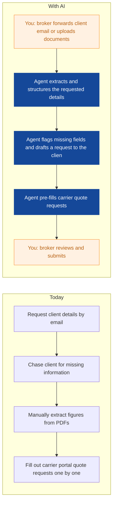
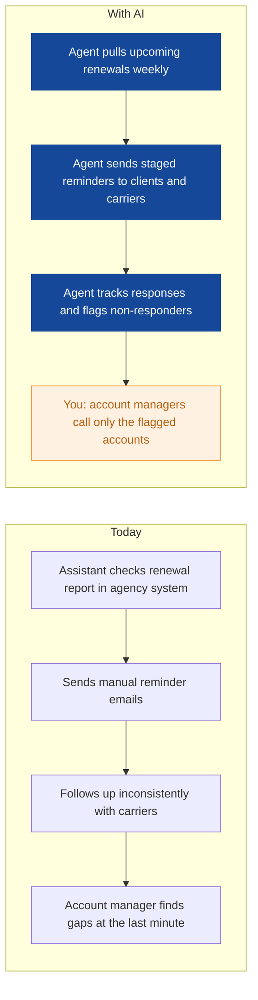
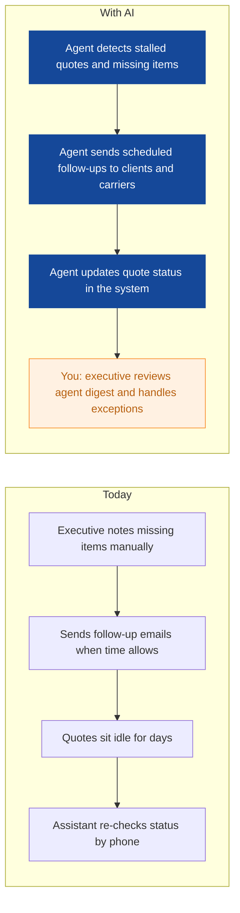
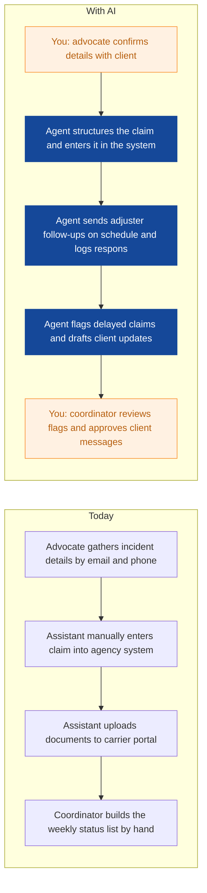
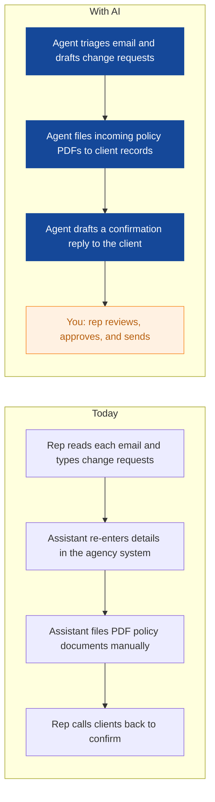
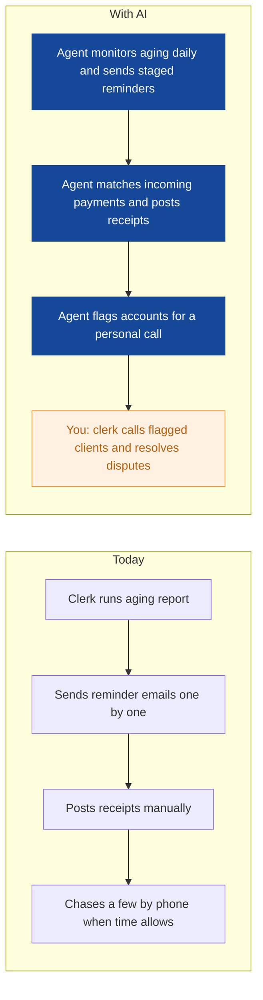
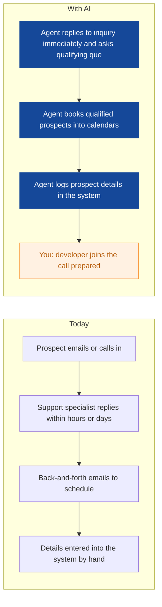
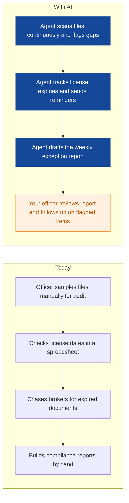
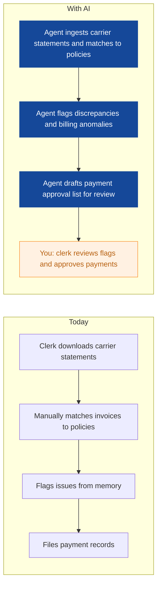

# AI Strategy for Clearpath Insurance Brokers

> **Example report for a fictional company.** Generated by [CompleteAIStrategy](https://completeaistrategy.com) with the same research, strategy and pricing rules as a real report.
> **[Open the interactive report with charts →](https://completeaistrategy.com/example/clearpath-insurance-brokers)**

| Hours saved per week | Value per year | Roles freed up | Opportunities |
|---:|---:|---:|---:|
| **138h** | **$317,400** | **3.5 FTE** | **9** |

## Summary
Clearpath Insurance Brokers runs on an agency management system, carrier portals, and a lot of PDFs, which means your team spends real hours copying data, chasing documents, and sending the same follow-up emails. The biggest wins here are not fancy AI projects: they are agents that pre-fill quote requests from client documents, chase missing underwriting info automatically, and keep the agency system updated so your brokers and assistants stop typing the same details three times. A renewal pipeline agent and a claims status updater round out the high-value items. Together these save your team an estimated 130 hours a week, under 6% of total staff time, mostly in Commercial Lines, Personal Lines, and Claims Support.

## Company snapshot
- **Industry:** Insurance brokerage
- **What they do:** Clearpath Insurance Brokers is an independent insurance broker in Toronto with about 55 employees. You sell commercial and personal lines insurance, helping businesses and individuals get quotes from carriers, compare options, renew policies, and get claims support. Your team runs on an agency management system and many PDFs.
- **Customers:** Small and mid-sized businesses, professionals, homeowners, and auto owners in Toronto and across Ontario.
- **Team size:** 51-200 (estimate 55)
- **Tools:** Agency management system, Carrier quote portals, PDF documents, Email, Spreadsheets, E-signature tools
- **AI maturity:** 2/5, Early. You have core systems in place but rely heavily on manual data entry, PDF handling, and email follow-ups. There is no visible automation today.

## Team and roles
| Department | People | Roles |
|---|---:|---|
| Commercial Lines | 16 | Commercial Account Manager (8), Commercial Account Executive (4), Commercial Broker Assistant (4) |
| Personal Lines | 14 | Personal Lines Account Manager (7), Personal Lines Broker Assistant (4), Personal Lines Customer Service Representative (3) |
| Claims Support | 6 | Claims Advocate (3), Claims Assistant (2), Claims Coordinator (1) |
| Sales and Marketing | 6 | Business Development Manager (2), Sales Support Specialist (2), Marketing Coordinator (2) |
| Accounting and Finance | 5 | Accounting Manager (1), Accounts Receivable Clerk (2), Accounts Payable Clerk (1), Payroll and Benefits Administrator (1) |
| Operations, Admin, and IT | 6 | Operations Manager (1), IT and Systems Administrator (1), Compliance Officer (1), Reception and Admin Assistant (2) |
| Leadership and Management | 2 | Managing Director (1), Finance and HR Director (1) |

## Opportunities
| # | Opportunity | Department | Hours/week | Impact | Effort |
|---:|---|---|---:|:-:|:-:|
| 1 | Quote requests assembled from client documents in minutes | Commercial Lines | 30 | 5/5 | 3/5 |
| 2 | Renewals tracked and reminders sent automatically | Commercial Lines | 22 | 5/5 | 2/5 |
| 3 | Missing underwriting information chased automatically | Commercial Lines | 18 | 4/5 | 2/5 |
| 4 | Claims intake and adjuster follow-ups handled faster | Claims Support | 20 | 4/5 | 3/5 |
| 5 | Personal lines policy changes and document filing handled at the front desk | Personal Lines | 18 | 3/5 | 3/5 |
| 6 | Overdue invoice follow-ups sent consistently | Accounting and Finance | 10 | 3/5 | 2/5 |
| 7 | New lead qualification and meeting scheduling for business development | Sales and Marketing | 8 | 3/5 | 2/5 |
| 8 | Compliance file audits and licensing tracking automated | Operations, Admin, and IT | 6 | 3/5 | 3/5 |
| 9 | Carrier statement matching for accounts payable | Accounting and Finance | 6 | 2/5 | 3/5 |

### 1. Quote requests assembled from client documents in minutes
An agent reads client-submitted PDFs, spreadsheets, and emails, extracts payroll, operations, and exposure details, and pre-fills carrier quote request forms or emails. Your account managers review and send instead of retyping everything by hand.

**Saves ~30h per week** · Roles: Commercial Account Manager, Commercial Broker Assistant · Tools: Agency management system, Carrier quote portals, Email, PDF document processing

### 2. Renewals tracked and reminders sent automatically
An agent monitors renewal dates in the agency system and runs a structured outreach sequence at 90, 60, and 30 days, updating account managers on which clients have responded. No policy quietly slips past its renewal date.

**Saves ~22h per week** · Roles: Commercial Account Manager, Commercial Broker Assistant · Tools: Agency management system, Email, Shared calendar

### 3. Missing underwriting information chased automatically
An agent tracks quotes sitting in underwriting, identifies what is missing, and sends polite, persistent follow-ups to clients and carriers. It drafts the emails and updates the quote status so your executives only step in when a human nudge matters.

**Saves ~18h per week** · Roles: Commercial Account Executive, Commercial Broker Assistant · Tools: Agency management system, Email, Carrier quote portals

### 4. Claims intake and adjuster follow-ups handled faster
An agent collects first notice of loss details from client calls and emails, opens the claim file in the agency system, and chases adjusters on a fixed schedule for status updates. Clients get automatic progress updates, and delayed claims get flagged for your coordinator.

**Saves ~20h per week** · Roles: Claims Advocate, Claims Assistant, Claims Coordinator · Tools: Agency management system, Email, Carrier portals

### 5. Personal lines policy changes and document filing handled at the front desk
An agent triages incoming client emails, drafts address and vehicle change requests, and files incoming policy PDFs into the right client records in the agency system. Your reps confirm and send instead of doing data entry all day.

**Saves ~18h per week** · Roles: Personal Lines Customer Service Representative, Personal Lines Broker Assistant · Tools: Agency management system, Email, PDF document processing

### 6. Overdue invoice follow-ups sent consistently
An agent watches your receivables aging and sends polite, escalating payment reminders to clients, posting receipts and updating the ledger when payments land. Your clerk focuses on the accounts that genuinely need a phone call.

**Saves ~10h per week** · Roles: Accounts Receivable Clerk · Tools: Accounting software, Email, Agency management system

### 7. New lead qualification and meeting scheduling for business development
An agent responds to inbound quote inquiries within minutes, asks a short set of qualifying questions, and books discovery calls straight into your developers' calendars. Your team walks into meetings with prospect details already captured in the system.

**Saves ~8h per week** · Roles: Business Development Manager, Sales Support Specialist · Tools: Email, Website contact forms, Scheduling tool, Agency management system or CRM

### 8. Compliance file audits and licensing tracking automated
An agent scans client files in the agency system for missing signatures, expired documents, or incomplete records, and produces a weekly exception report. It also tracks broker license expiry dates and sends renewal reminders.

**Saves ~6h per week** · Roles: Compliance Officer · Tools: Agency management system, E-signature tools, Spreadsheets

### 9. Carrier statement matching for accounts payable
An agent reads carrier statements and invoices, matches them to policies in the agency system, and flags mismatches or billing anomalies before payment. Your clerk approves rather than line-by-line matching.

**Saves ~6h per week** · Roles: Accounts Payable Clerk, Accounting Manager · Tools: Agency management system, Accounting software, PDF document processing

## Roadmap
**Phase 1 (Weeks 1-8): Quick wins with email and reminders**
- Set up renewal tracking and staged reminder emails in Commercial Lines
- Deploy automated follow-ups on stalled quotes and missing underwriting info
- Deploy receivables reminder agent in Accounting
- Baseline measurement: count hours spent on renewals, follow-ups, and collections

**Phase 2 (Weeks 9-16): Document processing and claims**
- Roll out PDF extraction for commercial quote requests
- Launch claims intake and adjuster follow-up agent
- Launch personal lines email triage and PDF filing agent
- Train staff on reviewing agent output before it goes to clients

**Phase 3 (Weeks 17-26): Front desk, compliance, and reporting**
- Deploy lead qualification and scheduling for inbound inquiries
- Automate compliance file audits and license tracking
- Automate carrier statement matching in accounts payable
- Review results against baseline and decide what to expand or retire

## Risks
- **Regulated insurance communications sent without human review could create compliance or E&O exposure.**: Every client-facing message is drafted by the agent but requires one-click approval from a licensed staff member. No agent sends binding or coverage advice on its own.
- **Agency management system may lack a clean API, making integrations harder than expected.**: Start Phase 1 with email-only automations that need no system integration, and confirm API access with your vendor before committing to deeper phases.
- **Staff distrust agents and keep doing work manually, so savings never materialize.**: Pick one owner per agent, run a 4-week pilot with real metrics, and only roll out agents that beat the manual process on accuracy and speed.
- **Client data sent to AI tools raises privacy and PIPEDA concerns.**: Use business-tier tools with no training on your data, restrict access by role, and get your compliance officer to sign off on the data flow before launch.
- **Agents draft wrong extraction from messy client PDFs, leading to bad quotes.**: Agents always flag low-confidence fields and show a side-by-side of extracted versus source data so the broker can verify before submitting.

## KPIs
- Renewal reminders sent on time: target 100% of renewals contacted at 90, 60, and 30 days
- Average time from client inquiry to first response: under 15 minutes for inbound leads
- Hours logged per week on manual data entry in Commercial Lines: 25% reduction within 90 days
- Percentage of overdue invoices followed up within 48 hours: target 95%
- Claims status updates sent to clients at least every 7 days: target 90% of open claims
- Agent accuracy rate on document extraction: above 95% before removing broker review

## Quote: phase 1
| Agent | Saves | Setup | Monthly |
|---|---:|---:|---:|
| Renewals tracked and reminders sent automatically | 22h/wk | $790 | $1,430 |
| Quote requests assembled from client documents in minutes | 30h/wk | $1,290 | $1,950 |
| Missing underwriting information chased automatically | 18h/wk | $790 | $1,170 |
| **Total** | **70h/wk** | **$2,870** | **$4,550** |

Setup is free when the agents run for 4 months. Full rollout of all 9 opportunities: $9,610 setup, $8,970/month.

---
Want this for your own company? **[Get your free AI strategy →](https://completeaistrategy.com)**
