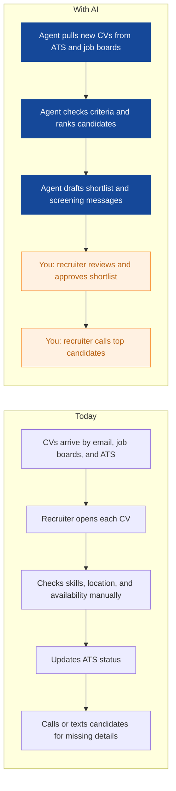
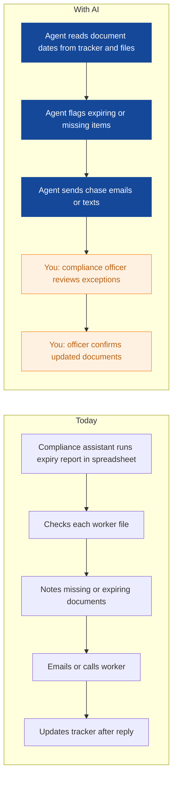
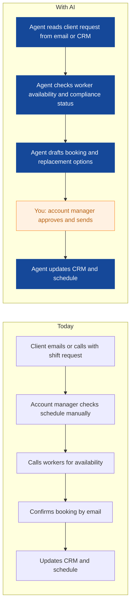
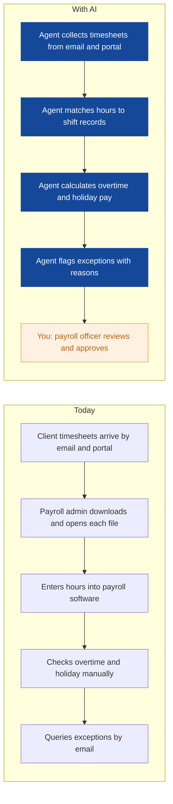
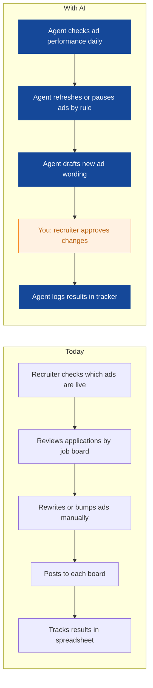
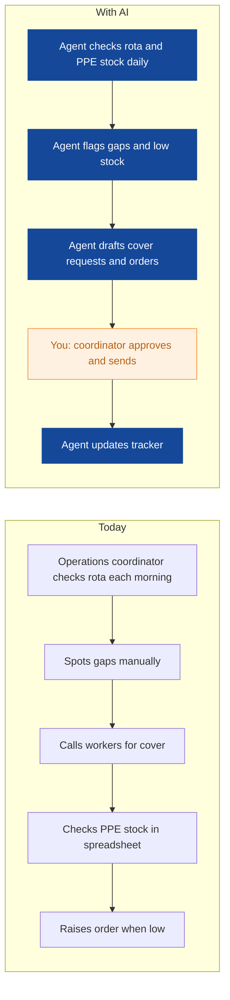
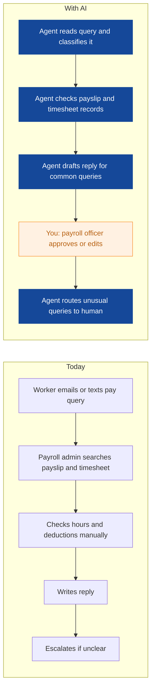
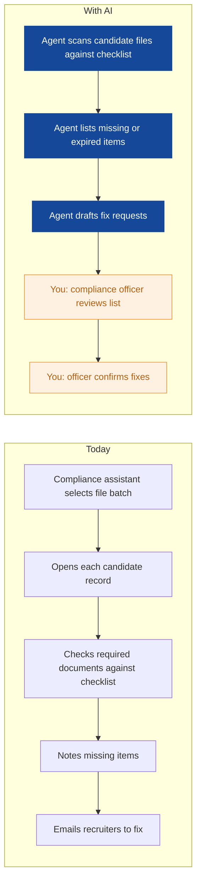
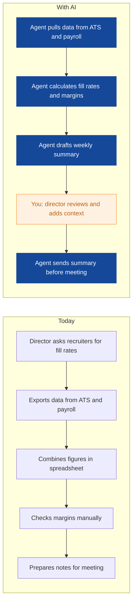

# AI Strategy for Cobalt Crew Recruitment

> **Example report for a fictional company.** Generated by [CompleteAIStrategy](https://completeaistrategy.com) with the same research, strategy and pricing rules as a real report.
> **[Open the interactive report with charts →](https://completeaistrategy.com/example/cobalt-crew-recruitment)**

| Hours saved per week | Value per year | Roles freed up | Opportunities |
|---:|---:|---:|---:|
| **75h** | **$172,500** | **1.9 FTE** | **9** |

## Our recommendation
**Start with a CV screening agent, a right-to-work expiry agent, and a shift booking agent to cut manual chasing, protect compliance, and fill shifts faster.**

Cobalt Crew Recruitment places temporary warehouse and logistics workers across Greater Manchester. Your 35-person team runs recruitment, compliance, scheduling, and weekly payroll using an ATS, job boards, spreadsheets, and payroll software. CV volume, right-to-work expiry checks, and daily shift changes create manual chasing that slows placements and risks compliance misses. Weekly payroll and client reporting add pressure when fill rates are already tight.

1. **Recruiters, compliance staff, and account managers carry most of the repetitive admin** Your recruitment team screens hundreds of CVs each week and confirms availability by phone and text. Compliance staff chase right-to-work documents and expiry dates across spreadsheets. Account managers take shift requests, confirm bookings, and handle call-offs while updating CRM and schedules.
2. **These three agents hit high-volume, rule-based tasks with existing tools** CV screening, right-to-work expiry checks, and shift booking all follow clear rules and use systems you already have. They create fast proof because the agent can draft, flag, or rank while a human approves. Each one reduces manual chasing in a different department, so the value is visible across the business.
3. **Pilot each agent for two weeks, check outputs, then scale across teams** Set narrow rules, keep humans in approval steps, and review errors weekly before expanding. Start with one recruiter pod, one compliance officer, and one account manager as pilot owners. After the pilot proves reliable, rollout scales to the full team and then to more client sites.

**Phase 1 at a glance:** Warehouse CVs screened and ranked in minutes · Right-to-work expiry checks run daily · Client shift requests booked with fewer calls. About 37 hours a week back for $2,400/month (setup $2,870, free on a 4-month run).

## 1. Recruiters, compliance staff, and account managers carry most of the repetitive admin
Your recruitment team screens hundreds of CVs each week and confirms availability by phone and text. Compliance staff chase right-to-work documents and expiry dates across spreadsheets. Account managers take shift requests, confirm bookings, and handle call-offs while updating CRM and schedules.

| Department | Hours saved / week | Share |
|---|---:|---:|
| Recruitment | 21 | 28% |
| Compliance | 17 | 23% |
| Payroll | 15 | 20% |
| Account Management | 12 | 16% |
| Operations and Admin | 6 | 8% |
| Management | 4 | 5% |

## 2. These three agents hit high-volume, rule-based tasks with existing tools
CV screening, right-to-work expiry checks, and shift booking all follow clear rules and use systems you already have. They create fast proof because the agent can draft, flag, or rank while a human approves. Each one reduces manual chasing in a different department, so the value is visible across the business.

| # | Opportunity | Department | Hours/week | Impact | Effort | Phase |
|---:|---|---|---:|:-:|:-:|:-:|
| 1 | Warehouse CVs screened and ranked in minutes | Recruitment | 15 | 5/5 | 2/5 | 1 |
| 2 | Right-to-work expiry checks run daily | Compliance | 10 | 5/5 | 2/5 | 1 |
| 3 | Client shift requests booked with fewer calls | Account Management | 12 | 5/5 | 3/5 | 1 |
| 4 | Timesheets entered and checked before payroll run | Payroll | 10 | 4/5 | 4/5 | later |
| 5 | Job ads refreshed without manual posting | Recruitment | 6 | 3/5 | 2/5 | later |
| 6 | Rota gaps and PPE orders handled earlier | Operations and Admin | 6 | 3/5 | 3/5 | later |
| 7 | Pay queries answered from a known list | Payroll | 5 | 3/5 | 3/5 | later |
| 8 | Candidate files audited in batches | Compliance | 7 | 4/5 | 2/5 | later |
| 9 | Weekly fill rates and margins reported without spreadsheet chase | Management | 4 | 3/5 | 3/5 | later |

### 1. Warehouse CVs screened and ranked in minutes (phase 1)
An agent reads incoming CVs from the ATS and job boards, checks warehouse and logistics criteria, and ranks candidates by availability, location, and right-to-work status. It drafts shortlists and screening questions for recruiters to approve.

**Saves ~15h per week** · Roles: Temporary Recruiter, Senior Recruiter, Candidate Coordinator · Tools: ATS, Job boards, Email, Google Sheets or Excel

### 2. Right-to-work expiry checks run daily (phase 1)
An agent checks right-to-work, DBS, and licence documents against expiry dates, flags missing or expiring items, and sends chase messages to workers and recruiters. It keeps a live compliance tracker without manual report building.

**Saves ~10h per week** · Roles: Compliance Officer, Compliance Assistant · Tools: ATS, Compliance tracker, Email, SMS

### 3. Client shift requests booked with fewer calls (phase 1)
An agent takes shift requests from client emails and CRM notes, checks available workers in the scheduling tool, and drafts booking confirmations and replacement options. Account managers approve the final booking.

**Saves ~12h per week** · Roles: Account Manager, Client Services Coordinator · Tools: CRM, Email, Shift scheduling tool, ATS

### 4. Timesheets entered and checked before payroll run
An agent collects timesheets from client emails and portals, checks hours and overtime against shift records, and flags exceptions before the weekly BACS run. Payroll staff review only the flagged items.

**Saves ~10h per week** · Roles: Payroll Administrator, Payroll Officer · Tools: Payroll software, Email, Shift scheduling tool, Excel or Google Sheets

### 5. Job ads refreshed without manual posting
An agent reviews performance of warehouse and logistics job ads and refreshes posts on Indeed and CV-Library on a set schedule. It pauses weak ads and drafts new wording for recruiter approval.

**Saves ~6h per week** · Roles: Temporary Recruiter, Senior Recruiter · Tools: Job boards, ATS, Excel or Google Sheets

### 6. Rota gaps and PPE orders handled earlier
An agent watches rota coverage and PPE stock levels, then flags gaps and drafts cover requests or purchase orders. Coordinators approve the action before it is sent.

**Saves ~6h per week** · Roles: Operations Coordinator, Office Administrator · Tools: Shift scheduling tool, Excel or Google Sheets, Email

### 7. Pay queries answered from a known list
An agent reads common pay queries by email and text, checks payslips and timesheet records, and drafts replies for payroll staff to approve. Unusual queries go straight to a human.

**Saves ~5h per week** · Roles: Payroll Administrator, Payroll Officer · Tools: Payroll software, Email, SMS, Excel or Google Sheets

### 8. Candidate files audited in batches
An agent checks candidate files for missing right-to-work, DBS, and licence documents before client audits. It produces an exception list so compliance staff fix only the files that need attention.

**Saves ~7h per week** · Roles: Compliance Officer, Compliance Assistant · Tools: ATS, Compliance tracker, Email

### 9. Weekly fill rates and margins reported without spreadsheet chase
An agent pulls fill rates, margin data, and payroll exceptions into one weekly summary for the directors. It highlights changes and questions so the management meeting starts with decisions, not data gathering.

**Saves ~4h per week** · Roles: Director or Manager · Tools: ATS, Payroll software, Excel or Google Sheets, Email

## 3. Pilot each agent for two weeks, check outputs, then scale across teams
Set narrow rules, keep humans in approval steps, and review errors weekly before expanding. Start with one recruiter pod, one compliance officer, and one account manager as pilot owners. After the pilot proves reliable, rollout scales to the full team and then to more client sites.

**Phase 1 (Weeks 1-4): Prove the three phase 1 agents**
- Map CV sources, right-to-work trackers, and shift request channels
- Set up CV screening agent with recruiter approval
- Set up right-to-work expiry agent with compliance approval
- Set up shift booking agent with account manager approval
- Review outputs weekly and fix false positives or misses

**Phase 2 (Weeks 5-10): Extend into payroll and operations**
- Add timesheet collection and exception agent
- Add pay query triage agent
- Add rota gap and PPE order agent
- Add job ad refresh agent
- Train payroll and operations staff on approval steps

**Phase 3 (Weeks 11-16): Scale reporting and audits**
- Add candidate file audit agent
- Add management reporting agent
- Set monthly KPI reviews for all agents
- Expand agents to more client sites and recruiter pods
- Document agent rules and owner responsibilities

**Risks**
- **The CV screening agent rejects good candidates because rules are too rigid.**: Keep recruiter approval on every shortlist and review false negatives weekly for the first month.
- **Compliance mistakes create legal or client audit problems.**: Let the agent flag and draft only. Compliance officers approve all right-to-work and document decisions.
- **Payroll errors damage worker trust and cause BACS delays.**: Run the timesheet agent in parallel with manual checks for four weeks and keep human approval before BACS.
- **Staff resist using new agents or ignore the outputs.**: Start with volunteer pilot users, show time saved in their own tasks, and give clear owner roles.
- **Worker or client data is exposed through new tools.**: Use role-based access, keep data inside existing systems where possible, and review permissions before each rollout.

**KPIs**
- Time from CV received to recruiter shortlist
- Right-to-work expiry checks completed on time
- Shift fill rate for client requests
- Timesheet exceptions caught before payroll run
- Hours saved per week from active agents
- Payroll accuracy and on-time BACS rate

## Investment: phase 1 costs $2,400 a month and gives back $8,011 a month in time
| Agent | Saves | Setup | Monthly |
|---|---:|---:|---:|
| Warehouse CVs screened and ranked in minutes | 15h/wk | $790 | $970 |
| Right-to-work expiry checks run daily | 10h/wk | $790 | $650 |
| Client shift requests booked with fewer calls | 12h/wk | $1,290 | $780 |
| **Total** | **37h/wk** | **$2,870** | **$2,400** |

Setup is free when the agents run for 4 months. Full rollout of all 9 opportunities: $10,210 setup, $4,890/month.

## Appendix: background
- **Industry:** Staffing and recruitment for warehouse and logistics
- **What they do:** Cobalt Crew Recruitment is a Manchester staffing agency that places temporary warehouse and logistics workers. Your team of 35 handles recruitment, account management, compliance, shift scheduling, and weekly payroll for client sites across Greater Manchester. You screen hundreds of CVs each week and keep temporary workers compliant and paid on time.
- **Customers:** Warehouse operators, logistics firms, distribution centres, 3PLs, and manufacturers in and around Manchester that need temporary labour.
- **Team size:** 11-50 (estimate 35)
- **Tools:** Applicant tracking system (ATS), Job boards such as Indeed and CV-Library, Excel or Google Sheets for trackers, Payroll software such as Sage or BrightPay, Right-to-work document checks, Shift scheduling tools, CRM for client accounts
- **AI maturity:** 2/5, Emerging. You have core systems like an ATS, payroll software, and spreadsheets, but most screening, compliance chasing, and shift booking is still manual. No AI agents are in daily use.

| Department | People | Roles |
|---|---:|---|
| Recruitment | 15 | Temporary Recruiter (10), Senior Recruiter (3), Candidate Coordinator (2) |
| Account Management | 6 | Account Manager (4), Client Services Coordinator (2) |
| Compliance | 5 | Compliance Officer (3), Compliance Assistant (2) |
| Payroll | 4 | Payroll Administrator (2), Payroll Officer (2) |
| Operations and Admin | 3 | Operations Coordinator (2), Office Administrator (1) |
| Management | 2 | Director or Manager (2) |

---
Want this for your own company? **[Get your free AI strategy →](https://completeaistrategy.com)**
