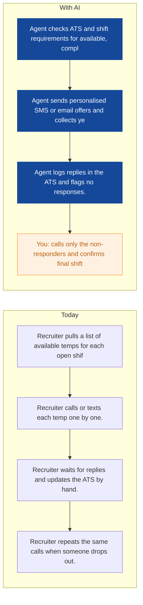
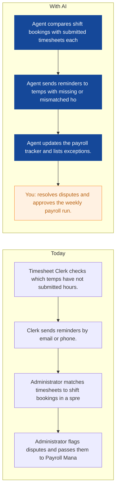
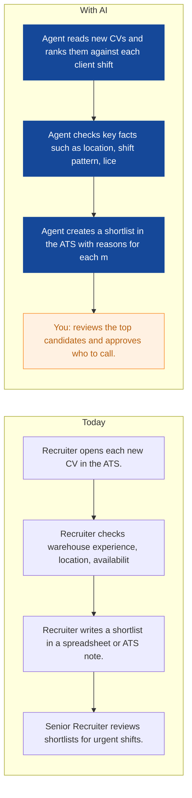
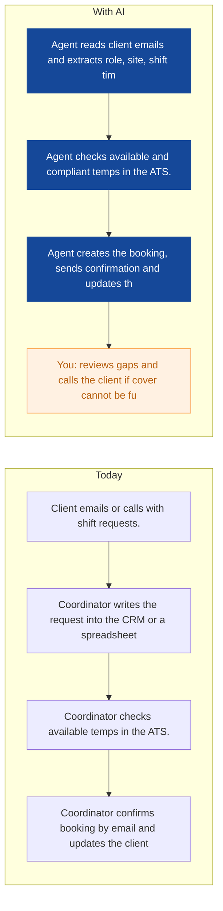
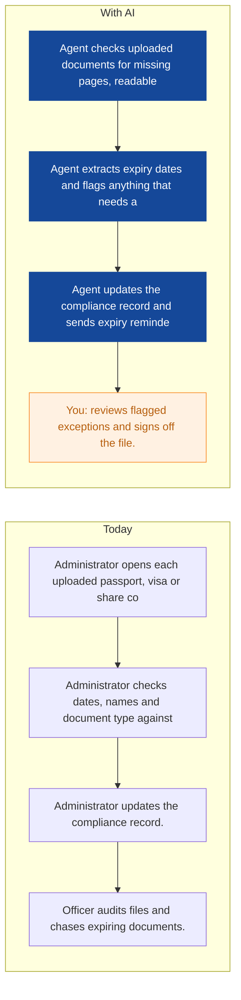
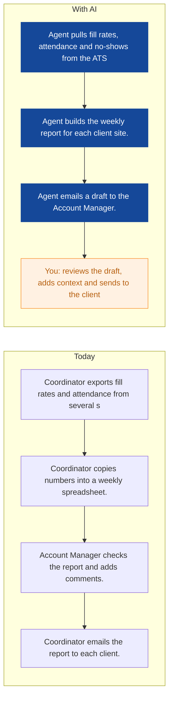
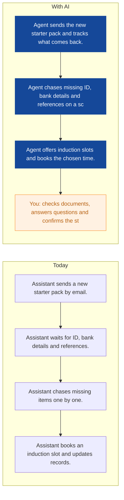
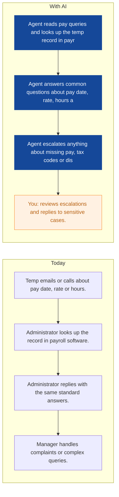
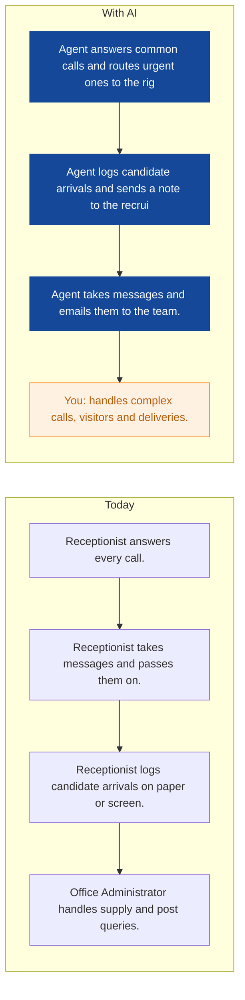

# AI Strategy for Cobalt Crew Recruitment

> **Example report for a fictional company.** Generated by [CompleteAIStrategy](https://completeaistrategy.com) with the same research, strategy and pricing rules as a real report.
> **[Open the interactive report with charts →](https://completeaistrategy.com/example/cobalt-crew-recruitment)**

| Hours saved per week | Value per year | Roles freed up | Opportunities |
|---:|---:|---:|---:|
| **84h** | **$193,200** | **2.1 FTE** | **9** |

## Summary
Cobalt Crew Recruitment places temp warehouse and logistics workers across Manchester and the North West. Your 35 person team is strong on relationships and client cover, but a lot of daily work still runs through manual checks, calls and spreadsheets. The best early wins are shift offers, timesheet chasing, candidate screening and right to work document checks. Start with agents that support your recruiters, payroll and compliance teams, and keep a human in charge of exceptions and final decisions.

## Company snapshot
- **Industry:** Staffing and Recruiting
- **What they do:** You run Cobalt Crew Recruitment, a Manchester staffing agency. You place temporary warehouse and logistics workers with client sites across the North West. Your 35 person team handles recruiting, account management, compliance and weekly payroll.
- **Customers:** Warehouse operators, logistics companies, e-commerce fulfilment centres, manufacturers, distributors and third-party logistics providers in Manchester and the North West.
- **Team size:** 11-50 (estimate 35)
- **Tools:** Applicant tracking system (ATS), Recruitment CRM, Indeed and LinkedIn job posting, Right-to-work document checking tools, Shift scheduling or rostering software, Payroll software, Microsoft 365, Time and attendance system
- **AI maturity:** 2/5, Early. You have an ATS, recruitment CRM, payroll and scheduling tools, but the handoffs between them are mostly manual. A score of 2 means the foundations are there, but agents are not yet doing repeatable work.

## Team and roles
| Department | People | Roles |
|---|---:|---|
| Recruitment | 12 | Senior Recruiter (2), Recruiter (7), Recruitment Administrator (3) |
| Account Management | 8 | Account Manager (5), Client Coordinator (2), Business Development Manager (1) |
| Compliance | 6 | Compliance Officer (2), Compliance Administrator (3), Onboarding Compliance Assistant (1) |
| Payroll | 5 | Payroll Manager (1), Payroll Administrator (3), Timesheet Clerk (1) |
| Operations and Admin | 4 | Operations Manager (1), Office Administrator (2), Receptionist (1) |

## Opportunities
| # | Opportunity | Department | Hours/week | Impact | Effort |
|---:|---|---|---:|:-:|:-:|
| 1 | Shift offers sent to available temps automatically | Recruitment | 12 | 5/5 | 2/5 |
| 2 | Timesheet chasing and shift matching | Payroll | 12 | 5/5 | 3/5 |
| 3 | Candidate screening for warehouse shifts | Recruitment | 14 | 5/5 | 3/5 |
| 4 | Client shift requests turned into confirmed bookings | Account Management | 10 | 5/5 | 4/5 |
| 5 | Right to work checks and expiry reminders | Compliance | 10 | 5/5 | 3/5 |
| 6 | Weekly client reports prepared from live data | Account Management | 7 | 4/5 | 2/5 |
| 7 | New starter pack and induction booking | Compliance | 8 | 4/5 | 3/5 |
| 8 | Common pay queries answered from payroll data | Payroll | 6 | 3/5 | 2/5 |
| 9 | Main phone triage and candidate arrival logging | Operations and Admin | 5 | 3/5 | 3/5 |

### 1. Shift offers sent to available temps automatically
An agent checks the ATS and shift requirements for available, compliant temps, then sends personalised SMS or email offers. It collects yes or no replies, logs them in the ATS and flags anyone who has not responded.

**Saves ~12h per week** · Roles: Recruiter, Recruitment Administrator, Senior Recruiter · Tools: Applicant tracking system (ATS), Recruitment CRM, SMS or WhatsApp, Microsoft 365

### 2. Timesheet chasing and shift matching
An agent compares shift bookings with submitted timesheets each morning, sends reminders to temps with missing or mismatched hours, and updates the payroll tracker. It lists exceptions for the payroll team to resolve before the weekly run.

**Saves ~12h per week** · Roles: Timesheet Clerk, Payroll Administrator, Payroll Manager · Tools: Time and attendance system, Payroll software, Applicant tracking system (ATS), Microsoft 365

### 3. Candidate screening for warehouse shifts
An agent reads new CVs and ranks them against each client shift brief, checking location, shift pattern, licence and right to work status. It creates a shortlist in the ATS with reasons for each match so recruiters can approve who to call.

**Saves ~14h per week** · Roles: Recruiter, Senior Recruiter, Recruitment Administrator · Tools: Applicant tracking system (ATS), Indeed, LinkedIn, Microsoft 365

### 4. Client shift requests turned into confirmed bookings
An agent reads client emails and extracts role, site, shift times, rates and numbers needed. It checks available and compliant temps in the ATS, creates the booking, sends confirmation and updates the CRM.

**Saves ~10h per week** · Roles: Account Manager, Client Coordinator · Tools: Recruitment CRM, Applicant tracking system (ATS), Scheduling software, Microsoft 365

### 5. Right to work checks and expiry reminders
An agent checks uploaded documents for missing pages, readable dates and key details, then extracts expiry dates and flags anything that needs a human check. It updates the compliance record and sends expiry reminders.

**Saves ~10h per week** · Roles: Compliance Administrator, Compliance Officer, Onboarding Compliance Assistant · Tools: Right to work document checking tools, Applicant tracking system (ATS), Microsoft 365

### 6. Weekly client reports prepared from live data
An agent pulls fill rates, attendance and no-shows from the ATS and time system, then builds the weekly report for each client site. It emails a draft to the Account Manager for review and context.

**Saves ~7h per week** · Roles: Client Coordinator, Account Manager · Tools: Applicant tracking system (ATS), Scheduling software, Time and attendance system, Microsoft 365

### 7. New starter pack and induction booking
An agent sends the new starter pack and tracks what comes back, then chases missing ID, bank details and references on a schedule. It offers induction slots and books the chosen time.

**Saves ~8h per week** · Roles: Onboarding Compliance Assistant, Compliance Administrator · Tools: Applicant tracking system (ATS), Microsoft 365, Scheduling software

### 8. Common pay queries answered from payroll data
An agent reads pay queries and looks up the temp record in payroll data. It answers common questions about pay date, rate, hours and deductions, then escalates anything about missing pay, tax codes or disputes.

**Saves ~6h per week** · Roles: Payroll Administrator, Payroll Manager · Tools: Payroll software, Microsoft 365, Email or helpdesk

### 9. Main phone triage and candidate arrival logging
An agent answers common calls and routes urgent ones to the right person, logs candidate arrivals and sends a note to the recruiter. It takes messages and emails them to the team.

**Saves ~5h per week** · Roles: Receptionist, Office Administrator · Tools: Phone system, Microsoft 365, Applicant tracking system (ATS)

## Roadmap
**Phase 1 (0 to 30 days): Set up the highest volume agents**
- Map the ATS, payroll, scheduling and email data you already use.
- Build the shift offer agent for SMS and email, with Recruiter approval.
- Build the timesheet chasing agent and test it on one client site.
- Agree human approval rules for compliance and payroll exceptions.

**Phase 2 (30 to 90 days): Add compliance, onboarding and client reporting**
- Launch the right to work check assistant with Compliance Officer sign off.
- Launch the new starter pack and induction booking agent.
- Launch the weekly client report agent for your top five client sites.
- Train recruiters and administrators on what the agents do and when to step in.

**Phase 3 (90 to 180 days): Extend to client requests, pay queries and phone triage**
- Connect client shift request emails to the booking agent.
- Add the common pay query agent for payroll inboxes and calls.
- Add phone triage and candidate arrival logging at reception.
- Review fill rates, payroll cut off times and query response times each month.

## Risks
- **Right to work and candidate data is sensitive. If an agent handles documents badly, you risk a data breach or compliance failure.**: Keep documents in your existing secure systems, limit agent access to the fields it needs, and have Compliance Officers approve all exceptions.
- **Automated shift offers or reminders may annoy temps if they are too frequent or poorly timed.**: Set clear send times, opt out rules and daily caps. Let temps reply in plain language.
- **A screening or matching agent could put forward the wrong candidate.**: Use agents to rank and prepare shortlists, not to make final hiring decisions. Senior Recruiters approve every candidate before a shift offer.
- **Payroll errors are costly and damage trust.**: Keep Payroll Manager sign off for every weekly run. The agent only prepares matches and flags exceptions.
- **Your systems may not connect cleanly.**: Start with email, SMS and spreadsheet outputs, then connect the ATS, payroll and scheduling tools in phases.

## KPIs
- Shift fill rate for client requests
- Average time from client shift request to confirmed cover
- Timesheets missing at weekly payroll cut off
- Right to work files complete before first shift
- Pay query first response time
- Hours saved per week from live agents

## Quote: phase 1
| Agent | Saves | Setup | Monthly |
|---|---:|---:|---:|
| Shift offers sent to available temps automatically | 12h/wk | $790 | $780 |
| Candidate screening for warehouse shifts | 14h/wk | $1,290 | $910 |
| Timesheet chasing and shift matching | 12h/wk | $1,290 | $780 |
| **Total** | **38h/wk** | **$3,370** | **$2,470** |

Setup is free when the agents run for 4 months. Full rollout of all 9 opportunities: $10,710 setup, $5,450/month.

---
Want this for your own company? **[Get your free AI strategy →](https://completeaistrategy.com)**
