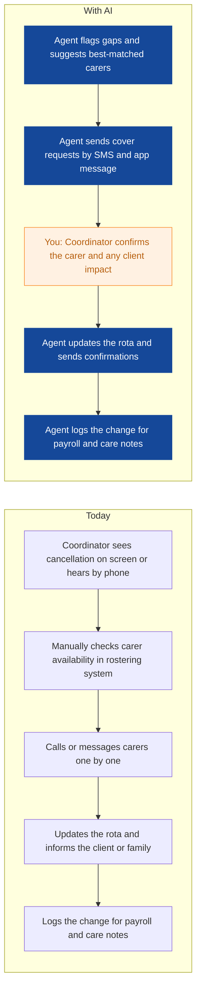
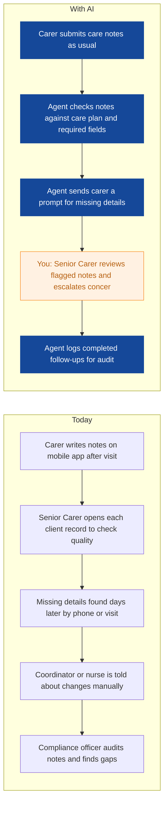
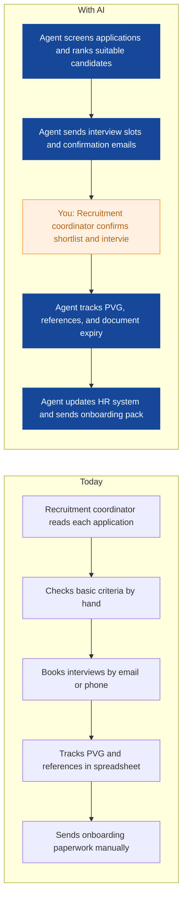
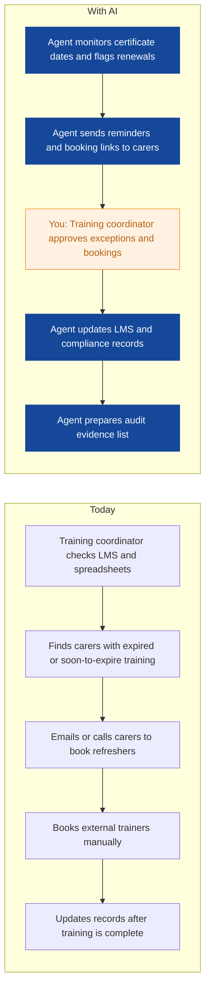
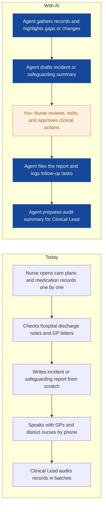
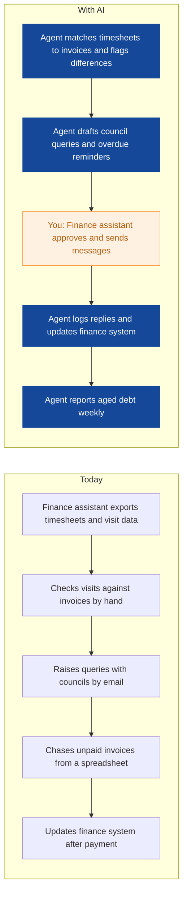
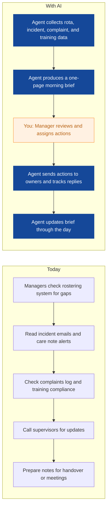
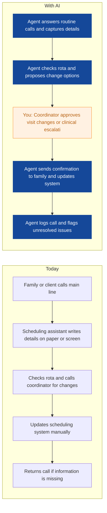

# AI Strategy for Evergreen Home Care

> **Example report for a fictional company.** Generated by [CompleteAIStrategy](https://completeaistrategy.com) with the same research, strategy and pricing rules as a real report.
> **[Open the interactive report with charts →](https://completeaistrategy.com/example/evergreen-home-care)**

| Hours saved per week | Value per year | Roles freed up | Opportunities |
|---:|---:|---:|---:|
| **144h** | **$331,200** | **3.6 FTE** | **8** |

## Our recommendation
**Start with rostering, care note quality, and carer recruitment agents; they reduce daily firefighting, improve records, and speed hiring.**

Evergreen Home Care runs visiting care across Greater Glasgow with about 210 staff, using rostering software, mobile care notes, an LMS, HR systems, and Microsoft 365 or Google Workspace. Demand for care is rising, but rota gaps, late care notes, and slow carer onboarding still pull coordinators, senior carers, and recruiters into manual admin that delays care and adds compliance risk.

1. **Rota gaps, care notes, and recruitment admin absorb the most repetitive effort.** Care Coordination spends each morning rebuilding rotas and calling carers to cover cancellations. Senior Carers then chase incomplete notes, while HR screens applications and tracks PVG and references by hand. These tasks repeat daily and are easy to measure.
2. **These three agents are high impact, low effort, and proven within weeks.** They use data already in rostering, mobile notes, and HR systems, so setup does not need new clinical decisions. They affect the largest teams and create quick proof for later nursing, compliance, and finance work.
3. **Roll out in four weeks per agent with human approval and weekly checks.** Start with one coordinator pod, one carer group, and one recruitment queue. Keep humans approving rota changes, care note escalations, and interview invitations. After eight weeks, scale what works and retire what does not.

**Phase 1 at a glance:** Last-minute carer cancellations filled faster · Care notes checked and missing details flagged · Carer applications screened and PVG tracked. About 77 hours a week back for $5,000/month (setup $3,370, free on a 4-month run).

## 1. Rota gaps, care notes, and recruitment admin absorb the most repetitive effort.
Care Coordination spends each morning rebuilding rotas and calling carers to cover cancellations. Senior Carers then chase incomplete notes, while HR screens applications and tracks PVG and references by hand. These tasks repeat daily and are easy to measure.

| Department | Hours saved / week | Share |
|---|---:|---:|
| Care Coordination | 43 | 30% |
| Care Delivery | 30 | 21% |
| HR and Recruitment | 22 | 15% |
| Training and Compliance | 15 | 10% |
| Office and Finance | 14 | 10% |
| Nursing and Clinical | 12 | 8% |
| Management | 8 | 6% |

## 2. These three agents are high impact, low effort, and proven within weeks.
They use data already in rostering, mobile notes, and HR systems, so setup does not need new clinical decisions. They affect the largest teams and create quick proof for later nursing, compliance, and finance work.

| # | Opportunity | Department | Hours/week | Impact | Effort | Phase |
|---:|---|---|---:|:-:|:-:|:-:|
| 1 | Last-minute carer cancellations filled faster | Care Coordination | 25 | 5/5 | 3/5 | 1 |
| 2 | Care notes checked and missing details flagged | Care Delivery | 30 | 4/5 | 3/5 | 1 |
| 3 | Carer applications screened and PVG tracked | HR and Recruitment | 22 | 4/5 | 2/5 | 1 |
| 4 | Mandatory training renewals chased automatically | Training and Compliance | 15 | 4/5 | 2/5 | later |
| 5 | Clinical records audits summarised for nurses | Nursing and Clinical | 12 | 4/5 | 4/5 | later |
| 6 | Council invoices and unpaid invoices chased | Office and Finance | 14 | 4/5 | 3/5 | later |
| 7 | Daily staffing risk report ready before 8am | Management | 8 | 4/5 | 3/5 | later |
| 8 | Client and family routine calls answered and logged | Care Coordination | 18 | 3/5 | 2/5 | later |

### 1. Last-minute carer cancellations filled faster (phase 1)
The agent watches the daily rota for cancellations and gaps, checks carer skills, availability, and travel time, then sends cover requests and logs replies. It updates the scheduling system once a human coordinator confirms the change.

**Saves ~25h per week** · Roles: Care Coordinator, Scheduling Assistant · Tools: Rostering and scheduling software, Mobile care notes app, SMS or messaging, Microsoft 365 or Google Workspace

### 2. Care notes checked and missing details flagged (phase 1)
The agent reviews care notes after visits, checks them against the care plan, and flags missing medication, mood, eating, or safeguarding details. Senior Carers see a short list each morning and follow up with carers.

**Saves ~30h per week** · Roles: Home Care Assistant, Senior Carer · Tools: Mobile care notes app, Rostering and scheduling software, Microsoft 365 or Google Workspace, LMS for training records

### 3. Carer applications screened and PVG tracked (phase 1)
The agent screens carer applications against role criteria, books interviews, and tracks PVG, references, and onboarding documents. It sends reminders and updates the HR system when a human confirms each step.

**Saves ~22h per week** · Roles: Recruitment Coordinator, HR Administrator · Tools: HR and payroll software, PVG and reference checking portals, Email and calendar, Microsoft 365 or Google Workspace

### 4. Mandatory training renewals chased automatically
The agent tracks training certificates and renewal dates, books refresher sessions, and reminds carers before certificates expire. It prepares a compliance view for audits.

**Saves ~15h per week** · Roles: Training Coordinator, Compliance Officer · Tools: Learning management system, HR and payroll software, Email and SMS, Microsoft 365 or Google Workspace

### 5. Clinical records audits summarised for nurses
The agent reviews medication and care plan records, drafts incident and safeguarding report summaries, and flags missing clinical information. Nurses approve or change every clinical conclusion.

**Saves ~12h per week** · Roles: Registered Nurse, Clinical Lead · Tools: Mobile care notes app, Clinical templates, Microsoft 365 or Google Workspace, Email and phone notes

### 6. Council invoices and unpaid invoices chased
The agent reconciles timesheets with invoices, prepares council invoice queries, and chases overdue private client payments. It sends draft emails for a human to approve before they go out.

**Saves ~14h per week** · Roles: Payroll and Finance Assistant, Administrator · Tools: Payroll and finance software, Council and NHS referral portals, Email, Microsoft 365 or Google Workspace

### 7. Daily staffing risk report ready before 8am
The agent pulls rota gaps, incidents, complaints, and overdue training into one morning brief. Managers get a short risk list with owners and suggested next steps.

**Saves ~8h per week** · Roles: Registered Manager, Area Supervisor, Operations Manager · Tools: Rostering and scheduling software, Mobile care notes app, Learning management system, Microsoft 365 or Google Workspace

### 8. Client and family routine calls answered and logged
The agent answers common client and family calls, logs visit changes, sends confirmations, and escalates clinical or safeguarding concerns to a human. It keeps a clean contact history in the scheduling system.

**Saves ~18h per week** · Roles: Scheduling Assistant, Care Coordinator · Tools: Phone system, Rostering and scheduling software, Contact log or CRM, Microsoft 365 or Google Workspace

## 3. Roll out in four weeks per agent with human approval and weekly checks.
Start with one coordinator pod, one carer group, and one recruitment queue. Keep humans approving rota changes, care note escalations, and interview invitations. After eight weeks, scale what works and retire what does not.

**Phase 1 (Weeks 1 to 8): Prove three agents on one coordinator pod, one carer group, and one recruitment queue**
- Set up rota gap agent with Care Coordination and confirm approval rules.
- Connect care note checking to mobile notes for one carer group.
- Pilot carer screening and PVG tracking in HR.
- Agree weekly review, data protection rules, and success measures.

**Phase 2 (Months 3 to 5): Scale what works and add training, clinical, and finance agents**
- Extend rota and care note agents to all coordinators and carer groups.
- Add training renewal and clinical audit agents with human review.
- Add invoice reconciliation and routine call agents.
- Train team leads to own each agent and its exceptions.

**Phase 3 (Months 6 to 9): Run a managed AI operations layer across departments**
- Connect agents to one reporting view for managers.
- Review accuracy, time saved, and compliance impact each month.
- Replace low-value agents and expand high-value ones.
- Keep a named human owner for every clinical, safeguarding, and HR decision.

**Risks**
- **Care notes and personal data are sensitive.**: Use role-based access, data processing agreements, audit logs, and keep client records inside approved systems.
- **Staff may not trust agent suggestions.**: Pilot with volunteers, show how to override, and measure accuracy weekly.
- **Poor integration with rostering or care notes software.**: Start with export and import or APIs where available, and keep human confirmation until stable.
- **Safeguarding or clinical issues may be missed.**: Route all clinical and safeguarding flags to a named human reviewer within one hour.
- **Agent answers may upset families.**: Limit phone agent to routine questions, use clear scripts, and transfer complex calls to a person.

**KPIs**
- Rota gaps filled within 30 minutes
- Care notes completed within 15 minutes of visit end
- Carer application to interview time in days
- Mandatory training compliance rate
- Council invoice query resolution days
- Coordinator overtime hours per week

## Investment: phase 1 costs $5,000 a month and gives back $16,671 a month in time
| Agent | Saves | Setup | Monthly |
|---|---:|---:|---:|
| Last-minute carer cancellations filled faster | 25h/wk | $1,290 | $1,620 |
| Care notes checked and missing details flagged | 30h/wk | $1,290 | $1,950 |
| Carer applications screened and PVG tracked | 22h/wk | $790 | $1,430 |
| **Total** | **77h/wk** | **$3,370** | **$5,000** |

Setup is free when the agents run for 4 months. Full rollout of all 8 opportunities: $9,420 setup, $9,350/month.

## Appendix: background
- **Industry:** Home care and social care
- **What they do:** Evergreen Home Care is a home care provider in Glasgow with about 210 employees. Your team mostly delivers visiting care to older adults in their own homes, backed by coordinators, nurses, HR and office staff. You recruit carers constantly and manage rosters, care notes, compliance training and council or NHS referrals.
- **Customers:** Older adults and their families in Glasgow, plus local councils and NHS teams that fund or refer care packages.
- **Team size:** 201-1000 (estimate 210)
- **Tools:** Care rostering and scheduling software, Mobile care notes app, Learning management system for mandatory training, HR and payroll software, Microsoft 365 or Google Workspace, PVG and reference checking portals, Council and NHS referral portals
- **AI maturity:** 2/5, Early. You have solid digital tools for rostering, care notes, training, and HR, but no visible AI in daily operations. Start with narrow agents on existing data and keep humans in the loop.

| Department | People | Roles |
|---|---:|---|
| Care Delivery | 150 | Home Care Assistant (140), Senior Carer (10) |
| Care Coordination | 18 | Care Coordinator (12), Scheduling Assistant (6) |
| Nursing and Clinical | 12 | Registered Nurse (8), Clinical Lead (4) |
| HR and Recruitment | 8 | Recruitment Coordinator (5), HR Administrator (3) |
| Training and Compliance | 6 | Training Coordinator (3), Compliance Officer (3) |
| Office and Finance | 10 | Administrator (4), Payroll and Finance Assistant (3), Data and Systems Administrator (3) |
| Management | 6 | Registered Manager (2), Operations Manager (1), Area Supervisor (3) |

---
Want this for your own company? **[Get your free AI strategy →](https://completeaistrategy.com)**
