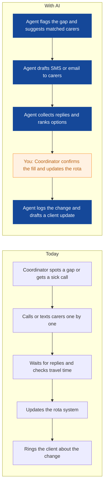
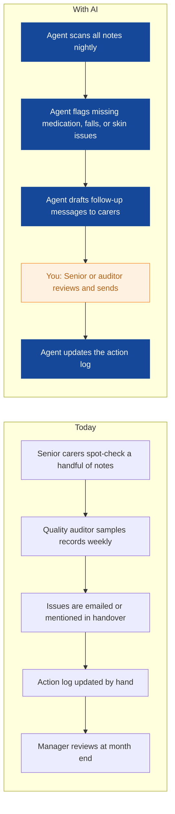
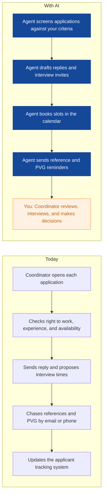
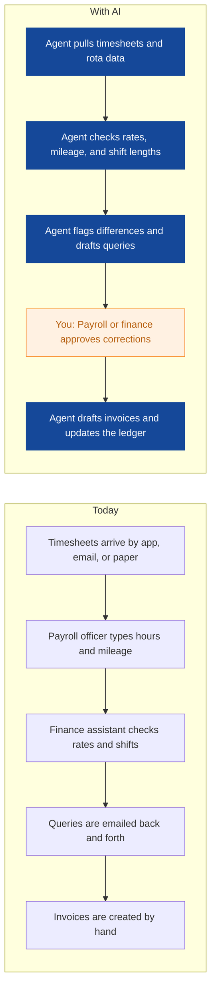
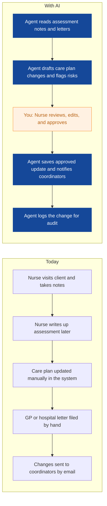
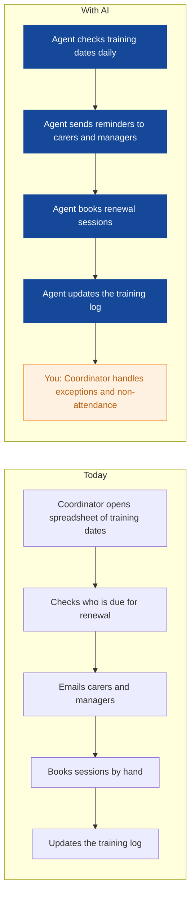
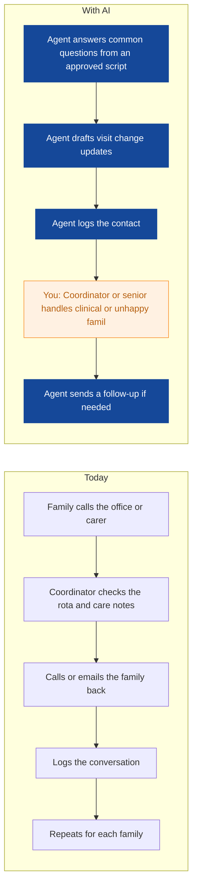
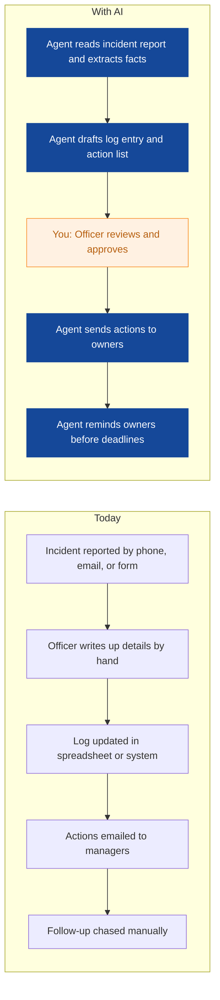
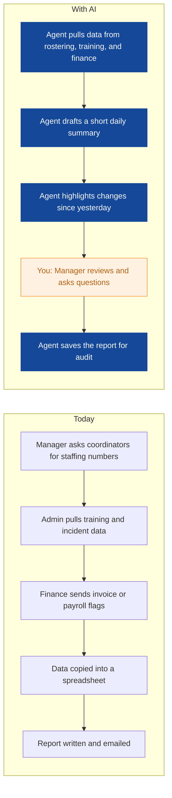

# AI Strategy for Evergreen Home Care

> **Example report for a fictional company.** Generated by [CompleteAIStrategy](https://completeaistrategy.com) with the same research, strategy and pricing rules as a real report.
> **[Open the interactive report with charts →](https://completeaistrategy.com/example/evergreen-home-care)**

| Hours saved per week | Value per year | Roles freed up | Opportunities |
|---:|---:|---:|---:|
| **325h** | **$747,500** | **8.1 FTE** | **9** |

## Summary
Evergreen Home Care runs 150 care workers across Glasgow with local authority and NHS funding, so small rota changes and record gaps quickly affect families and compliance. Your team already uses rostering software, mobile care notes, and Microsoft 365, but coordinators, seniors, and admin staff still spend hours on phone calls, spreadsheets, and chasing paperwork. The first wins are filling rota gaps faster, checking care notes, screening carer applications, and checking timesheets before payroll. Start with one or two agents in Care Coordination and Compliance, measure the hours saved, then add recruitment and finance. Keep humans approving care decisions and anything clinical.

## Company snapshot
- **Industry:** Home care and social care services
- **What they do:** Evergreen Home Care provides home care in Glasgow. You and your team send carers to elderly clients' homes for personal care, medication reminders, and daily living support. You also run nursing, scheduling, recruitment, compliance training, and office functions to keep visits covered and records up to date.
- **Customers:** Elderly people and their families in Glasgow, often funded through local authorities or the NHS.
- **Team size:** 201-1000 (estimate 210)
- **Tools:** Rostering and care management software such as Birdie, Log m, Mobile care notes apps used by carers on phones, Microsoft 365 for email, documents, and spreadsheets, Payroll software such as Sage or Xero, HR and applicant tracking systems for recruitment, Learning management system for mandatory training records, Phone and messaging tools for on-call coordination
- **AI maturity:** 2/5, Developing. You have rostering and mobile care notes in place, and Microsoft 365 is used across the office. Much of the rota, recruitment, invoice, and compliance work is still manual or spreadsheet based, so there is room to add simple agents without replacing your main systems.

## Team and roles
| Department | People | Roles |
|---|---:|---|
| Care Delivery | 150 | Care Worker (140), Senior Carer (8), Field Supervisor (2) |
| Care Coordination | 18 | Care Coordinator (10), Scheduling Administrator (5), On-call Coordinator (3) |
| Nursing and Clinical | 12 | Registered Nurse (9), Clinical Lead (2), Care Assessor (1) |
| HR and Recruitment | 9 | Recruitment Coordinator (4), HR Administrator (3), Training Coordinator (2) |
| Compliance and Training | 7 | Compliance Officer (3), Trainer (3), Quality Auditor (1) |
| Admin and Finance | 9 | Finance Assistant (4), Payroll Officer (2), Office Administrator (2), Receptionist (1) |
| Management | 5 | Registered Manager (1), Operations Manager (1), Care Manager (2), Business Administrator (1) |

## Opportunities
| # | Opportunity | Department | Hours/week | Impact | Effort |
|---:|---|---|---:|:-:|:-:|
| 1 | Rota gaps filled faster | Care Coordination | 80 | 5/5 | 3/5 |
| 2 | Care notes checked before they become problems | Compliance and Training | 35 | 4/5 | 2/5 |
| 3 | Carer applications screened and interviews booked | HR and Recruitment | 45 | 4/5 | 2/5 |
| 4 | Timesheets and invoices checked before payroll | Admin and Finance | 50 | 4/5 | 3/5 |
| 5 | Care plan updates drafted for nurses | Nursing and Clinical | 30 | 4/5 | 4/5 |
| 6 | Training certificates tracked and renewals booked | Compliance and Training | 25 | 3/5 | 2/5 |
| 7 | Family questions answered and updates sent | Care Delivery | 25 | 3/5 | 3/5 |
| 8 | Incidents and complaints logged and tracked | Compliance and Training | 20 | 3/5 | 3/5 |
| 9 | Daily management report in your inbox | Management | 15 | 3/5 | 2/5 |

### 1. Rota gaps filled faster
An agent watches your rota for gaps and cancellations. It checks carer availability, skills, and travel time, then drafts messages to the best-matched carers and proposes a fill for a coordinator to approve.

**Saves ~80h per week** · Roles: Care Coordinator, Scheduling Administrator, On-call Coordinator · Tools: Rostering and care management software, Phone and SMS, Microsoft 365, Email

### 2. Care notes checked before they become problems
An agent scans mobile care notes each evening for missing entries, medication gaps, and changes in condition. It drafts a short exception list and follow-up messages for seniors to review.

**Saves ~35h per week** · Roles: Quality Auditor, Senior Carer, Compliance Officer · Tools: Mobile care notes app, Microsoft 365, Email

### 3. Carer applications screened and interviews booked
An agent reads new carer applications, checks them against your basic criteria, and drafts replies. It books interview slots, sends reminders, and chases references and PVG checks.

**Saves ~45h per week** · Roles: Recruitment Coordinator, HR Administrator · Tools: Applicant tracking system, Microsoft 365, Email, Calendar

### 4. Timesheets and invoices checked before payroll
An agent pulls timesheets and rota data, checks pay rates, mileage, and shift lengths, and flags differences. It drafts invoices and pay queries for your team to approve.

**Saves ~50h per week** · Roles: Finance Assistant, Payroll Officer · Tools: Sage or Xero, Rostering software, Microsoft 365, Email

### 5. Care plan updates drafted for nurses
An agent reads assessment notes, medication records, and GP letters, then drafts care plan updates and highlights what changed. A nurse reviews and approves before anything is saved.

**Saves ~30h per week** · Roles: Registered Nurse, Care Assessor, Clinical Lead · Tools: Care management software, Microsoft 365, Email

### 6. Training certificates tracked and renewals booked
An agent watches mandatory training dates, sends reminders to carers, and books renewal sessions. It updates the training log and flags anyone who cannot work until training is complete.

**Saves ~25h per week** · Roles: Training Coordinator, Compliance Officer · Tools: Learning management system, Microsoft 365, Email, Calendar

### 7. Family questions answered and updates sent
An agent drafts routine updates to families about visit changes, late arrivals, or supply needs. It answers common questions by SMS or email and passes anything clinical or complex to a human.

**Saves ~25h per week** · Roles: Senior Carer, Field Supervisor, Care Coordinator · Tools: Phone and SMS, Email, Care management software, Microsoft 365

### 8. Incidents and complaints logged and tracked
An agent reads incident emails and forms, pulls out the key facts, and drafts a log entry with actions. It tracks open actions and reminds owners before deadlines.

**Saves ~20h per week** · Roles: Compliance Officer, Quality Auditor, Registered Manager · Tools: Microsoft 365, Incident system, Email

### 9. Daily management report in your inbox
An agent gathers rota gaps, incidents, training compliance, and finance flags into one short daily email. You get the numbers and a plain summary without asking three teams for updates.

**Saves ~15h per week** · Roles: Business Administrator, Operations Manager, Registered Manager · Tools: Microsoft 365, Rostering software, Learning management system, Sage or Xero

## Roadmap
**Phase 1 (Weeks 1 to 4): Rota and care notes**
- Connect rostering software, mobile care notes, and Microsoft 365
- Set up rota gap agent for Care Coordination
- Set up care note checker for Compliance and Training
- Train coordinators and senior carers on approvals
- Review hours saved and false alerts after two weeks

**Phase 2 (Weeks 5 to 12): Recruitment, training, and finance admin**
- Add carer application screening and interview booking
- Add reference and PVG chase reminders
- Add training certificate tracker and renewal booking
- Add timesheet and invoice checking agent
- Agree who approves exceptions in HR and Finance

**Phase 3 (Months 4 to 6): Clinical, family, and management reporting**
- Add care plan draft assistant for nurses
- Add family update and common question agent
- Add incident and complaint log assistant
- Add daily management report
- Review all agents with the Registered Manager and adjust scripts

## Risks
- **Data protection and client confidentiality**: Use approved systems, limit access by role, keep audit logs, and sign off with your data protection lead before launch.
- **Care quality could suffer if staff trust drafts without checking**: Keep human approval for care plans, medication, incidents, and family clinical questions. Spot-check agent output weekly.
- **Staff may not use the agents**: Start with coordinators and seniors who feel the pain, give short training, and show time saved in their own rota.
- **Integration limits with rostering or care notes software**: Check API access first. If no API, use email or spreadsheet exports and keep the first version simple.
- **Too many alerts or wrong matches**: Set clear rules, start with one team, and review false positives after two weeks before expanding.

## KPIs
- Rota gaps filled within 30 minutes (percentage)
- Care notes completed with no missing medication or personal care fields (percentage)
- Time from carer application to interview booked (days)
- Training compliance above 95 percent (percentage)
- Payroll and invoice queries resolved within 2 working days (percentage)
- Hours saved per week across live agents (number)

## Quote: phase 1
| Agent | Saves | Setup | Monthly |
|---|---:|---:|---:|
| Rota gaps filled faster | 80h/wk | $1,290 | $2,900 |
| Carer applications screened and interviews booked | 45h/wk | $790 | $2,900 |
| Care notes checked before they become problems | 35h/wk | $790 | $2,270 |
| **Total** | **160h/wk** | **$2,870** | **$8,070** |

Setup is free when the agents run for 4 months. Full rollout of all 9 opportunities: $10,210 setup, $18,430/month.

---
Want this for your own company? **[Get your free AI strategy →](https://completeaistrategy.com)**
