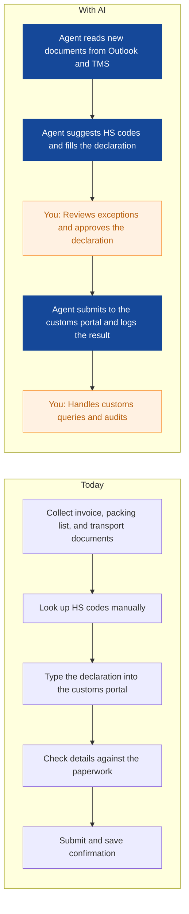
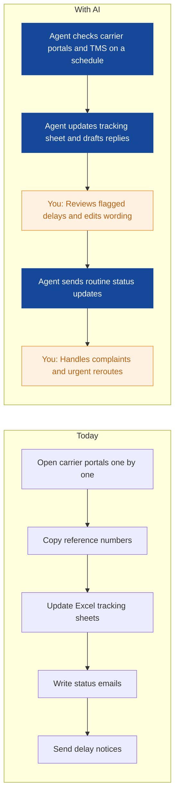
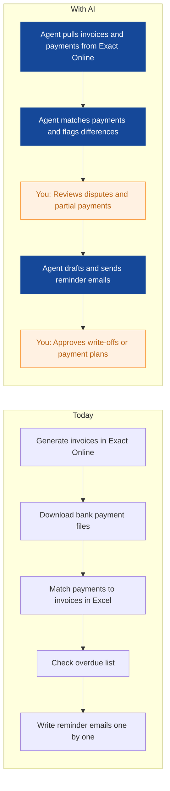
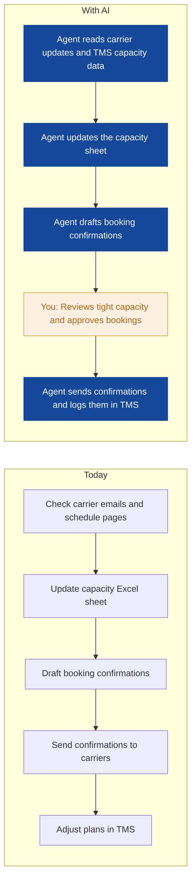
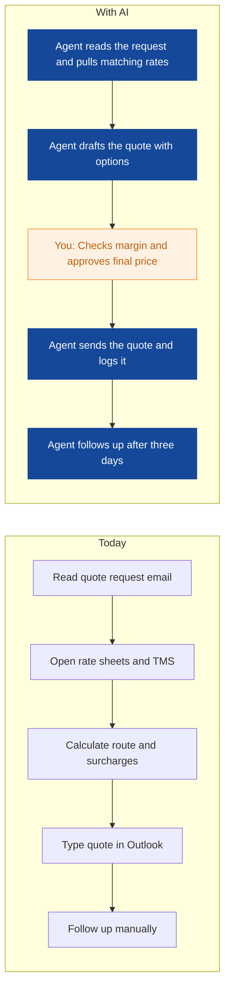
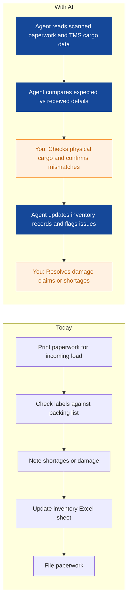
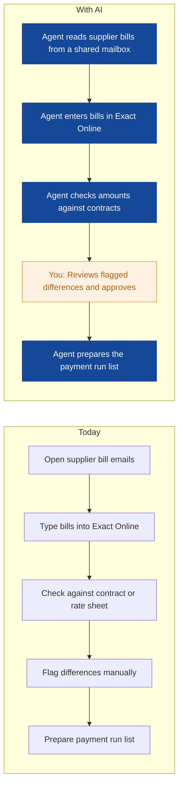
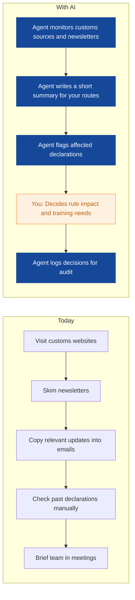

# AI Strategy for Harborline Freight

> **Example report for a fictional company.** Generated by [CompleteAIStrategy](https://completeaistrategy.com) with the same research, strategy and pricing rules as a real report.
> **[Open the interactive report with charts →](https://completeaistrategy.com/example/harborline-freight)**

| Hours saved per week | Value per year | Roles freed up | Opportunities |
|---:|---:|---:|---:|
| **86h** | **$197,800** | **2.2 FTE** | **8** |

## Summary
Harborline Freight runs on a TMS, Exact Online, Outlook, and many Excel sheets. Your 85-person team handles planning, customs, service, finance, sales, and warehouse work, and most repetitive admin still sits with people. Start with customs declarations, shipment status replies, invoice matching, and quote prep. These are high-volume, document-heavy tasks where an agent can draft, check, and follow up while your team approves exceptions. Keep warehouse automation out of phase one because the work is mostly physical.

## Company snapshot
- **Industry:** Freight forwarding and logistics
- **What they do:** Harborline Freight is a road and sea freight forwarder based in Rotterdam, Netherlands. You book container and truck transport for importers, handle customs paperwork, track shipments, and invoice clients. Your team of about 85 people runs planning, customs, customer service, finance, sales, and warehouse operations.
- **Customers:** Importers and exporters that need road and sea transport, customs clearance, and shipment visibility. Likely small to mid-sized trading companies and manufacturers shipping into and out of Europe.
- **Team size:** 51-200 (estimate 85)
- **Tools:** Microsoft Excel, Microsoft Outlook, Transportation Management System (TMS), Exact Online
- **AI maturity:** 2/5, Early. You have core systems in place, but AI use is limited to occasional manual experiments. Data lives in TMS, Exact Online, Outlook, and Excel, so agents need careful mapping before they can act.

## Team and roles
| Department | People | Roles |
|---|---:|---|
| Planning | 15 | Freight Planner (7), Route Optimizer (4), Capacity Coordinator (4) |
| Customs | 12 | Customs Declarant (8), Compliance Specialist (4) |
| Customer Service | 15 | Account Coordinator (8), Tracking Specialist (7) |
| Finance | 10 | Accounts Receivable Clerk (4), Accounts Payable Clerk (3), Billing Clerk (3) |
| Sales | 10 | Account Manager (6), Business Development Representative (4) |
| Warehouse | 23 | Warehouse Operator (12), Forklift Driver (6), Inventory Clerk (5) |

## Opportunities
| # | Opportunity | Department | Hours/week | Impact | Effort |
|---:|---|---|---:|:-:|:-:|
| 1 | Customs declarations drafted and checked before submission | Customs | 16 | 5/5 | 4/5 |
| 2 | Shipment status replies sent without manual portal checks | Customer Service | 18 | 5/5 | 3/5 |
| 3 | Invoice matching and overdue reminders handled daily | Finance | 12 | 4/5 | 3/5 |
| 4 | Capacity updates and booking confirmations prepared for planners | Planning | 10 | 4/5 | 3/5 |
| 5 | Rate quotes prepared from your own rate sheets | Sales | 9 | 4/5 | 2/5 |
| 6 | Goods checked against paperwork on arrival | Warehouse | 8 | 3/5 | 3/5 |
| 7 | Supplier bills entered and checked before payment runs | Finance | 8 | 3/5 | 3/5 |
| 8 | Customs rule changes summarized for your team | Customs | 5 | 3/5 | 2/5 |

### 1. Customs declarations drafted and checked before submission
An agent reads commercial invoices, packing lists, and transport documents, then suggests HS codes and fills the customs declaration. It flags gaps or mismatches for a declarant to review before submission.

**Saves ~16h per week** · Roles: Customs Declarant, Compliance Specialist · Tools: TMS, Outlook, Customs portal, Excel

### 2. Shipment status replies sent without manual portal checks
An agent checks carrier tracking portals and the TMS for each active shipment, then drafts status replies and delay notices. Your team reviews unusual cases and sends the final message.

**Saves ~18h per week** · Roles: Account Coordinator, Tracking Specialist · Tools: TMS, Carrier portals, Outlook, Excel

### 3. Invoice matching and overdue reminders handled daily
An agent pulls invoices from Exact Online, matches incoming payments, and drafts polite overdue reminders. It lists partial payments and disputes for a clerk to resolve.

**Saves ~12h per week** · Roles: Accounts Receivable Clerk, Billing Clerk · Tools: Exact Online, Outlook, Excel

### 4. Capacity updates and booking confirmations prepared for planners
An agent tracks available truck and container space from carrier updates and the TMS, then prepares booking confirmations and updates the capacity sheet. Planners step in when capacity is tight or a booking needs a decision.

**Saves ~10h per week** · Roles: Capacity Coordinator, Freight Planner · Tools: TMS, Outlook, Excel, Carrier portals

### 5. Rate quotes prepared from your own rate sheets
An agent reads a quote request, finds the right rates in your Excel rate sheets and TMS, and drafts a quote in Outlook. Account managers set final prices and approve discounts.

**Saves ~9h per week** · Roles: Account Manager, Business Development Representative · Tools: Outlook, Excel, TMS

### 6. Goods checked against paperwork on arrival
An agent compares scanned packing lists and labels against expected cargo data, then updates inventory records and flags short or damaged shipments. Warehouse staff still handle physical checks and put-away.

**Saves ~8h per week** · Roles: Inventory Clerk, Warehouse Operator · Tools: Excel, TMS, Outlook, Scanner exports

### 7. Supplier bills entered and checked before payment runs
An agent reads supplier bills from Outlook, enters them in Exact Online, and checks amounts against contracts or rate agreements. A clerk approves the payment run and handles price disputes.

**Saves ~8h per week** · Roles: Accounts Payable Clerk · Tools: Exact Online, Outlook, Excel

### 8. Customs rule changes summarized for your team
An agent watches official customs sites and newsletters, summarizes changes that affect your routes and products, and flags declarations that may need a second look. Compliance staff decide what to change.

**Saves ~5h per week** · Roles: Compliance Specialist, Customs Declarant · Tools: Outlook, Customs websites, Excel

## Roadmap
**Phase 1 (Weeks 1 to 4): Pick two safe wins and set the rules**
- Connect agents to Outlook and Excel only, no automatic sends.
- Start with shipment status drafts and customs document pre-fill.
- Write clear rules for when a human must approve.
- Train one owner per department.
- Review output daily for two weeks.

**Phase 2 (Weeks 5 to 12): Add finance and planning agents**
- Connect Exact Online for invoice matching and supplier bills.
- Connect TMS read access for planning capacity updates.
- Run quote prep for two account managers.
- Set exception queues for disputes, delays, and customs checks.
- Measure hours saved and error rates weekly.

**Phase 3 (Weeks 13 to 24): Scale what works and stop what does not**
- Expand customs and service agents to all teams.
- Add warehouse paperwork check for one inbound dock.
- Review every agent monthly against KPIs.
- Remove agents that create more checks than they save.
- Train new staff on human review steps.

## Risks
- **Bad customs or HS code suggestions could cause delays or fines.**: Keep a declarant approval on every declaration and sample audit 10 percent of agent drafts each week.
- **Clients may notice automated replies and lose trust.**: Use your own tone, sign with a named coordinator, and review delay messages before sending for the first month.
- **Excel and TMS data may be messy, so agents give wrong answers.**: Clean the rate sheets and key TMS fields before each rollout, and give agents read-only access at first.
- **Staff may avoid the agents or use them in the wrong way.**: Name a department owner, run short training, and track usage and exception rates in weekly meetings.
- **Over-automation could hide problems until they get large.**: Set approval limits and exception queues, and review agent logs every week for missed items.

## KPIs
- Average time to answer a shipment status email
- Customs declarations submitted with no correction
- Overdue invoices older than 30 days as a share of total
- Quote turnaround time from request to sent quote
- Agent drafts approved without change
- Hours saved per week across live agents

## Quote: phase 1
| Agent | Saves | Setup | Monthly |
|---|---:|---:|---:|
| Shipment status replies sent without manual portal checks | 18h/wk | $1,290 | $1,170 |
| Customs declarations drafted and checked before submission | 16h/wk | $1,890 | $1,040 |
| Rate quotes prepared from your own rate sheets | 9h/wk | $790 | $580 |
| **Total** | **43h/wk** | **$3,970** | **$2,790** |

Setup is free when the agents run for 4 months. Full rollout of all 8 opportunities: $9,920 setup, $5,580/month.

---
Want this for your own company? **[Get your free AI strategy →](https://completeaistrategy.com)**
