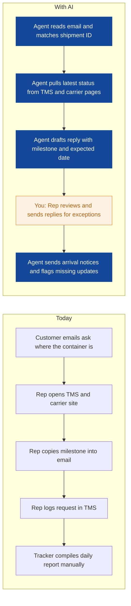
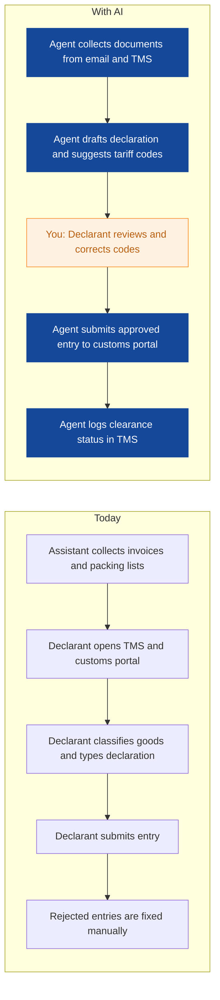
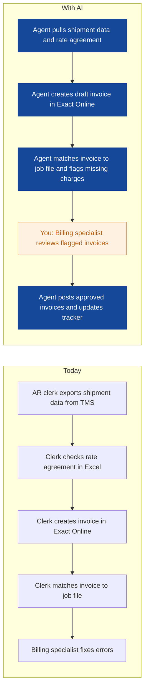
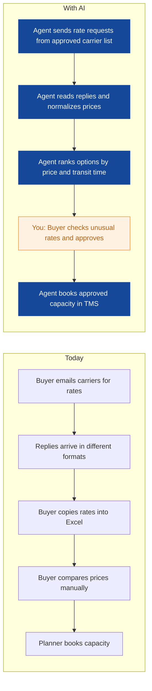
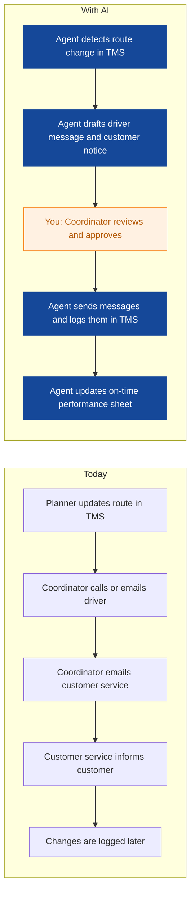
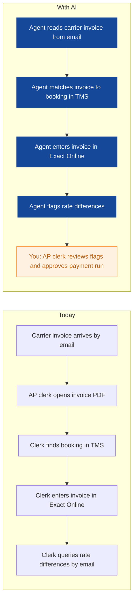
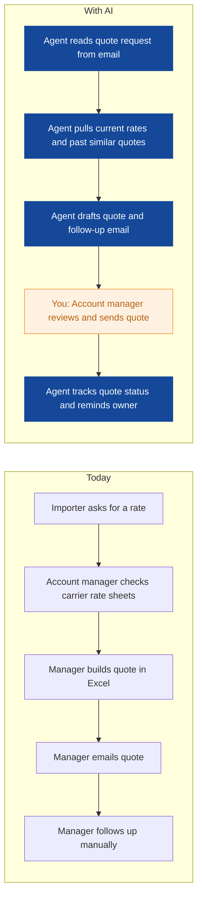
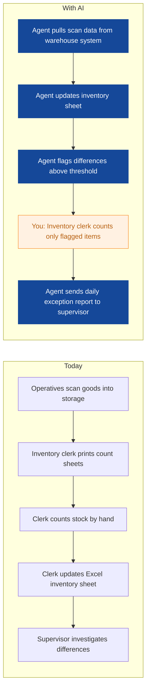
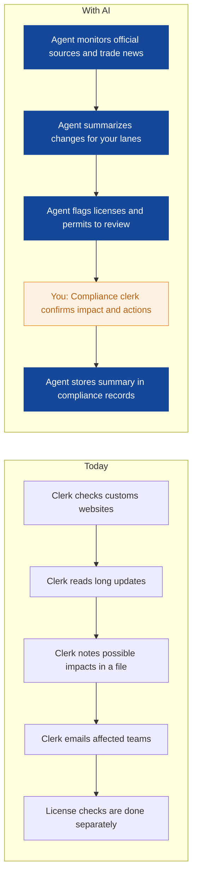

# AI Strategy for Harborline Freight

> **Example report for a fictional company.** Generated by [CompleteAIStrategy](https://completeaistrategy.com) with the same research, strategy and pricing rules as a real report.
> **[Open the interactive report with charts →](https://completeaistrategy.com/example/harborline-freight)**

| Hours saved per week | Value per year | Roles freed up | Opportunities |
|---:|---:|---:|---:|
| **179h** | **$411,700** | **4.5 FTE** | **9** |

## Our recommendation
**Start with a shipment status agent, a customs declaration assistant, and an invoice matching agent to cut repetitive admin, speed customer answers, and free your team for exceptions.**

Harborline Freight runs road and sea freight forwarding from Rotterdam with about 85 staff across planning, customs, customer service, finance, sales, and warehouse. Most daily work runs through Outlook, Excel, a TMS, and Exact Online. Bookings, customs paperwork, shipment tracking, and billing still depend on people copying data between email, spreadsheets, and the TMS. As volumes rise, delays and errors show up in customer updates, declarations, and invoices.

1. **Planning, customs, customer service, and finance carry most of the repetitive admin** Shipment status questions, declaration preparation, and invoice matching repeat every day across four departments. These tasks follow clear rules and pull from systems you already use. They are also where small delays create customer complaints and billing disputes.
2. **Shipment status, customs drafts, and invoice matching give fast proof with low effort** Each of these three agents connects to Outlook and the TMS without replacing your core systems. Customs and invoice work keep a human approval step, so risk stays controlled. Customer service sees faster answers within weeks, which builds support for wider use.
3. **Start with human review, then expand to planning, sales, warehouse, and compliance** Run the first three agents with a named owner in each department and a daily review of outputs. Fix data gaps in the TMS before adding more connections. Once error rates and time savings hold, add planning, sales, carrier invoice, warehouse, and compliance agents in the same way.

**Phase 1 at a glance:** Shipment status questions answered automatically · Customs declarations prepared before review · Client invoices matched and prepared automatically. About 86 hours a week back for $5,590/month (setup $3,370, free on a 4-month run).

## 1. Planning, customs, customer service, and finance carry most of the repetitive admin
Shipment status questions, declaration preparation, and invoice matching repeat every day across four departments. These tasks follow clear rules and pull from systems you already use. They are also where small delays create customer complaints and billing disputes.

| Department | Hours saved / week | Share |
|---|---:|---:|
| Finance | 44 | 25% |
| Customs | 40 | 22% |
| Planning | 34 | 19% |
| Customer Service | 32 | 18% |
| Sales | 15 | 8% |
| Warehouse | 14 | 8% |

## 2. Shipment status, customs drafts, and invoice matching give fast proof with low effort
Each of these three agents connects to Outlook and the TMS without replacing your core systems. Customs and invoice work keep a human approval step, so risk stays controlled. Customer service sees faster answers within weeks, which builds support for wider use.

| # | Opportunity | Department | Hours/week | Impact | Effort | Phase |
|---:|---|---|---:|:-:|:-:|:-:|
| 1 | Shipment status questions answered automatically | Customer Service | 32 | 5/5 | 2/5 | 1 |
| 2 | Customs declarations prepared before review | Customs | 30 | 5/5 | 3/5 | 1 |
| 3 | Client invoices matched and prepared automatically | Finance | 24 | 4/5 | 3/5 | 1 |
| 4 | Capacity requests and rate comparisons handled faster | Planning | 18 | 4/5 | 3/5 | later |
| 5 | Route change messages sent to drivers and customers | Planning | 16 | 3/5 | 2/5 | later |
| 6 | Carrier invoices checked against bookings | Finance | 20 | 4/5 | 3/5 | later |
| 7 | Rate quotes for importers drafted in minutes | Sales | 15 | 4/5 | 2/5 | later |
| 8 | Warehouse inventory counts updated without paper | Warehouse | 14 | 3/5 | 4/5 | later |
| 9 | Customs rule changes summarized for compliance | Customs | 10 | 3/5 | 2/5 | later |

### 1. Shipment status questions answered automatically (phase 1)
The agent reads shipment status emails, checks the TMS and carrier tracking pages, and drafts a reply with the latest milestone. It also sends daily arrival notices and flags shipments with no update for more than 24 hours.

**Saves ~32h per week** · Roles: Customer Service Rep, Shipment Tracker · Tools: Outlook, TMS, Carrier tracking portals

### 2. Customs declarations prepared before review (phase 1)
The agent collects invoices and packing lists from email, pulls shipment details from the TMS, and prepares a draft import declaration with suggested tariff codes. It checks the draft against past entries and submits only after a declarant approves.

**Saves ~30h per week** · Roles: Customs Declarant, Customs Assistant · Tools: Outlook, TMS, Customs portal, Excel

### 3. Client invoices matched and prepared automatically (phase 1)
The agent builds draft client invoices from TMS shipment data and rate agreements, then matches each invoice to the job file. It checks for missing charges and routes only unclear cases to billing staff.

**Saves ~24h per week** · Roles: Accounts Receivable Clerk, Billing Specialist · Tools: TMS, Exact Online, Excel, Outlook

### 4. Capacity requests and rate comparisons handled faster
The agent sends rate requests to regular carriers, collects replies, and puts truck and container prices into a comparison sheet. Planners see the best options first and approve bookings.

**Saves ~18h per week** · Roles: Capacity Buyer, Freight Planner · Tools: Outlook, Excel, TMS

### 5. Route change messages sent to drivers and customers
The agent watches the TMS for route changes and delay flags, then drafts driver instructions and customer delay notices. Coordinators approve messages before they go out.

**Saves ~16h per week** · Roles: Route Coordinator, Freight Planner · Tools: TMS, Outlook, Excel

### 6. Carrier invoices checked against bookings
The agent enters carrier invoices from email or PDF into Exact Online and matches them to the original booking. It flags rate differences for the AP clerk to review before payment.

**Saves ~20h per week** · Roles: Accounts Payable Clerk · Tools: Outlook, TMS, Exact Online

### 7. Rate quotes for importers drafted in minutes
The agent gathers current road and sea rates from approved carrier lists and past quotes, then drafts a quote for the account manager to review. It also prepares follow-up emails for open quotes.

**Saves ~15h per week** · Roles: Account Manager, Sales Rep · Tools: Outlook, Excel, TMS

### 8. Warehouse inventory counts updated without paper
The agent takes scanned goods data and updates inventory sheets, then flags count differences for the inventory clerk. Supervisors get a daily exception list instead of full manual counts.

**Saves ~14h per week** · Roles: Inventory Clerk, Warehouse Supervisor · Tools: Warehouse scanner system, Excel, Outlook

### 9. Customs rule changes summarized for compliance
The agent monitors official customs and permit sources for changes that affect Harborline's lanes and goods. It drafts a short weekly summary and flags licenses that need review.

**Saves ~10h per week** · Roles: Compliance Clerk · Tools: Web sources, Outlook, Excel

## 3. Start with human review, then expand to planning, sales, warehouse, and compliance
Run the first three agents with a named owner in each department and a daily review of outputs. Fix data gaps in the TMS before adding more connections. Once error rates and time savings hold, add planning, sales, carrier invoice, warehouse, and compliance agents in the same way.

**Phase 1 (Weeks 1-6): Prove three agents on everyday admin**
- Map shipment status emails, customs documents, and invoice data to TMS fields
- Build the shipment status agent with a customer service review step
- Build the customs declaration draft agent with declarant approval
- Build the invoice matching agent with billing specialist review
- Track time saved, reply speed, and error rates each week

**Phase 2 (Weeks 7-14): Connect planning, sales, and carrier invoice work**
- Add capacity request and rate comparison agent for planning
- Add route change message agent for drivers and customers
- Add carrier invoice matching agent for accounts payable
- Add rate quote drafting agent for sales
- Review results with department owners before moving on

**Phase 3 (Weeks 15-24): Extend to warehouse and compliance, then scale what works**
- Add inventory update agent for warehouse scan data
- Add customs rule summary agent for compliance
- Tune first three agents based on six months of use
- Set a monthly review of accuracy, time saved, and staff feedback
- Decide which agents to expand to more teams or lanes

**Risks**
- **Bad TMS data leads to wrong customer replies or invoices**: Start with human review, add confidence flags, and clean key fields before each agent goes live.
- **Customs mistakes create fines or delayed clearance**: Keep declarant approval before submission, limit tariff suggestions, and store an audit log of every draft.
- **Staff worry that agents will replace their jobs**: Explain that agents handle repetitive steps, train people for exception handling, and share time saved with the team.
- **Carrier portals change or block automated access**: Use email and TMS data first, add portal access only where allowed, and keep manual fallback steps documented.
- **Invoice errors hurt cash flow or client trust**: Run sample checks for the first month, set approval thresholds, and review a weekly reconciliation report.

**KPIs**
- Share of shipment status emails answered within 2 hours
- Customs declarations submitted without rejection
- Invoice matching accuracy and days from shipment to invoice
- Hours saved per week by team
- Quote response time for importer requests
- On-time customer update rate for delayed shipments

## Investment: phase 1 costs $5,590 a month and gives back $18,619 a month in time
| Agent | Saves | Setup | Monthly |
|---|---:|---:|---:|
| Shipment status questions answered automatically | 32h/wk | $790 | $2,080 |
| Customs declarations prepared before review | 30h/wk | $1,290 | $1,950 |
| Client invoices matched and prepared automatically | 24h/wk | $1,290 | $1,560 |
| **Total** | **86h/wk** | **$3,370** | **$5,590** |

Setup is free when the agents run for 4 months. Full rollout of all 9 opportunities: $10,210 setup, $11,630/month.

## Appendix: background
- **Industry:** Freight forwarding and logistics
- **What they do:** Harborline Freight is a road and sea freight forwarder based in Rotterdam, Netherlands. You and your team book container and truck transport for importers, handle customs paperwork, track shipments, and invoice clients. The company has about 85 employees across planning, customs, customer service, finance, sales, and warehouse.
- **Customers:** Importers that need container and truck transport into and through the Netherlands and Europe.
- **Team size:** 51-200 (estimate 85)
- **Tools:** Microsoft Excel, Microsoft Outlook, Transportation Management System (TMS), Exact Online
- **AI maturity:** 2/5, Early piloting. You have core systems and practical Excel skills, but most repetitive work is still manual. A focused first wave of three agents can prove value before a wider rollout.

| Department | People | Roles |
|---|---:|---|
| Planning | 18 | Freight Planner (8), Route Coordinator (6), Capacity Buyer (4) |
| Customs | 12 | Customs Declarant (7), Customs Assistant (3), Compliance Clerk (2) |
| Customer Service | 15 | Customer Service Rep (10), Shipment Tracker (3), Claims Handler (2) |
| Finance | 10 | Accounts Receivable Clerk (4), Accounts Payable Clerk (3), Billing Specialist (2), Finance Manager (1) |
| Sales | 8 | Account Manager (4), Sales Rep (3), Bid Coordinator (1) |
| Warehouse | 22 | Warehouse Operative (12), Forklift Driver (6), Warehouse Supervisor (2), Inventory Clerk (2) |

---
Want this for your own company? **[Get your free AI strategy →](https://completeaistrategy.com)**
