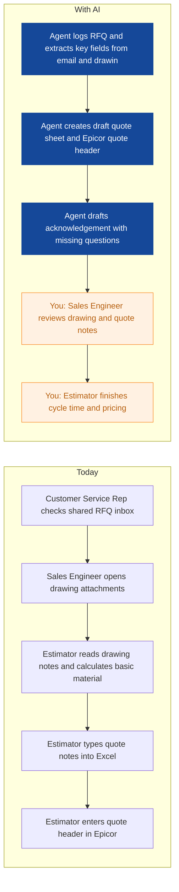
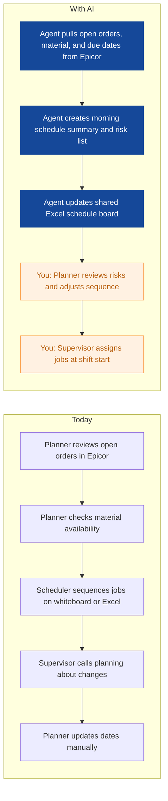
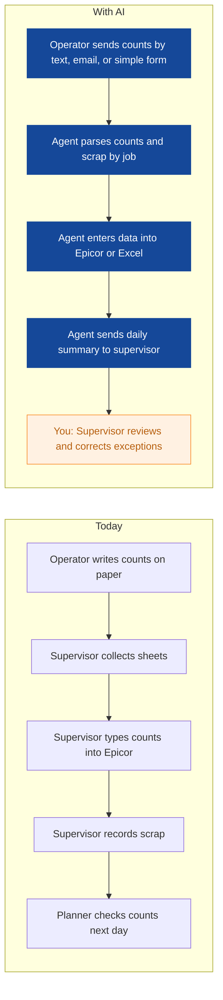
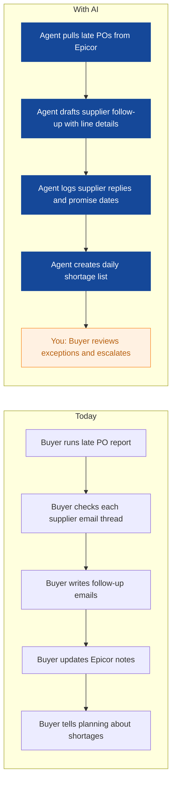
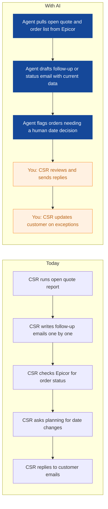
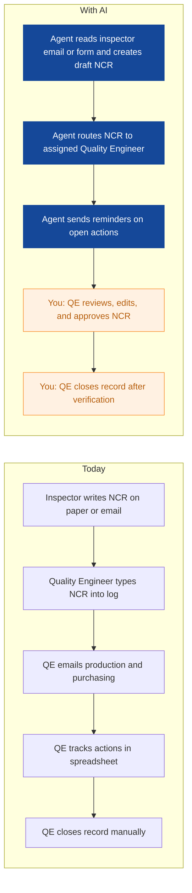
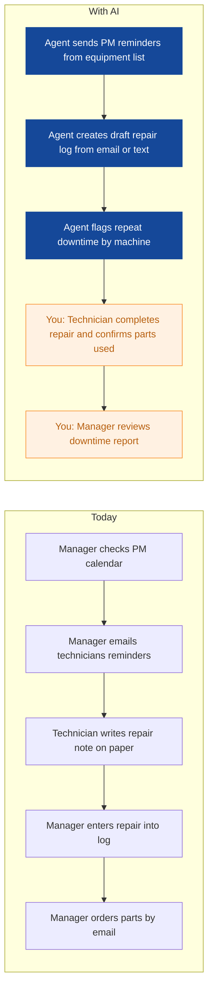
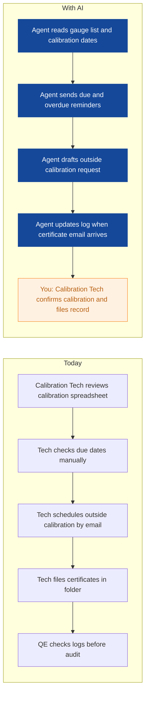

# AI Strategy for Ironleaf Manufacturing

> **Example report for a fictional company.** Generated by [CompleteAIStrategy](https://completeaistrategy.com) with the same research, strategy and pricing rules as a real report.
> **[Open the interactive report with charts →](https://completeaistrategy.com/example/ironleaf-manufacturing)**

| Hours saved per week | Value per year | Roles freed up | Opportunities |
|---:|---:|---:|---:|
| **84h** | **$193,200** | **2.1 FTE** | **9** |

## Summary
Ironleaf Manufacturing runs custom metal parts work through Epicor, email RFQ intake, CAD drawings, and Excel quoting. Your team already has strong ERP and shop floor habits, but too much RFQ, scheduling, quality, purchasing, and finance work is still manual and scattered across inboxes and spreadsheets. The practical path is to add AI agents that read emails, extract drawing and PO details, draft updates, and log data into Epicor and Excel, with your people reviewing anything customer-facing or production-critical. Start with RFQ intake and daily scheduling because they touch the most revenue and capacity decisions. Keep the scope tight: assistants that prepare work, not systems that make final decisions.

## Company snapshot
- **Industry:** Metal parts manufacturing
- **What they do:** You run a metal parts manufacturing company in Ohio, USA. Your team does CNC machining and sheet metal work for customers who send drawings and RFQs, and you quote custom parts. About 160 employees handle production, quality, purchasing, sales engineering, planning and finance.
- **Customers:** Industrial OEMs and equipment makers that need custom metal parts, mostly in Ohio and nearby states.
- **Team size:** 51-200 (estimate 160)
- **Tools:** Epicor ERP, Email based RFQ intake, CAD software for drawings, CAM software for CNC programming, CNC controls such as Fanuc or Haas, Microsoft 365 or Outlook, Excel for quoting and planning, Calipers, micrometers, and CMM for inspection
- **AI maturity:** 2/5, Early. You have Epicor, Outlook, Excel, and CAD/CAM in daily use, but AI is not part of regular work. Most automation is manual entry or basic ERP transactions, with no agents reading email, drawings, or supplier messages.

## Team and roles
| Department | People | Roles |
|---|---:|---|
| Production | 94 | CNC Machinist (45), Sheet Metal Operator (24), Setup Technician (15), Production Supervisor (10) |
| Quality | 18 | Quality Inspector (10), Quality Engineer (5), Calibration Technician (3) |
| Purchasing | 10 | Buyer (6), Receiving Clerk (3), Purchasing Manager (1) |
| Sales Engineering | 15 | Sales Engineer (6), Estimator (6), Customer Service Rep (3) |
| Planning and Scheduling | 8 | Production Planner (4), Scheduler (3), Planning Manager (1) |
| Finance | 7 | Staff Accountant (3), Accounts Payable and Receivable (3), Controller (1) |
| Maintenance and Facilities | 8 | Maintenance Technician (5), Facilities Technician (2), Maintenance Manager (1) |

## Opportunities
| # | Opportunity | Department | Hours/week | Impact | Effort |
|---:|---|---|---:|:-:|:-:|
| 1 | RFQ intake and quote prep | Sales Engineering | 18 | 5/5 | 3/5 |
| 2 | Daily schedule and late job alerts | Planning and Scheduling | 10 | 5/5 | 3/5 |
| 3 | Production count and scrap entry | Production | 12 | 4/5 | 3/5 |
| 4 | Invoice matching and AP exceptions | Finance | 10 | 4/5 | 3/5 |
| 5 | Supplier PO follow-up and expediting | Purchasing | 9 | 4/5 | 2/5 |
| 6 | Quote follow-ups and order status answers | Sales Engineering | 8 | 4/5 | 2/5 |
| 7 | Nonconformance and corrective action logging | Quality | 7 | 4/5 | 2/5 |
| 8 | Preventive maintenance reminders and repair logs | Maintenance and Facilities | 6 | 3/5 | 2/5 |
| 9 | Calibration due date tracking | Quality | 4 | 3/5 | 1/5 |

### 1. RFQ intake and quote prep
An agent watches your RFQ inbox, opens attachments, extracts part numbers, quantities, material, and due dates, then creates a draft quote record in Epicor and a quote prep sheet in Excel. It also drafts an acknowledgement email that asks for missing drawing details.

**Saves ~18h per week** · Roles: Sales Engineer, Estimator, Customer Service Rep · Tools: Outlook, Epicor, Excel, CAD

### 2. Daily schedule and late job alerts
An agent reviews open work orders and material availability in Epicor each morning, builds a short schedule summary, and flags jobs at risk of missing a date. It emails the summary to supervisors and updates a shared Excel schedule board.

**Saves ~10h per week** · Roles: Production Planner, Scheduler, Production Supervisor · Tools: Epicor, Excel, Outlook

### 3. Production count and scrap entry
An agent reads end-of-shift count sheets, texts, or emails from operators and enters production counts and scrap into Epicor or Excel. Supervisors get a clean daily summary instead of chasing paper.

**Saves ~12h per week** · Roles: CNC Machinist, Sheet Metal Operator, Production Supervisor · Tools: Epicor, Excel, Outlook

### 4. Invoice matching and AP exceptions
An agent matches vendor invoices to purchase orders and receipts in Epicor, flags price or quantity mismatches, and drafts vendor questions. It prepares an exception list so AP can focus on real problems.

**Saves ~10h per week** · Roles: Accounts Payable and Receivable, Staff Accountant, Controller · Tools: Epicor, Outlook, Excel

### 5. Supplier PO follow-up and expediting
An agent monitors late purchase orders in Epicor, drafts supplier follow-up emails with PO line details, and logs replies and new promise dates. It gives buyers a daily exception list instead of a full open PO report.

**Saves ~9h per week** · Roles: Buyer, Purchasing Manager · Tools: Epicor, Outlook, Excel

### 6. Quote follow-ups and order status answers
An agent tracks open quotes and orders in Epicor, sends polite follow-up emails on a set cadence, and drafts status replies using current work order and shipment data. Your team approves anything that changes a promise date.

**Saves ~8h per week** · Roles: Customer Service Rep, Sales Engineer · Tools: Outlook, Epicor

### 7. Nonconformance and corrective action logging
An agent turns inspector notes, photos, and email into draft nonconformance records in Epicor or Excel, routes them to the right quality engineer, and tracks corrective action due dates. It sends reminders and updates the log when steps close.

**Saves ~7h per week** · Roles: Quality Inspector, Quality Engineer · Tools: Outlook, Epicor, Excel

### 8. Preventive maintenance reminders and repair logs
An agent tracks preventive maintenance dates for CNC and sheet metal equipment, sends reminders to technicians, and turns repair emails into draft work logs. It keeps a simple downtime and parts list updated.

**Saves ~6h per week** · Roles: Maintenance Technician, Maintenance Manager, Facilities Technician · Tools: Outlook, Excel, Epicor

### 9. Calibration due date tracking
An agent tracks gauge and calibration due dates, sends reminders before expiry, and updates the calibration log when certificates arrive. It helps you avoid finding an overdue gauge during an audit.

**Saves ~4h per week** · Roles: Calibration Technician, Quality Engineer · Tools: Excel, Outlook

## Roadmap
**Phase 1 (Weeks 1 to 4): Fix the revenue and schedule front door**
- Connect agent to shared RFQ inbox and extract fields into Excel draft
- Build quote prep template and Epicor quote header draft
- Set up daily schedule summary from Epicor open work orders
- Train Sales Engineering and Planning on review steps
- Measure baseline quote response time and schedule update time

**Phase 2 (Months 2 to 3): Add quality, purchasing, and production data agents**
- Launch NCR logging and corrective action reminders
- Launch late PO follow-up and supplier promise tracking
- Launch production count and scrap entry from shift messages
- Keep human approval on all customer and supplier messages
- Review error rates weekly and adjust rules

**Phase 3 (Months 4 to 6): Extend to finance and maintenance**
- Launch invoice matching exception list with AP review
- Launch PM reminders and repair log drafts
- Launch calibration due date tracking
- Create monthly savings and quality dashboard
- Decide what to expand based on measured hours saved

## Risks
- **Agents read the wrong field from a drawing or email and draft a bad quote.**: Keep estimator approval before any quote goes out. Start with extraction only and compare against manual review for the first 4 weeks.
- **Epicor integration is harder than expected, causing delays.**: Start with Outlook, Excel, and CSV imports. Add direct Epicor writes only after the workflow is proven.
- **Supervisors and operators do not trust automated counts or logs.**: Use a simple review screen and daily exception report. Let supervisors correct entries before they affect planning.
- **Customer or supplier receives an automated message with wrong tone or data.**: Use draft-only mode for all external emails. A named person sends every message until error rate is low.
- **Data quality in Epicor, BOMs, or calibration list limits agent accuracy.**: Clean the top 20 used records first. Assign one owner per data set and review monthly.

## KPIs
- Average RFQ response time from receipt to quote sent
- Number of quotes sent per week
- Hours saved per week across live agents
- On-time supplier PO follow-ups and shortage escalations
- NCR and corrective action closure time
- Invoice exception rate and AP days to resolve

## Quote: phase 1
| Agent | Saves | Setup | Monthly |
|---|---:|---:|---:|
| RFQ intake and quote prep | 18h/wk | $1,290 | $1,170 |
| Supplier PO follow-up and expediting | 9h/wk | $790 | $580 |
| Daily schedule and late job alerts | 10h/wk | $1,290 | $650 |
| **Total** | **37h/wk** | **$3,370** | **$2,400** |

Setup is free when the agents run for 4 months. Full rollout of all 9 opportunities: $8,810 setup, $5,480/month.

---
Want this for your own company? **[Get your free AI strategy →](https://completeaistrategy.com)**
