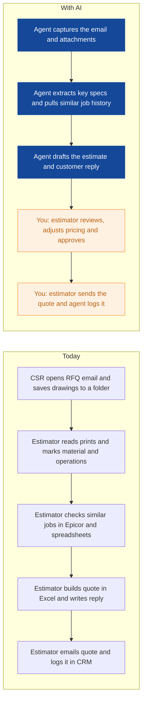
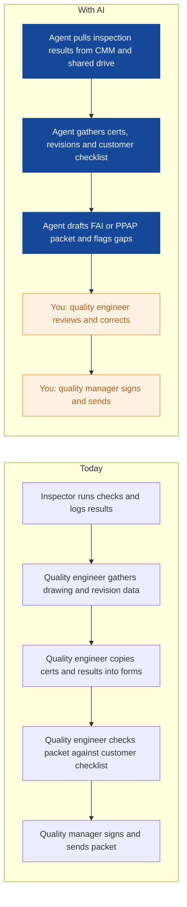
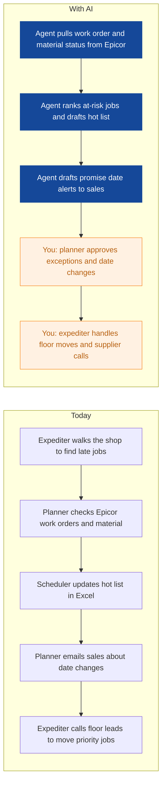
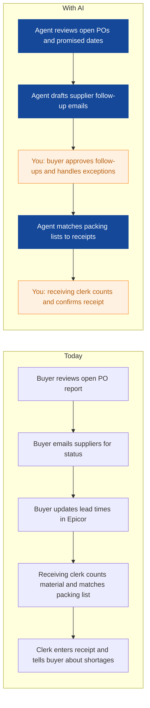
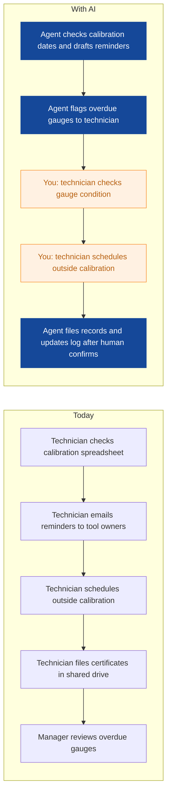
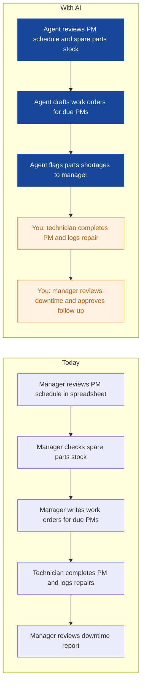
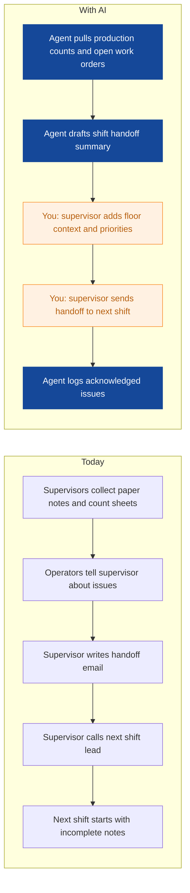
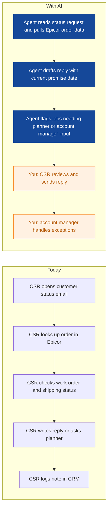

# AI Strategy for Ironleaf Manufacturing

> **Example report for a fictional company.** Generated by [CompleteAIStrategy](https://completeaistrategy.com) with the same research, strategy and pricing rules as a real report.
> **[Open the interactive report with charts →](https://completeaistrategy.com/example/ironleaf-manufacturing)**

| Hours saved per week | Value per year | Roles freed up | Opportunities |
|---:|---:|---:|---:|
| **97h** | **$223,100** | **2.4 FTE** | **9** |

## Our recommendation
**Start with an RFQ intake and quote drafting agent, a first article and PPAP packet agent, and a planner expedite and status update agent to cut response delays and free skilled time.**

Ironleaf Manufacturing runs custom CNC and sheet metal work for industrial buyers who send drawings and RFQs by email. Epicor, CAD/CAM and spreadsheets hold the core data, but much of the daily coordination still moves through email and manual entry. As order volume and customer expectations rise, your skilled estimators, quality engineers and planners spend hours copying data and chasing status instead of solving manufacturing problems. Delays in quotes, quality packets and promise dates put repeat business at risk.

1. **Repetitive work concentrates in RFQ triage, quality packets and planning firefighting** Your sales engineers read drawings, build estimates and chase updates by hand. Quality engineers copy inspection results into FAI and PPAP forms while planners and expediters rebuild status reports from Epicor and email.
2. **These three agents use email, Epicor reports and existing templates** These three workflows repeat every day, touch many orders and use data you already have in Epicor, email and shared drives. They need human review, so they build trust without touching machine controls or final pricing.
3. **Run supervised pilots with named owners, then expand after two clean weeks** Give each agent a named owner, run it in draft mode and review samples daily for two weeks before it sends anything. After that, expand to more order types and add the next agents in purchasing, finance and maintenance.

**Phase 1 at a glance:** RFQ emails become draft quotes in hours · First article and PPAP packets assembled automatically · Planner sends daily hot list and promise date alerts. About 48 hours a week back for $3,120/month (setup $2,870, free on a 4-month run).

## 1. Repetitive work concentrates in RFQ triage, quality packets and planning firefighting
Your sales engineers read drawings, build estimates and chase updates by hand. Quality engineers copy inspection results into FAI and PPAP forms while planners and expediters rebuild status reports from Epicor and email.

| Department | Hours saved / week | Share |
|---|---:|---:|
| Sales Engineering and Estimating | 26 | 27% |
| Quality | 20 | 21% |
| Planning and Scheduling | 16 | 16% |
| Finance and Admin | 12 | 12% |
| Purchasing and Supply Chain | 10 | 10% |
| Maintenance and Tooling | 8 | 8% |
| Production | 5 | 5% |

## 2. These three agents use email, Epicor reports and existing templates
These three workflows repeat every day, touch many orders and use data you already have in Epicor, email and shared drives. They need human review, so they build trust without touching machine controls or final pricing.

| # | Opportunity | Department | Hours/week | Impact | Effort | Phase |
|---:|---|---|---:|:-:|:-:|:-:|
| 1 | RFQ emails become draft quotes in hours | Sales Engineering and Estimating | 18 | 5/5 | 2/5 | 1 |
| 2 | First article and PPAP packets assembled automatically | Quality | 14 | 5/5 | 3/5 | 1 |
| 3 | Planner sends daily hot list and promise date alerts | Planning and Scheduling | 16 | 4/5 | 2/5 | 1 |
| 4 | Supplier PO follow-ups sent before material runs late | Purchasing and Supply Chain | 10 | 3/5 | 2/5 | later |
| 5 | Calibration reminders and logs kept current | Quality | 6 | 2/5 | 1/5 | later |
| 6 | AP invoice matching reviewed before month end | Finance and Admin | 12 | 3/5 | 3/5 | later |
| 7 | Maintenance PMs and spare parts checked daily | Maintenance and Tooling | 8 | 3/5 | 3/5 | later |
| 8 | Shift handoff notes written from daily logs | Production | 5 | 2/5 | 2/5 | later |
| 9 | Customer order status replies drafted from Epicor | Sales Engineering and Estimating | 8 | 3/5 | 2/5 | later |

### 1. RFQ emails become draft quotes in hours (phase 1)
The agent reads incoming RFQ emails and attachments, extracts part specs, checks Epicor history and drafts a cost estimate with a customer reply. Your estimator reviews, adjusts and approves before anything goes out.

**Saves ~18h per week** · Roles: Sales Engineer and Estimator, Customer Service Representative · Tools: Outlook, Epicor, CAD viewer, Excel

### 2. First article and PPAP packets assembled automatically (phase 1)
The agent collects inspection results, drawing revisions and material certs into a draft FAI or PPAP packet. It flags missing data so your quality engineer only reviews and signs.

**Saves ~14h per week** · Roles: Quality Engineer, Quality Inspector, Quality Manager · Tools: Epicor, CMM software, Shared drive, Excel, Word

### 3. Planner sends daily hot list and promise date alerts (phase 1)
The agent checks Epicor work orders and material status, then drafts a hot list and promise date changes for sales and the shop. Your planner approves exceptions and the expediter handles floor issues.

**Saves ~16h per week** · Roles: Production Planner, Expediter, Scheduler · Tools: Epicor, Outlook, Excel

### 4. Supplier PO follow-ups sent before material runs late
The agent monitors open purchase orders in Epicor and sends polite follow-up requests when promised dates pass. It also matches packing lists to receipts and flags short shipments.

**Saves ~10h per week** · Roles: Buyer, Receiving and Shipping Clerk · Tools: Epicor, Outlook, Supplier portals

### 5. Calibration reminders and logs kept current
The agent tracks gauge calibration dates, drafts reminders and updates the calibration log when records are filed. Your technician handles physical checks and outside scheduling.

**Saves ~6h per week** · Roles: Calibration Technician, Quality Manager · Tools: Excel, Outlook, Shared drive

### 6. AP invoice matching reviewed before month end
The agent matches incoming AP invoices to Epicor purchase orders and receiving records, then drafts exceptions for review. Your accountant approves matches and posts only the exceptions.

**Saves ~12h per week** · Roles: Accountant, Controller and Finance Manager · Tools: Epicor, Outlook, PDF invoices, Excel

### 7. Maintenance PMs and spare parts checked daily
The agent reviews the PM schedule, checks spare parts in Epicor and drafts work orders for due maintenance. Your technicians complete the work and log repairs.

**Saves ~8h per week** · Roles: Maintenance Technician, Maintenance Manager · Tools: Epicor, Outlook, Maintenance logs

### 8. Shift handoff notes written from daily logs
The agent summarizes production counts, open issues and machine notes into a draft shift handoff. Supervisors review the draft and add floor context.

**Saves ~5h per week** · Roles: Production Supervisor, CNC Machinist, Sheet Metal Operator · Tools: Epicor, Outlook, Shared drive

### 9. Customer order status replies drafted from Epicor
The agent reads status request emails, checks Epicor order and work order status, and drafts a reply with current promise dates. Your CSR reviews and sends, or escalates exceptions.

**Saves ~8h per week** · Roles: Customer Service Representative, Account Manager · Tools: Epicor, Outlook, CRM

## 3. Run supervised pilots with named owners, then expand after two clean weeks
Give each agent a named owner, run it in draft mode and review samples daily for two weeks before it sends anything. After that, expand to more order types and add the next agents in purchasing, finance and maintenance.

**Phase 1 (Weeks 1-6): Prove three office agents with supervised daily review**
- Set up RFQ intake and quote draft agent for one sales engineer team
- Set up FAI and PPAP packet agent for one quality engineer
- Set up planner hot list and promise date agent for one planner and expediter
- Review samples daily, fix exceptions and record hours saved
- Hold a 30-minute weekly check with each named owner

**Phase 2 (Weeks 7-16): Add purchasing, finance and maintenance agents after phase 1 signs off**
- Add supplier PO follow-up and receipt matching agent
- Add AP invoice matching agent for one accountant
- Add maintenance PM and spare parts agent for one maintenance manager
- Add calibration log agent for one quality technician
- Expand phase 1 agents to more order types and users

**Phase 3 (Months 5-9): Scale to more workflows and users as your team takes ownership**
- Add shift handoff and customer status reply agents
- Train internal owners to adjust prompts, templates and exception rules
- Review KPI trends monthly and retire any agent that does not save time
- Add new agents only after existing agents meet review and accuracy targets

**Risks**
- **Bad data in Epicor or drawings leads to wrong drafts**: Keep human approval on all customer-facing and financial outputs, run daily sample audits and correct data at the source.
- **Estimators or quality staff do not trust agent output**: Name one owner per agent, start in draft mode, and let the owner set the review rules before anything is sent.
- **Email and attachment access raises security concerns**: Limit each agent to a shared mailbox and specific folders, use least-privilege access and log every action.
- **Scope creep across too many workflows slows the first wins**: Freeze the phase 1 list until each agent meets its accuracy and time-saving targets, then add the next agents.
- **Customer-specific quote or PPAP formats vary too much**: Build a template library for the top formats and route unusual requests to a human exception queue.

**KPIs**
- Quote turnaround time from RFQ email to sent quote
- FAI and PPAP packet cycle time
- On-time promise date accuracy
- AP invoice match rate without manual touch
- Hours saved per week by agent, validated by supervisors
- User adoption rate for phase 1 agents

## Investment: phase 1 costs $3,120 a month and gives back $10,392 a month in time
| Agent | Saves | Setup | Monthly |
|---|---:|---:|---:|
| RFQ emails become draft quotes in hours | 18h/wk | $790 | $1,170 |
| First article and PPAP packets assembled automatically | 14h/wk | $1,290 | $910 |
| Planner sends daily hot list and promise date alerts | 16h/wk | $790 | $1,040 |
| **Total** | **48h/wk** | **$2,870** | **$3,120** |

Setup is free when the agents run for 4 months. Full rollout of all 9 opportunities: $8,310 setup, $6,300/month.

## Appendix: background
- **Industry:** Metal parts manufacturing
- **What they do:** Ironleaf Manufacturing is a custom metal parts maker in Ohio with about 160 employees. You run CNC machining and sheet metal work for industrial buyers who send drawings and RFQs by email. Your team covers production, quality, purchasing, sales engineering, planning and finance, with Epicor as the main ERP.
- **Customers:** Industrial OEMs, machine builders and product companies in North America. Your buyers are design engineers, purchasing managers and supply chain teams who send drawings and RFQs by email.
- **Team size:** 51-200 (estimate 160)
- **Tools:** Epicor ERP, Email-based RFQ intake, CAD/CAM software for CNC and sheet metal, CNC controls and nesting software, Spreadsheets for planning and quoting, Calipers, micrometers and CMM for inspection
- **AI maturity:** 2/5, Early. You have strong ERP and CAD systems but little automation between email, Epicor and documents. First wins should avoid machine controls and focus on office workflows.

| Department | People | Roles |
|---|---:|---|
| Production | 90 | CNC Machinist (40), Sheet Metal Operator (25), Welder and Fabricator (15), Production Supervisor (10) |
| Quality | 12 | Quality Inspector (7), Quality Engineer (3), Quality Manager (1), Calibration Technician (1) |
| Purchasing and Supply Chain | 10 | Buyer (5), Purchasing Manager (1), Receiving and Shipping Clerk (3), Inventory Controller (1) |
| Sales Engineering and Estimating | 18 | Sales Engineer and Estimator (10), Account Manager (4), Customer Service Representative (3), Sales Manager (1) |
| Planning and Scheduling | 8 | Production Planner (4), Scheduler (2), Planning Manager (1), Expediter (1) |
| Finance and Admin | 12 | Accountant (5), Admin and Payroll (4), IT and ERP Admin (2), Controller and Finance Manager (1) |
| Maintenance and Tooling | 10 | Maintenance Technician (5), Tooling Technician (3), Maintenance Manager (1), Setup Technician (1) |

---
Want this for your own company? **[Get your free AI strategy →](https://completeaistrategy.com)**
