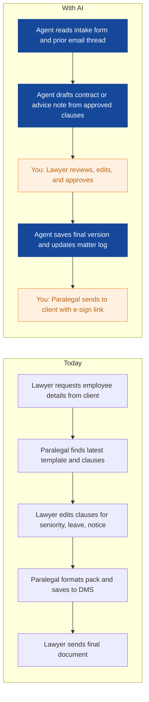
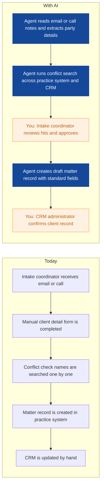
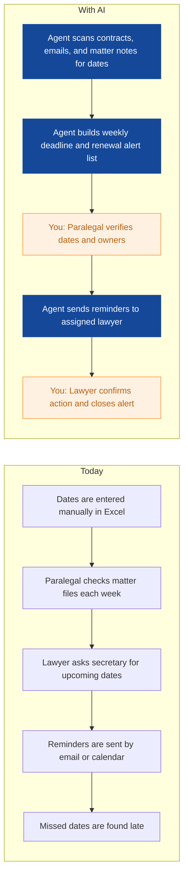
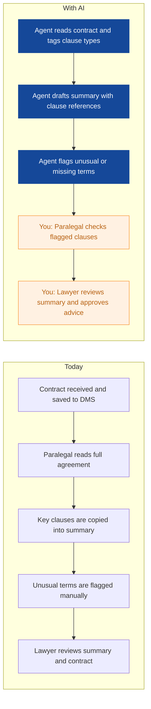
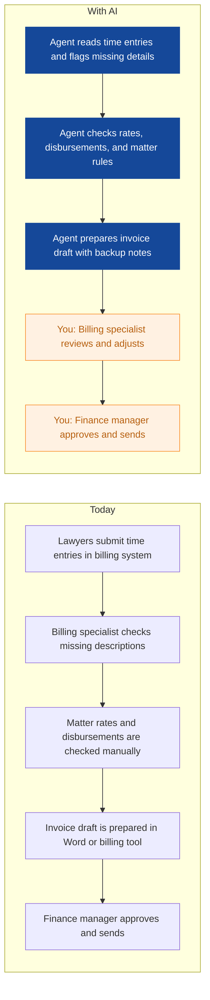
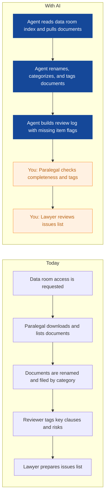
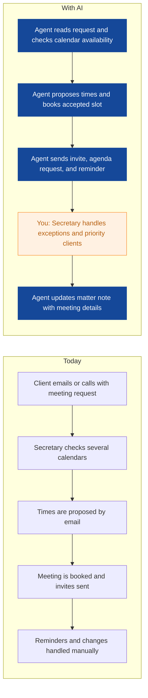
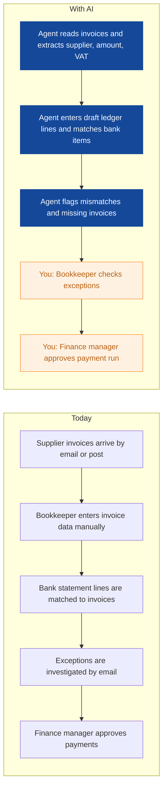
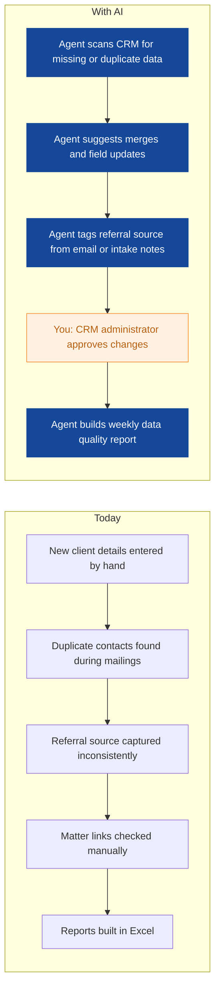

# AI Strategy for Lumen Legal

> **Example report for a fictional company.** Generated by [CompleteAIStrategy](https://completeaistrategy.com) with the same research, strategy and pricing rules as a real report.
> **[Open the interactive report with charts →](https://completeaistrategy.com/example/lumen-legal)**

| Hours saved per week | Value per year | Roles freed up | Opportunities |
|---:|---:|---:|---:|
| **119h** | **$273,700** | **3 FTE** | **9** |

## Our recommendation
**Start with three phase 1 agents for employment contract drafting, client intake and conflict checks, and deadline and renewal tracking to reduce repetitive admin and protect billable time.**

Lumen Legal is a 45 person law firm in Antwerp advising Belgian businesses on employment and commercial law. Your team relies on Microsoft 365, practice management, time and billing, and a document management system for daily work. Lawyers, paralegals, and secretaries spend hours on repetitive drafting, intake, deadline tracking, and billing, which limits advisory capacity and raises the risk of missed dates or conflicts.

1. **Repetitive drafting, intake, and deadline work consume lawyer and support capacity** Employment and commercial lawyers, paralegals, secretaries, and billing staff all handle repeated document, date, and client data work. These tasks are necessary but pull time from advice, negotiation, and client contact.
2. **These three agents target frequent, rule-based work with clear data and fast review** Employment drafting, client intake, and deadline tracking recur daily, use structured information, and already have clear review steps. They can show value in weeks with limited integration and low risk because a person approves every output.
3. **Roll out in controlled waves, keep human review, and measure saved time weekly** Run phase 1 with a small group of willing lawyers and secretaries, keep human sign-off on all advice and dates, and review output quality each week. After the first results are proven, expand the same agents to more teams and add phase 2 use cases.

**Phase 1 at a glance:** Employment contracts drafted from approved templates · Client intake and conflict checks run before matter opening · Deadlines and contract renewals tracked in one alert list. About 38 hours a week back for $2,470/month (setup $2,370, free on a 4-month run).

## 1. Repetitive drafting, intake, and deadline work consume lawyer and support capacity
Employment and commercial lawyers, paralegals, secretaries, and billing staff all handle repeated document, date, and client data work. These tasks are necessary but pull time from advice, negotiation, and client contact.

| Department | Hours saved / week | Share |
|---|---:|---:|
| Commercial Law | 30 | 25% |
| Finance and Billing | 25 | 21% |
| Paralegal and Document Support | 22 | 18% |
| Client Intake and CRM | 17 | 14% |
| Employment Law | 16 | 13% |
| Legal Secretaries and Administration | 9 | 8% |

## 2. These three agents target frequent, rule-based work with clear data and fast review
Employment drafting, client intake, and deadline tracking recur daily, use structured information, and already have clear review steps. They can show value in weeks with limited integration and low risk because a person approves every output.

| # | Opportunity | Department | Hours/week | Impact | Effort | Phase |
|---:|---|---|---:|:-:|:-:|:-:|
| 1 | Employment contracts drafted from approved templates | Employment Law | 16 | 5/5 | 2/5 | 1 |
| 2 | Client intake and conflict checks run before matter opening | Client Intake and CRM | 12 | 4/5 | 2/5 | 1 |
| 3 | Deadlines and contract renewals tracked in one alert list | Commercial Law | 10 | 5/5 | 2/5 | 1 |
| 4 | Contract clauses reviewed and summarized for lawyer sign-off | Paralegal and Document Support | 22 | 4/5 | 3/5 | later |
| 5 | Time entries cleaned and invoices drafted before review | Finance and Billing | 18 | 4/5 | 3/5 | later |
| 6 | Due diligence documents compiled and tagged for review | Commercial Law | 20 | 4/5 | 4/5 | later |
| 7 | Client meetings scheduled with fewer back-and-forth emails | Legal Secretaries and Administration | 9 | 3/5 | 1/5 | later |
| 8 | Supplier invoices entered and payments reconciled weekly | Finance and Billing | 7 | 3/5 | 2/5 | later |
| 9 | Client records and referral sources cleaned every week | Client Intake and CRM | 5 | 3/5 | 2/5 | later |

### 1. Employment contracts drafted from approved templates (phase 1)
The agent gathers employee details, selects approved clauses, and produces a first draft employment contract or advice note. Your lawyer reviews, edits, and approves before anything goes to the client.

**Saves ~16h per week** · Roles: Employment Lawyer, Paralegal · Tools: Microsoft Word, Outlook, Practice management software, Document management system, E-signature software

### 2. Client intake and conflict checks run before matter opening (phase 1)
The agent collects client and counterparty details, runs standard conflict searches, and prepares the matter opening record. Your intake team reviews exceptions and approves opening.

**Saves ~12h per week** · Roles: Intake Coordinator, CRM Administrator · Tools: Outlook, Practice management software, CRM, VOIP phone system, E-signature software

### 3. Deadlines and contract renewals tracked in one alert list (phase 1)
The agent extracts dates from contracts, matters, and court documents, then maintains a weekly alert list for renewals, termination notices, and filing deadlines. Your team confirms each date and owns the follow-up.

**Saves ~10h per week** · Roles: Commercial Lawyer, Paralegal · Tools: Practice management software, Outlook, Excel, Document management system

### 4. Contract clauses reviewed and summarized for lawyer sign-off
The agent reads incoming contracts, tags standard and unusual clauses, and prepares a short summary with clause references. Your paralegals and lawyers review the flagged issues before advice goes out.

**Saves ~22h per week** · Roles: Paralegal, Document Reviewer, Commercial Lawyer · Tools: Document management system, Microsoft Word, Adobe Acrobat, Excel

### 5. Time entries cleaned and invoices drafted before review
The agent checks time records against matter rules, groups entries by client and matter, and prepares invoice drafts with backup notes. Your billing team reviews, adjusts, and approves invoices.

**Saves ~18h per week** · Roles: Billing Specialist, Finance Manager, Bookkeeper · Tools: Time and billing software, Excel, Outlook, Practice management software

### 6. Due diligence documents compiled and tagged for review
The agent collects documents from a virtual data room or shared folder, tags them by category, and builds a due diligence review log. Your team checks completeness and focuses on flagged risks.

**Saves ~20h per week** · Roles: Commercial Lawyer, Paralegal, Document Reviewer · Tools: Document management system, Excel, Adobe Acrobat, SharePoint

### 7. Client meetings scheduled with fewer back-and-forth emails
The agent reads meeting requests, checks lawyer calendars, proposes times, and sends confirmations or reminders. Your secretaries handle exceptions and sensitive client calls.

**Saves ~9h per week** · Roles: Legal Secretary, Office Administrator · Tools: Outlook, VOIP phone system, Practice management software

### 8. Supplier invoices entered and payments reconciled weekly
The agent reads supplier invoices and bank statements, enters standard data, and matches payments to invoices. Your bookkeeper reviews exceptions and the finance manager approves payment runs.

**Saves ~7h per week** · Roles: Bookkeeper, Finance Manager · Tools: Accounting software, Excel, Outlook, Adobe Acrobat

### 9. Client records and referral sources cleaned every week
The agent checks client records for missing fields, duplicate contacts, and outdated matter links, then updates referral source tags. Your CRM administrator reviews changes and keeps relationship notes current.

**Saves ~5h per week** · Roles: CRM Administrator, Intake Coordinator · Tools: CRM, Excel, Outlook

## 3. Roll out in controlled waves, keep human review, and measure saved time weekly
Run phase 1 with a small group of willing lawyers and secretaries, keep human sign-off on all advice and dates, and review output quality each week. After the first results are proven, expand the same agents to more teams and add phase 2 use cases.

**Phase 1 (Weeks 1-6): Prove value with three agents in employment, intake, and deadlines**
- Map approved employment clauses and intake fields
- Build and test employment contract agent in Word and DMS
- Connect intake agent to Outlook, practice system, and CRM
- Set deadline tracker to read contracts and matter notes
- Train pilot users and review outputs weekly

**Phase 2 (Weeks 7-14): Add document review, billing, and due diligence support**
- Extend contract clause review to commercial matters
- Connect billing agent to time and billing software
- Build due diligence compilation and tagging agent
- Set quality checks for flagged clauses and invoices
- Expand phase 1 agents to more lawyers and secretaries

**Phase 3 (Weeks 15-24): Extend to administration, finance, and CRM data quality**
- Add meeting scheduling agent for secretaries
- Connect supplier invoice agent to accounting software
- Launch CRM data clean and referral tracking agent
- Build monthly management report on saved time and quality
- Review new use cases before adding more agents

**Risks**
- **Confidentiality and legal privilege could be exposed if client data is used in the wrong tool.**: Use firm-approved systems, restrict access by role, keep client data inside existing practice and document systems, and require human review before any output leaves the firm.
- **Incorrect agent output could lead to wrong advice or a missed deadline.**: Keep human sign-off for all legal advice, dates, and client communications. Sample review agent outputs weekly and correct errors before wider use.
- **Lawyers and secretaries may not trust or use the new agents.**: Involve willing lawyers and secretaries in design, start with low-risk tasks, show weekly time savings, and let users request changes.
- **Poor data quality or missing integrations could slow the rollout.**: Start with export and import where direct connections are not ready, clean reference data before go-live, and keep each agent limited to one clear task.
- **Scope creep could spread attention and delay results.**: Fix the phase 1 use cases, review progress monthly, and only add new agents after the first three show reliable output and time savings.

**KPIs**
- Hours saved per week by agent, verified by team leads
- Percentage of first drafts accepted with minor edits
- Average intake to matter opening time
- Number of missed deadlines or renewal notices
- Invoice draft cycle time from time entry close
- Weekly active use of phase 1 agents by lawyers and support staff

## Investment: phase 1 costs $2,470 a month and gives back $8,227 a month in time
| Agent | Saves | Setup | Monthly |
|---|---:|---:|---:|
| Employment contracts drafted from approved templates | 16h/wk | $790 | $1,040 |
| Client intake and conflict checks run before matter opening | 12h/wk | $790 | $780 |
| Deadlines and contract renewals tracked in one alert list | 10h/wk | $790 | $650 |
| **Total** | **38h/wk** | **$2,370** | **$2,470** |

Setup is free when the agents run for 4 months. Full rollout of all 9 opportunities: $8,910 setup, $7,720/month.

## Appendix: background
- **Industry:** Legal services
- **What they do:** Lumen Legal is a 45 person law firm in Antwerp, Belgium. You advise businesses on employment and commercial law, draft and review contracts, track deadlines, and handle client intake, time recording, and billing. Your clients are mainly companies and employers that need regular legal support in Belgium.
- **Customers:** Businesses and employers in Belgium, including SMEs, HR teams, and commercial companies that need employment and commercial legal support.
- **Team size:** 11-50 (estimate 45)
- **Tools:** Microsoft 365 (Outlook, Word, Excel), Legal practice management software, Time and billing software, Document management system, Adobe Acrobat or PDF editing tools, E-signature software, VOIP phone system
- **AI maturity:** 2/5, Early. You have strong Microsoft 365 and practice management systems, but no visible AI agents in daily legal or admin work. Start with supervised agents on structured tasks.

| Department | People | Roles |
|---|---:|---|
| Employment Law | 12 | Employment Lawyer (8), Paralegal (3), Legal Secretary (1) |
| Commercial Law | 12 | Commercial Lawyer (8), Paralegal (3), Legal Secretary (1) |
| Paralegal and Document Support | 8 | Paralegal (5), Document Reviewer (3) |
| Legal Secretaries and Administration | 6 | Legal Secretary (4), Office Administrator (2) |
| Finance and Billing | 4 | Finance Manager (1), Billing Specialist (2), Bookkeeper (1) |
| Client Intake and CRM | 3 | Intake Coordinator (2), CRM Administrator (1) |

---
Want this for your own company? **[Get your free AI strategy →](https://completeaistrategy.com)**
