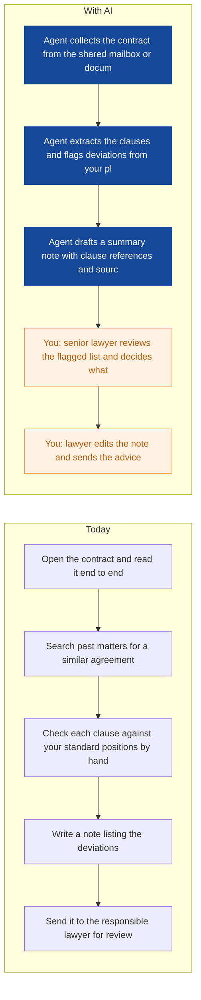
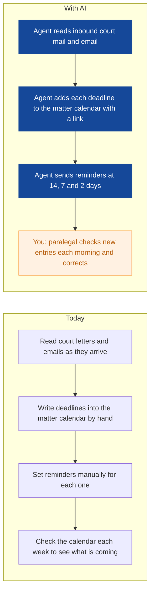
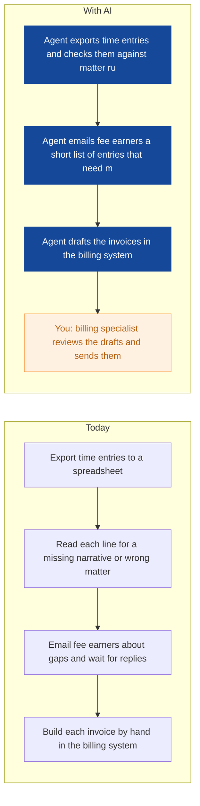
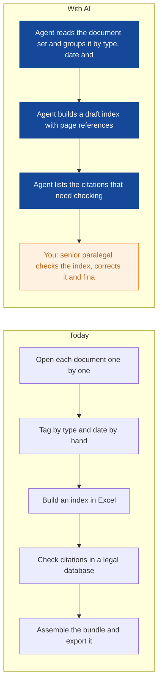
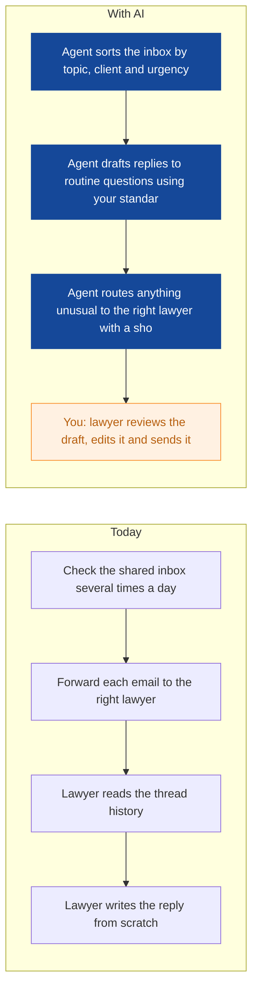
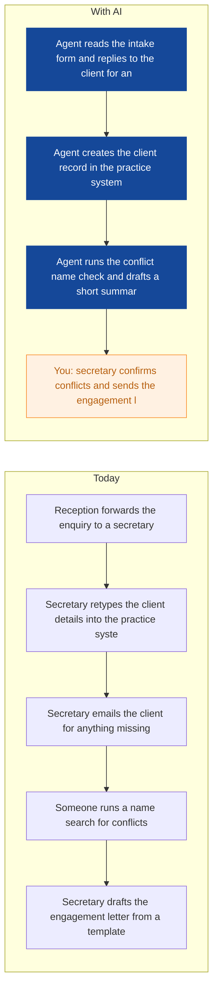
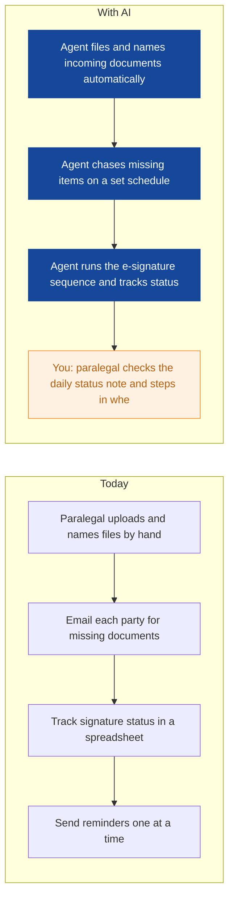
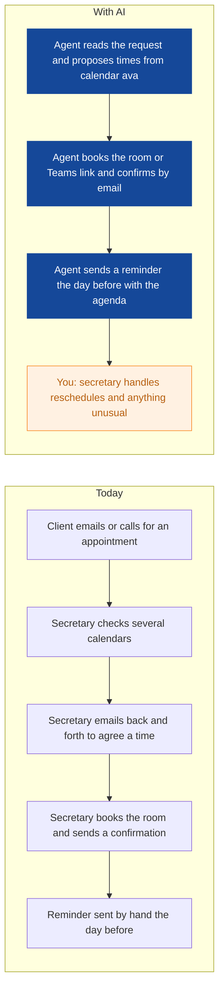
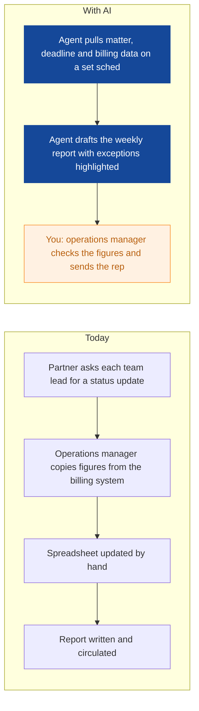

# AI Strategy for Lumen Legal

> **Example report for a fictional company.** Generated by [CompleteAIStrategy](https://completeaistrategy.com) with the same research, strategy and pricing rules as a real report.
> **[Open the interactive report with charts →](https://completeaistrategy.com/example/lumen-legal)**

| Hours saved per week | Value per year | Roles freed up | Opportunities |
|---:|---:|---:|---:|
| **62h** | **$142,600** | **1.6 FTE** | **9** |

## Summary
Lumen Legal is a 45 person firm where most of the work is done by hand: deadlines written into calendars one by one, contracts read end to end, time entries checked line by line, and clients answered from a shared inbox. You already have Microsoft 365, a practice management system, a document management system and time and billing software, which is the foundation these agents need. The realistic first year gain is around 60 hours a week across the firm, close to 3 to 4 percent of your capacity, focused on the tasks your lawyers and paralegals like least. Nothing an agent produces should leave the firm without a named person approving it, and every draft should point back to the source document. Start with deadlines, contract first-pass review and billing preparation, because those are the easiest to measure and the least risky.

## Company snapshot
- **Industry:** Legal services
- **What they do:** Lumen Legal is a 45 person law firm in Antwerp, Belgium. You and your team advise employers and companies on employment and commercial law, draft and review contracts, track deadlines, and handle time registration and billing. Your clients are businesses that need practical legal support in Belgium.
- **Customers:** Businesses, employers, and companies in Belgium, from small firms to larger enterprises needing employment and commercial law support.
- **Team size:** 11-50 (estimate 45)
- **Tools:** Microsoft 365, Legal practice management software, Time and billing software, Document management system, E-signature tools, Client intake forms
- **AI maturity:** 2/5, Early. You have the systems in place (Microsoft 365, practice management, document management, time and billing) but almost no AI in daily work. Deadline tracking, contract review and time entry checks are still manual, so there is a clear starting point with low risk.

## Team and roles
| Department | People | Roles |
|---|---:|---|
| Employment Law | 12 | Employment Partner (1), Senior Employment Lawyer (3), Employment Associate (5), Employment Paralegal (3) |
| Commercial Law | 12 | Commercial Partner (1), Senior Commercial Lawyer (3), Commercial Associate (5), Commercial Paralegal (3) |
| Paralegal and Document Services | 8 | Senior Paralegal (3), Legal Assistant (5) |
| Secretarial and Administration | 6 | Legal Secretary (4), Office Manager (1), Receptionist (1) |
| Finance and Billing | 5 | Finance Manager (1), Billing Specialist (2), Bookkeeper (2) |
| Management and Operations | 2 | Managing Partner (1), Operations Manager (1) |

## Opportunities
| # | Opportunity | Department | Hours/week | Impact | Effort |
|---:|---|---|---:|:-:|:-:|
| 1 | Contract first-pass review against your playbook | Commercial Law | 10 | 5/5 | 3/5 |
| 2 | Deadline and tribunal calendar agent | Employment Law | 8 | 5/5 | 3/5 |
| 3 | Time entry review and draft invoices | Finance and Billing | 8 | 4/5 | 3/5 |
| 4 | Document review and bundle preparation | Paralegal and Document Services | 9 | 4/5 | 4/5 |
| 5 | Client question triage and draft replies | Employment Law | 7 | 4/5 | 3/5 |
| 6 | New client intake and conflict check pack | Secretarial and Administration | 6 | 3/5 | 3/5 |
| 7 | Data room and signature coordination | Commercial Law | 5 | 3/5 | 3/5 |
| 8 | Client appointment scheduling and reminders | Secretarial and Administration | 5 | 3/5 | 2/5 |
| 9 | Weekly matter and performance reporting | Management and Operations | 4 | 3/5 | 2/5 |

### 1. Contract first-pass review against your playbook
An agent reads each incoming contract and compares the clauses against your firm's standard positions and fallback wording. It returns a short list of deviations with the clause text and a link to the source, and a lawyer still makes every call.

**Saves ~10h per week** · Roles: Senior Commercial Lawyer, Commercial Associate, Commercial Paralegal · Tools: Microsoft 365, Document management system, Practice management system

### 2. Deadline and tribunal calendar agent
An agent watches incoming court and tribunal correspondence, pulls out each deadline and adds it to the matter calendar with reminders at 14, 7 and 2 days. Your paralegals keep the final check every morning.

**Saves ~8h per week** · Roles: Employment Paralegal, Senior Employment Lawyer, Employment Associate · Tools: Microsoft 365, Practice management system, Deadline calendar

### 3. Time entry review and draft invoices
An agent reviews the week's time entries against matter budgets and billing rules, flags entries with missing detail or the wrong matter, and prepares draft invoices. Nothing is sent until your billing team approves it.

**Saves ~8h per week** · Roles: Billing Specialist, Finance Manager · Tools: Time and billing software, Microsoft 365, Practice management system

### 4. Document review and bundle preparation
An agent reads a set of documents, groups them by type, date and issue, and builds a first pass index and bundle. It lists the citations it finds so a paralegal can check them against the source.

**Saves ~9h per week** · Roles: Senior Paralegal, Legal Assistant · Tools: Document management system, Microsoft 365, Legal research database

### 5. Client question triage and draft replies
An agent reads the shared client inbox, sorts questions by topic, client and urgency, and drafts replies to routine questions using your firm's standard answers. A lawyer reviews and sends every reply.

**Saves ~7h per week** · Roles: Senior Employment Lawyer, Employment Associate, Employment Paralegal · Tools: Microsoft 365, Practice management system

### 6. New client intake and conflict check pack
An agent takes inbound intake forms and emails, pulls out the key facts, creates the client record, and prepares a conflict check summary and a draft engagement letter for a person to approve.

**Saves ~6h per week** · Roles: Legal Secretary, Receptionist, Office Manager · Tools: Client intake forms, Practice management system, Microsoft 365

### 7. Data room and signature coordination
An agent keeps the deal data room up to date, chases outstanding documents on a fixed schedule, and runs the e-signature sequence for closing documents. It sends a status note once a day.

**Saves ~5h per week** · Roles: Commercial Paralegal, Commercial Associate · Tools: E-signature tools, Document management system, Microsoft 365

### 8. Client appointment scheduling and reminders
An agent handles meeting requests by email, proposes times based on the lawyer's calendar, books the room or Teams link, and sends confirmation and a reminder the day before. Anything unusual goes to a secretary.

**Saves ~5h per week** · Roles: Legal Secretary, Receptionist · Tools: Microsoft 365, Practice management system

### 9. Weekly matter and performance reporting
An agent pulls matter status, deadlines and billing figures into a one page weekly report with the exceptions highlighted. It flags matters that are off budget or behind schedule.

**Saves ~4h per week** · Roles: Managing Partner, Operations Manager · Tools: Practice management system, Time and billing software, Microsoft 365

## Roadmap
**Phase 1 (Weeks 1 to 6): Get the basics connected**
- Connect Microsoft 365, your practice management system and your document management system to the agent platform
- Write down one firm rule: nothing leaves the firm without a named person approving it
- Set up the deadline and tribunal calendar agent for the Employment Law team
- Set up appointment scheduling and reminders for reception
- Name one owner per team who checks agent output and reports problems

**Phase 2 (Weeks 7 to 16): Move into the legal work**
- Roll out contract first-pass review to Commercial Law, starting with supplier contracts
- Roll out client question triage and draft replies to the Employment Law shared inbox
- Roll out time entry review and draft invoices to Finance and Billing
- Pilot document review and bundle preparation with two paralegals on one live case
- Review hours saved and error rates at the end of week 12 before deciding on phase 3

**Phase 3 (Weeks 17 to 30): Cover the rest of the firm**
- Add new client intake and conflict check packs
- Add data room and signature coordination for Commercial Law transactions
- Add weekly matter and performance reporting for the managing partner
- Extend document review and bundle preparation to all paralegals
- Review the full year of results with your compliance advisor and set targets for year two

## Risks
- **Client and matter data going into tools that are not approved for it**: Keep every agent inside your Microsoft 365 tenant and your existing systems, sign a data processing agreement with each supplier, leave client names out of prompts where they are not needed, and apply the same confidentiality rules you use today.
- **A wrong draft from an agent being treated as final and sent to a client or a court**: No agent output leaves the firm without a named lawyer or paralegal approving it, and every draft shows the source document and clause it came from. Reviewers check the source, not just the summary.
- **Lawyers who bill by the hour do not use the tools**: Start with the tasks nobody wants to do (deadlines, time entries, bundling), show the time saved on the first two live matters, and track use per team each month so you can see who has adopted it and who has not.
- **Cost and setup time running past what you planned**: Fix the scope of each phase, give each phase one owner, and stop and review before spending on the next phase. Do not start more than two new agents at once.
- **GDPR and Belgian bar rules not being met for personal data in the tools**: Keep a short data processing register, set retention limits on anything the agents store, and check the setup with your compliance advisor before phase 2 begins.

## KPIs
- Hours saved per week across the firm (target: around 60 by the end of phase 3)
- Deadlines missed or entered late (target: zero)
- Average working days from client question to reply
- Share of draft invoices sent within 5 working days of month end
- Average contract review turnaround in days
- Share of agent drafts changed or rejected by a human reviewer (quality check)

## Quote: phase 1
| Agent | Saves | Setup | Monthly |
|---|---:|---:|---:|
| Contract first-pass review against your playbook | 10h/wk | $1,290 | $650 |
| Deadline and tribunal calendar agent | 8h/wk | $1,290 | $520 |
| Time entry review and draft invoices | 8h/wk | $1,290 | $520 |
| **Total** | **26h/wk** | **$3,870** | **$1,690** |

Setup is free when the agents run for 4 months. Full rollout of all 9 opportunities: $11,210 setup, $4,040/month.

---
Want this for your own company? **[Get your free AI strategy →](https://completeaistrategy.com)**
