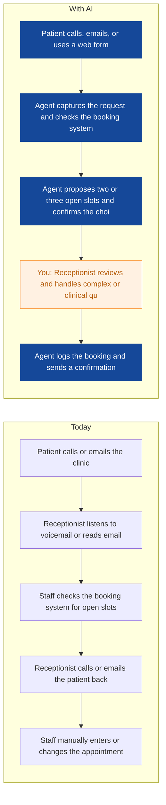
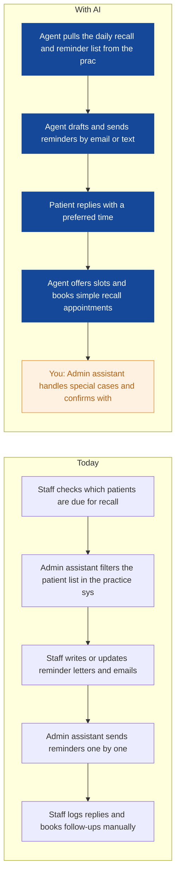
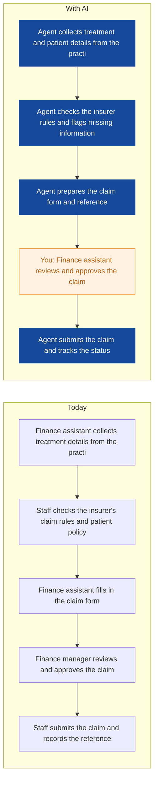
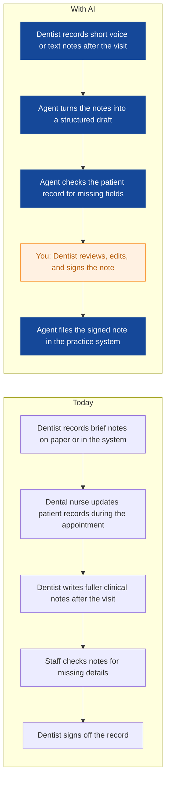
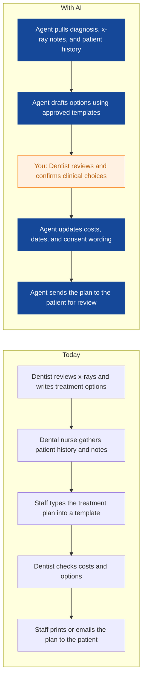
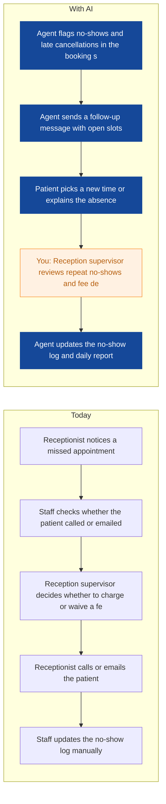
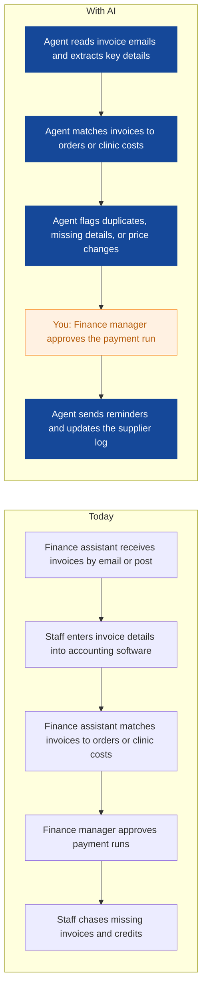
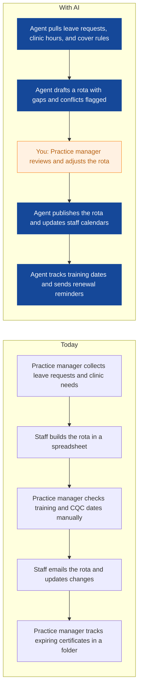
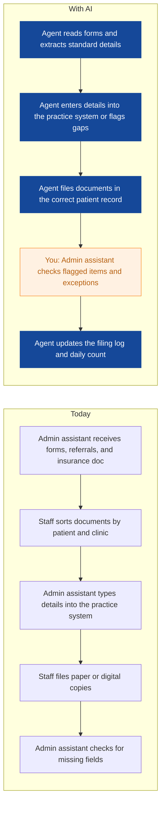

# AI Strategy for Maple & Sage Dental

> **Example report for a fictional company.** Generated by [CompleteAIStrategy](https://completeaistrategy.com) with the same research, strategy and pricing rules as a real report.
> **[Open the interactive report with charts →](https://completeaistrategy.com/example/maple-sage-dental)**

| Hours saved per week | Value per year | Roles freed up | Opportunities |
|---:|---:|---:|---:|
| **91h** | **$209,300** | **2.3 FTE** | **9** |

## Our recommendation
**Start with the front desk appointment agent, the recall reminder agent, and the insurance claim agent, so your team cuts the most repetitive admin and proves value before expanding.**

Maple & Sage Dental runs three dental clinics in Leeds with about 40 staff, offering check-ups, hygiene, general treatments, emergency appointments, insurance support, and treatment plans. Appointment calls, reminders, insurance claims, and clinical admin still depend on manual work across three sites, which slows patient response, risks missed follow-ups, and takes your team away from chairside care.

1. **Front desk, recall admin, and insurance claims absorb most of the repetitive work.** Receptionists handle calls, reschedules, reminders, payments, and insurance questions while also managing the desk. Admin assistants send recall letters and file documents, and finance assistants submit claims and chase balances. These tasks are frequent, rule-based, and spread across all three clinics, so delays show up in bookings, no-shows, and unpaid claims.
2. **These three agents are quick to set up and target visible daily pain.** Appointment booking and recall reminders use existing phone, email, and reminder tools, so they need little integration. Insurance claim preparation follows a predictable form and falls between finance and front desk, where errors cost time. Together they cover patient contact, follow-up, and payment, the three areas your team feels first.
3. **Roll out in stages, keep humans in control, and measure before expanding.** Start with one clinic or one workflow, train the small group who will use it, and review outputs daily for the first two weeks. Human staff approve bookings, claim submissions, and reminder wording until accuracy is proven. After that, extend the same agents to the other clinics and add clinical and rota support.

**Phase 1 at a glance:** Appointment requests answered and booked from calls and web forms · Recall letters and appointment reminders sent on schedule · Insurance claims prepared and submitted with fewer errors. About 44 hours a week back for $2,860/month (setup $2,870, free on a 4-month run).

## 1. Front desk, recall admin, and insurance claims absorb most of the repetitive work.
Receptionists handle calls, reschedules, reminders, payments, and insurance questions while also managing the desk. Admin assistants send recall letters and file documents, and finance assistants submit claims and chase balances. These tasks are frequent, rule-based, and spread across all three clinics, so delays show up in bookings, no-shows, and unpaid claims.

| Department | Hours saved / week | Share |
|---|---:|---:|
| Front Desk | 27 | 30% |
| Admin and Operations | 21 | 23% |
| Finance | 19 | 21% |
| Clinical | 18 | 20% |
| Practice Management | 6 | 7% |

## 2. These three agents are quick to set up and target visible daily pain.
Appointment booking and recall reminders use existing phone, email, and reminder tools, so they need little integration. Insurance claim preparation follows a predictable form and falls between finance and front desk, where errors cost time. Together they cover patient contact, follow-up, and payment, the three areas your team feels first.

| # | Opportunity | Department | Hours/week | Impact | Effort | Phase |
|---:|---|---|---:|:-:|:-:|:-:|
| 1 | Appointment requests answered and booked from calls and web forms | Front Desk | 18 | 5/5 | 2/5 | 1 |
| 2 | Recall letters and appointment reminders sent on schedule | Admin and Operations | 14 | 4/5 | 2/5 | 1 |
| 3 | Insurance claims prepared and submitted with fewer errors | Finance | 12 | 4/5 | 3/5 | 1 |
| 4 | Clinical notes drafted from templates after visits | Clinical | 10 | 4/5 | 3/5 | later |
| 5 | Treatment plan drafts prepared for dentist review | Clinical | 8 | 4/5 | 3/5 | later |
| 6 | No-show and late cancellation follow-up handled automatically | Front Desk | 9 | 4/5 | 2/5 | later |
| 7 | Supplier invoice coding and payment reminders run on a schedule | Finance | 7 | 3/5 | 3/5 | later |
| 8 | Staff rota and training records kept up to date | Practice Management | 6 | 3/5 | 3/5 | later |
| 9 | Patient data entry and document filing done with checks | Admin and Operations | 7 | 3/5 | 2/5 | later |

### 1. Appointment requests answered and booked from calls and web forms (phase 1)
An agent answers routine booking, rescheduling, and cancellation requests from phone messages, email, and web forms, then proposes open slots. It checks the practice system for availability and sends confirmation, while staff handle complex or clinical questions.

**Saves ~18h per week** · Roles: Receptionist, Reception supervisor · Tools: Phone system, Email, Appointment booking system, Practice management software

### 2. Recall letters and appointment reminders sent on schedule (phase 1)
An agent builds the daily recall and reminder list from the practice system, drafts the message, and sends it by the patient's preferred channel. It tracks replies and books simple recall appointments or flags them for staff.

**Saves ~14h per week** · Roles: Admin assistant, Hygienist · Tools: Practice management software, Patient reminder tools, Email

### 3. Insurance claims prepared and submitted with fewer errors (phase 1)
An agent gathers treatment codes, patient details, and insurer rules, then prepares the claim form for review. It submits approved claims and logs the status so staff can chase only the exceptions.

**Saves ~12h per week** · Roles: Finance assistant, Finance manager · Tools: Practice management software, Accounting software, Email, Insurer portals

### 4. Clinical notes drafted from templates after visits
An agent uses the dentist's short voice or text notes to draft a structured clinical note in the practice system. The dentist reviews, edits, and signs it, which reduces end-of-day typing.

**Saves ~10h per week** · Roles: Dentist, Dental nurse · Tools: Practice management software, Voice notes, Email

### 5. Treatment plan drafts prepared for dentist review
An agent assembles the dentist's diagnosis, x-ray findings, and standard options into a treatment plan draft for the patient. The dentist reviews the clinical choices and approves the final plan.

**Saves ~8h per week** · Roles: Dentist, Dental nurse · Tools: Practice management software, Email, Document templates

### 6. No-show and late cancellation follow-up handled automatically
An agent spots no-shows and late cancellations, sends a polite follow-up, and offers another appointment slot. It updates the no-show log and alerts the supervisor when a patient misses repeatedly.

**Saves ~9h per week** · Roles: Reception supervisor, Receptionist · Tools: Appointment booking system, Phone system, Email

### 7. Supplier invoice coding and payment reminders run on a schedule
An agent reads supplier invoices, matches them to purchase orders or clinic costs, and prepares them for approval. It also sends payment reminders and flags duplicate or missing invoices.

**Saves ~7h per week** · Roles: Finance assistant, Finance manager · Tools: Accounting software, Email, Spreadsheets

### 8. Staff rota and training records kept up to date
An agent drafts rotas across the three clinics from leave, clinic hours, and cover rules, then tracks training and compliance dates. The practice manager reviews and adjusts before publishing.

**Saves ~6h per week** · Roles: Practice manager · Tools: Spreadsheets, Email, Practice management software

### 9. Patient data entry and document filing done with checks
An agent reads forms, referrals, and insurance documents, then enters or files the standard details into the practice system. It flags anything unclear for an admin assistant to check.

**Saves ~7h per week** · Roles: Admin assistant · Tools: Practice management software, Email, Document storage

## 3. Roll out in stages, keep humans in control, and measure before expanding.
Start with one clinic or one workflow, train the small group who will use it, and review outputs daily for the first two weeks. Human staff approve bookings, claim submissions, and reminder wording until accuracy is proven. After that, extend the same agents to the other clinics and add clinical and rota support.

**Phase 1 (Weeks 1 to 6): Prove booking, recall, and insurance agents at one clinic**
- Choose one clinic as the first test site
- Set up the appointment booking agent with the phone system and booking system
- Set up the recall reminder agent with the practice system and email
- Set up the insurance claim agent with finance and insurer rules
- Review daily outputs and fix errors before wider use

**Phase 2 (Weeks 7 to 16): Extend into clinical notes, no-shows, and patient filing**
- Add clinical note drafting for dentists and dental nurses
- Add no-show and late cancellation follow-up at the front desk
- Add patient data entry and document filing for admin assistants
- Train staff on review steps and exception handling
- Track time saved and error rates each week

**Phase 3 (Weeks 17 to 30): Connect finance, rota, and reporting across three clinics**
- Add supplier invoice coding and payment reminders for finance
- Add rota and training record support for the practice manager
- Connect agents to reporting for clinic performance
- Roll out proven agents to all three clinics
- Set a quarterly review of accuracy, privacy, and staff feedback

**Risks**
- **Patient data privacy and UK GDPR rules are not followed.**: Use UK data storage, restrict access by role, complete a data protection review, and keep human approval for any patient-facing message or record change.
- **Clinical notes or treatment plan drafts contain errors.**: Keep dentists responsible for all clinical decisions and require a dentist to review, edit, and sign every clinical note or plan.
- **Staff do not trust the agents or stop using them.**: Start with one clinic, train the people who will review outputs, and share weekly examples of time saved and errors fixed.
- **The practice management software does not connect easily.**: Begin with email, web forms, and CSV imports. Only add deeper integration after the agent has proven accurate for four to six weeks.
- **Exceptions are missed because staff rely too much on automation.**: Run a daily exception report, keep named human owners for bookings, claims, and clinical notes, and review missed items in the weekly team meeting.

**KPIs**
- Calls and web booking requests answered within one working hour
- Recall appointment booking rate
- No-show and late cancellation rate
- Insurance claims submitted within three days and first-pass acceptance rate
- Admin hours saved per week by clinic
- Staff satisfaction with agent support and review workload

## Investment: phase 1 costs $2,860 a month and gives back $9,526 a month in time
| Agent | Saves | Setup | Monthly |
|---|---:|---:|---:|
| Appointment requests answered and booked from calls and web forms | 18h/wk | $790 | $1,170 |
| Recall letters and appointment reminders sent on schedule | 14h/wk | $790 | $910 |
| Insurance claims prepared and submitted with fewer errors | 12h/wk | $1,290 | $780 |
| **Total** | **44h/wk** | **$2,870** | **$2,860** |

Setup is free when the agents run for 4 months. Full rollout of all 9 opportunities: $9,610 setup, $5,900/month.

## Appendix: background
- **Industry:** Dental care
- **What they do:** Maple & Sage Dental runs three dental clinics in Leeds, UK. Your team of about 40 provides check-ups, hygiene, general treatments, appointment booking, insurance support, and treatment plans for local patients.
- **Customers:** Local patients in Leeds, including families, adults, and children. Some treatment is paid privately or through insurance.
- **Team size:** 11-50 (estimate 40)
- **Tools:** Practice management software (not named in brief), Appointment booking system, Phone system, Email, Accounting software, Patient reminder tools
- **AI maturity:** 2/5, Early. Tools are mostly manual with practice software and reminders in place. A few simple automations could be added without a big IT project.

| Department | People | Roles |
|---|---:|---|
| Clinical | 24 | Dentist (6), Hygienist (4), Dental nurse (14) |
| Front Desk | 8 | Receptionist (7), Reception supervisor (1) |
| Practice Management | 1 | Practice manager (1) |
| Finance | 3 | Finance manager (1), Finance assistant (2) |
| Admin and Operations | 4 | Admin assistant (3), Operations coordinator (1) |

---
Want this for your own company? **[Get your free AI strategy →](https://completeaistrategy.com)**
