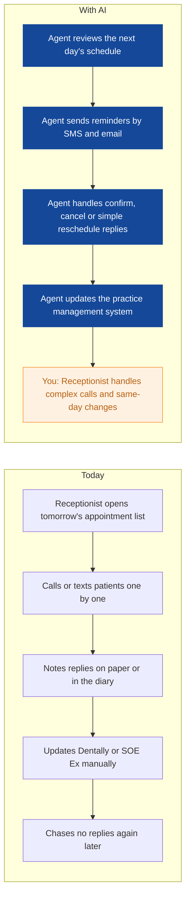
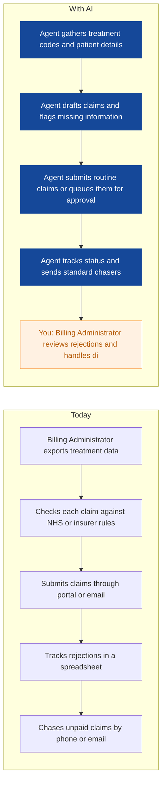
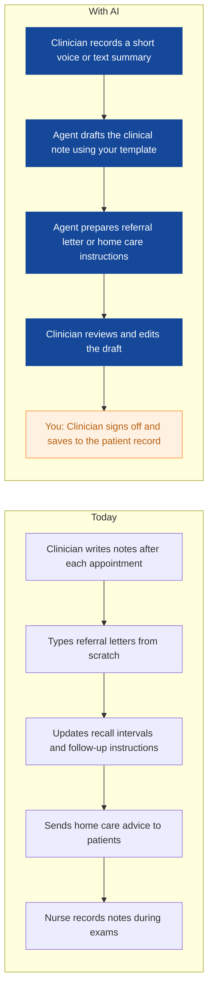
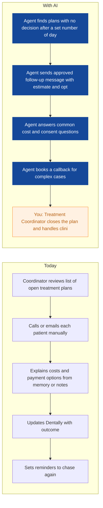
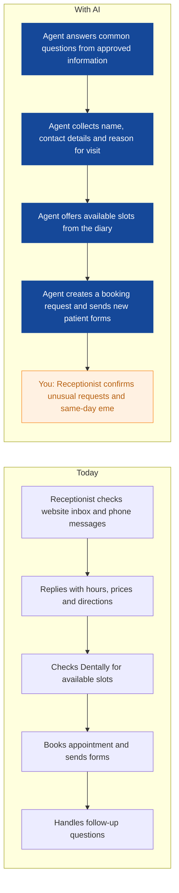
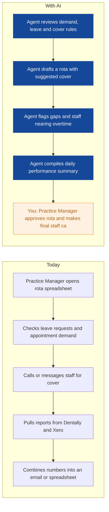
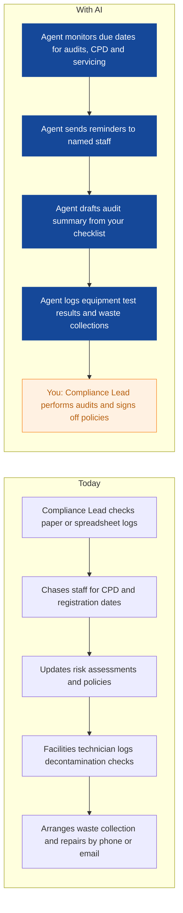
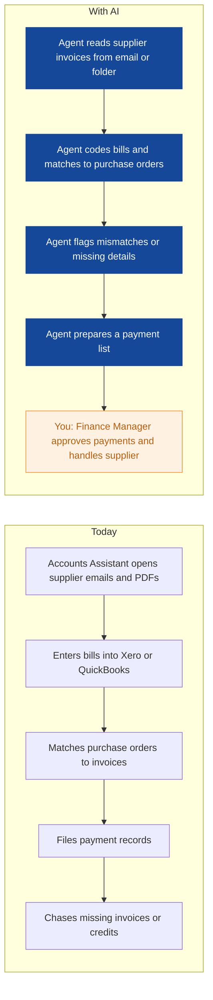

# AI Strategy for Maple & Sage Dental

> **Example report for a fictional company.** Generated by [CompleteAIStrategy](https://completeaistrategy.com) with the same research, strategy and pricing rules as a real report.
> **[Open the interactive report with charts →](https://completeaistrategy.com/example/maple-sage-dental)**

| Hours saved per week | Value per year | Roles freed up | Opportunities |
|---:|---:|---:|---:|
| **65h** | **$149,500** | **1.6 FTE** | **8** |

## Summary
Maple & Sage Dental runs three Leeds clinics with about 40 staff and a mix of NHS and private patients. Your team already uses practice management software, SMS reminders and Xero or QuickBooks, but most patient admin, claims chasing and clinical paperwork is still manual. The best first steps are low-risk agents for appointment reminders, new patient enquiries and treatment plan follow-ups. Later steps can connect Dentally or SOE Ex to finance and management reporting, with human sign-off kept for all clinical and payment decisions. A realistic early target is around 65 hours saved per week across all sites, which is about 4 percent of your team's weekly hours.

## Company snapshot
- **Industry:** Dental care and healthcare services
- **What they do:** Maple & Sage Dental is a group of three dental clinics in Leeds, UK. You provide general, hygiene and cosmetic dental care to local individuals and families, with a mix of NHS and private patients. Your team of about 40 handles appointments, reminders, insurance and treatment plans by phone and email.
- **Customers:** Local individuals and families in Leeds. A mix of NHS patients, private patients and some insurance-funded cases.
- **Team size:** 11-50 (estimate 40)
- **Tools:** Dental practice management software such as Dentally, SOE Ex, Microsoft 365 and Outlook for email and documents, Xero or QuickBooks for finance, VoIP phone system, SMS and email appointment reminder tool, Card payment terminals and online booking forms
- **AI maturity:** 2/5, Early. You have core practice software and reminder tools in place. Most cross-site admin is still manual, with data spread across Dentally or SOE Ex, Outlook, Xero or QuickBooks and spreadsheets. Simple agents can be added without replacing your main systems.

## Team and roles
| Department | People | Roles |
|---|---:|---|
| Clinical Team | 24 | Dentist (8), Hygienist (5), Dental Nurse (11) |
| Patient Reception | 8 | Receptionist (6), Treatment Coordinator (2) |
| Practice Management | 3 | Practice Manager (1), Assistant Practice Manager (1), Operations Coordinator (1) |
| Finance & Billing | 3 | Finance Manager (1), Billing Administrator (1), Accounts Assistant (1) |
| Compliance & Facilities | 2 | Compliance Lead (1), Facilities and Decontamination Technician (1) |

## Opportunities
| # | Opportunity | Department | Hours/week | Impact | Effort |
|---:|---|---|---:|:-:|:-:|
| 1 | Appointment reminders and rescheduling handled automatically | Patient Reception | 12 | 5/5 | 2/5 |
| 2 | Insurance and NHS claims tracked and chased | Finance & Billing | 10 | 4/5 | 3/5 |
| 3 | Clinical notes and referral letters drafted for review | Clinical Team | 9 | 4/5 | 3/5 |
| 4 | Treatment plan follow-ups sent on time | Patient Reception | 8 | 4/5 | 2/5 |
| 5 | New patient enquiries answered and booked faster | Patient Reception | 8 | 3/5 | 2/5 |
| 6 | Rota gaps and daily performance summary prepared | Practice Management | 7 | 4/5 | 3/5 |
| 7 | Compliance dates and equipment logs watched automatically | Compliance & Facilities | 6 | 3/5 | 2/5 |
| 8 | Supplier invoices entered and matched | Finance & Billing | 5 | 3/5 | 2/5 |

### 1. Appointment reminders and rescheduling handled automatically
An agent checks tomorrow's schedule, sends SMS or email reminders, and handles simple confirm, cancel or reschedule replies. It updates the practice management system and only passes complex calls to your team.

**Saves ~12h per week** · Roles: Receptionist · Tools: Dentally, SOE Ex, SMS reminder tool, Outlook, VoIP phone system

### 2. Insurance and NHS claims tracked and chased
An agent prepares claim drafts from treatment codes, submits or queues them, and tracks rejections or unpaid claims. It sends polite chasers and gives the billing administrator a daily list of items needing a human decision.

**Saves ~10h per week** · Roles: Billing Administrator, Finance Manager · Tools: Dentally, SOE Ex, Xero, QuickBooks, NHS claims portal, Insurance portals

### 3. Clinical notes and referral letters drafted for review
An agent uses your templates and short voice or typed prompts to draft clinical notes, referral letters and home care instructions. The clinician reviews, edits and signs off before anything goes into the patient record or to a referrer.

**Saves ~9h per week** · Roles: Dentist, Hygienist, Dental Nurse · Tools: Dentally, SOE Ex, Microsoft 365, Outlook, Dictation tool

### 4. Treatment plan follow-ups sent on time
An agent tracks unconfirmed treatment plans and sends follow-up messages with cost, consent and payment option details from approved templates. It books callbacks for the coordinator when a patient has questions.

**Saves ~8h per week** · Roles: Treatment Coordinator · Tools: Dentally, Outlook, SMS reminder tool, Payment plan records

### 5. New patient enquiries answered and booked faster
An agent answers common questions from your website and inbox about opening hours, treatments, NHS or private prices and parking. It collects patient details, offers available slots and creates a booking request for reception to confirm.

**Saves ~8h per week** · Roles: Receptionist · Tools: Website form, Outlook, Dentally, SMS reminder tool

### 6. Rota gaps and daily performance summary prepared
An agent reviews appointment demand, staff leave and clinic cover rules to draft a weekly rota and flag gaps. It also compiles a short daily performance summary from your practice software and finance data.

**Saves ~7h per week** · Roles: Practice Manager, Assistant Practice Manager · Tools: Dentally, Xero, QuickBooks, Microsoft 365, Rota spreadsheet

### 7. Compliance dates and equipment logs watched automatically
An agent tracks infection control audits, CPD renewals, equipment servicing and waste collection dates. It sends reminders, drafts simple audit summaries and keeps a single log for inspection.

**Saves ~6h per week** · Roles: Compliance Lead, Facilities and Decontamination Technician · Tools: Microsoft 365, SharePoint, Equipment logs, Outlook

### 8. Supplier invoices entered and matched
An agent reads supplier invoices from email or a shared folder, codes them and matches them to purchase orders. It flags price or quantity mismatches and prepares a payment list for approval.

**Saves ~5h per week** · Roles: Accounts Assistant, Finance Manager · Tools: Xero, QuickBooks, Outlook, Supplier portals

## Roadmap
**Phase 1 (Weeks 1 to 4): Quick wins with reminders and patient enquiries**
- Set up appointment reminder and rescheduling agent for all three clinics
- Connect website and inbox enquiry agent to approved opening hours, price and treatment information
- Use treatment plan follow-up templates for unconfirmed private and NHS plans
- Train reception and treatment coordinators on review and escalation steps

**Phase 2 (Weeks 5 to 12): Finance, claims and management reporting**
- Connect claims tracking agent to Dentally or SOE Ex and finance system
- Set up supplier invoice entry and purchase order matching in Xero or QuickBooks
- Build weekly rota draft and daily performance summary agent
- Add compliance date and equipment log reminders for all sites

**Phase 3 (Months 4 to 6): Clinical notes and deeper reporting**
- Pilot clinical note and referral letter drafting with two dentists and one hygienist
- Add human sign-off workflow before notes save to patient records
- Link management reporting to finance and appointment data for monthly reviews
- Review time saved, error rates and patient feedback before wider rollout

## Risks
- **Patient data privacy and NHS confidentiality rules**: Use UK data storage, limit access by role, keep patient identifiers out of prompts where possible, and sign a data processing agreement with the tool provider.
- **Clinical notes or advice contain errors**: Keep clinicians as the only people who sign off notes, referrals and home care instructions. Use approved templates and require review before anything saves.
- **Staff do not trust or use the new agents**: Start with reception and billing tasks that save clear time. Train one champion per site and review outputs weekly for the first month.
- **Practice software or finance systems do not connect easily**: Check Dentally, SOE Ex, Xero or QuickBooks integration options before build. If no direct link exists, use email or export files as a fallback.
- **Savings are smaller than expected**: Track hours saved per task each week. Stop or adjust any agent that does not save at least two hours per week per site after the first month.

## KPIs
- No-show rate across all three clinics
- Average time to reply to a new patient enquiry
- Percentage of unconfirmed treatment plans followed up within 48 hours
- Value of unpaid insurance and NHS claims older than 30 days
- Hours spent on rota, reporting and invoice entry per week
- Percentage of clinical notes completed same day

## Quote: phase 1
| Agent | Saves | Setup | Monthly |
|---|---:|---:|---:|
| Appointment reminders and rescheduling handled automatically | 12h/wk | $790 | $780 |
| Treatment plan follow-ups sent on time | 8h/wk | $790 | $520 |
| Insurance and NHS claims tracked and chased | 10h/wk | $1,290 | $650 |
| **Total** | **30h/wk** | **$2,870** | **$1,950** |

Setup is free when the agents run for 4 months. Full rollout of all 8 opportunities: $7,820 setup, $4,210/month.

---
Want this for your own company? **[Get your free AI strategy →](https://completeaistrategy.com)**
