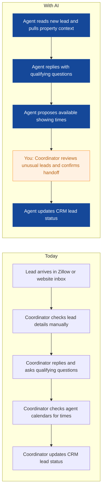
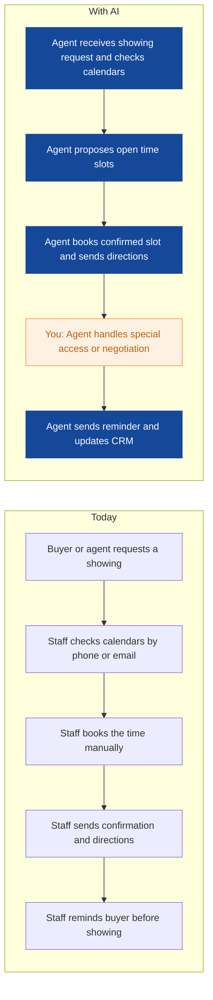
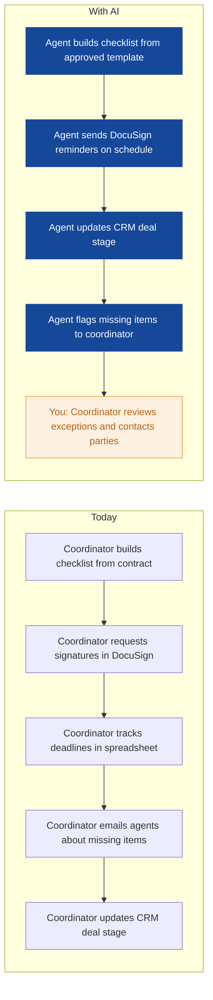
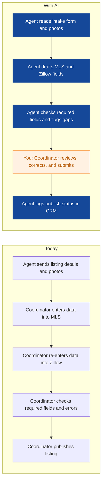
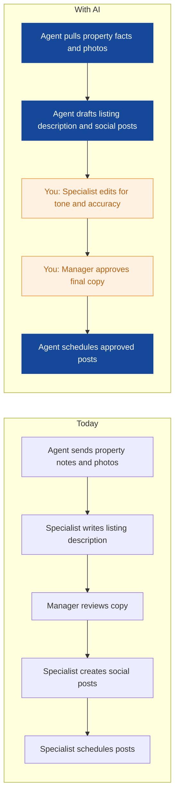
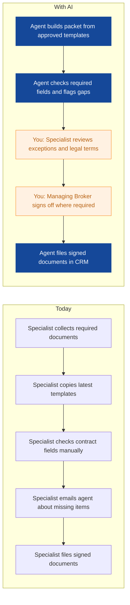
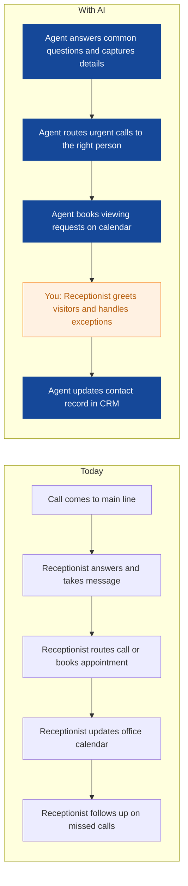
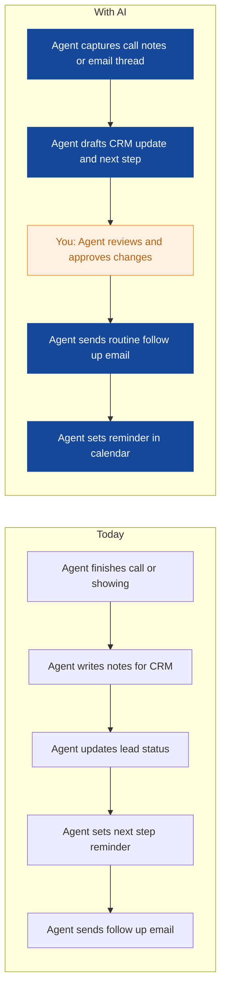
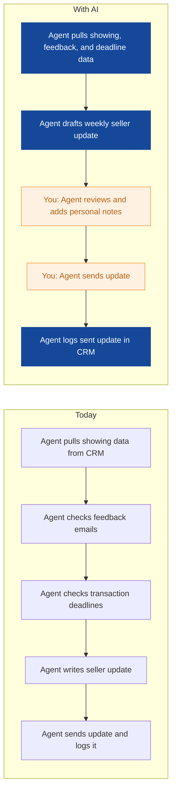

# AI Strategy for Northpeak Realty

> **Example report for a fictional company.** Generated by [CompleteAIStrategy](https://completeaistrategy.com) with the same research, strategy and pricing rules as a real report.
> **[Open the interactive report with charts →](https://completeaistrategy.com/example/northpeak-realty)**

| Hours saved per week | Value per year | Roles freed up | Opportunities |
|---:|---:|---:|---:|
| **72h** | **$165,600** | **1.8 FTE** | **9** |

## Our recommendation
**Start with a lead response agent, a showing scheduler, and a transaction deadline chaser; they cut response delays, booking friction, and missed paperwork while your team stays in control.**

Northpeak Realty runs a 22 person residential agency in Denver with sales, transaction coordination, marketing, admin, and client services using CRM, Zillow feeds, DocuSign, and MLS. Leads, showings, and paperwork move through email, phone, and calendar work that the team manages manually. As lead volume and deal activity rise, response times and deadlines depend on people checking inboxes, calendars, and signature status by hand. That creates lost buyer opportunities, missed paperwork dates, and CRM records that fall behind.

1. **Inbound leads, showings, and transaction paperwork carry most repetitive work** Sales agents and the buyer inquiry coordinator spend their days answering leads, booking showings, and updating the CRM. Transaction coordinators chase signatures, deadlines, and missing fields across DocuSign and email. Marketing and admin handle steady copy, scheduling, and filing work that repeats every week.
2. **Lead response, showing scheduling, and deadline chasing are the best first agents** These three sit on high volume, rules based tasks that use systems you already have: CRM, Zillow feeds, calendar, and DocuSign. Each can be tested in weeks with clear quality checks. They reduce buyer wait times and missed dates without changing how agents sell.
3. **Launch with human review, measure errors, then expand to other departments** Phase one keeps a person approving messages, bookings, and deadline notices while the agent drafts and tracks. You review response times, error rates, and hours saved weekly, then move proven agents to listing, marketing, and admin work. Scale remains controlled because the same review model applies to each new agent.

**Phase 1 at a glance:** Zillow and website leads answered in minutes · Showings booked and confirmed without phone tag · Transaction deadlines and signatures tracked automatically. About 30 hours a week back for $1,950/month (setup $2,870, free on a 4-month run).

## 1. Inbound leads, showings, and transaction paperwork carry most repetitive work
Sales agents and the buyer inquiry coordinator spend their days answering leads, booking showings, and updating the CRM. Transaction coordinators chase signatures, deadlines, and missing fields across DocuSign and email. Marketing and admin handle steady copy, scheduling, and filing work that repeats every week.

| Department | Hours saved / week | Share |
|---|---:|---:|
| Listings and Transaction Coordination | 23 | 32% |
| Sales | 22 | 31% |
| Client Services | 12 | 17% |
| Marketing | 8 | 11% |
| Admin and Office Operations | 7 | 10% |

## 2. Lead response, showing scheduling, and deadline chasing are the best first agents
These three sit on high volume, rules based tasks that use systems you already have: CRM, Zillow feeds, calendar, and DocuSign. Each can be tested in weeks with clear quality checks. They reduce buyer wait times and missed dates without changing how agents sell.

| # | Opportunity | Department | Hours/week | Impact | Effort | Phase |
|---:|---|---|---:|:-:|:-:|:-:|
| 1 | Zillow and website leads answered in minutes | Client Services | 12 | 5/5 | 2/5 | 1 |
| 2 | Showings booked and confirmed without phone tag | Sales | 10 | 4/5 | 2/5 | 1 |
| 3 | Transaction deadlines and signatures tracked automatically | Listings and Transaction Coordination | 8 | 5/5 | 3/5 | 1 |
| 4 | Listings published to MLS and Zillow faster | Listings and Transaction Coordination | 9 | 4/5 | 3/5 | later |
| 5 | Listing copy and social posts drafted from property facts | Marketing | 8 | 4/5 | 2/5 | later |
| 6 | Offer packets assembled and checked before sending | Listings and Transaction Coordination | 6 | 4/5 | 3/5 | later |
| 7 | Main phone and viewing requests routed by an agent | Admin and Office Operations | 7 | 3/5 | 2/5 | later |
| 8 | CRM notes and follow-ups updated from calls and emails | Sales | 7 | 3/5 | 2/5 | later |
| 9 | Weekly seller updates drafted from CRM and showing data | Sales | 5 | 3/5 | 2/5 | later |

### 1. Zillow and website leads answered in minutes (phase 1)
The agent reads each new Zillow or website lead, asks qualifying questions, proposes showing times, and updates the CRM. It keeps the buyer inquiry coordinator focused on complex cases and agent handoffs.

**Saves ~12h per week** · Roles: Buyer Inquiry Coordinator, Buyer's Agent, Real Estate Agent · Tools: CRM, Zillow feeds, Email and calendar

### 2. Showings booked and confirmed without phone tag (phase 1)
The agent coordinates showing requests, checks agent calendars, sends confirmations, and reminds buyers before the visit. It reduces phone tag and last minute cancellations for your agents.

**Saves ~10h per week** · Roles: Real Estate Agent, Buyer's Agent, Front Desk Receptionist · Tools: CRM, Email and calendar, MLS

### 3. Transaction deadlines and signatures tracked automatically (phase 1)
The agent builds closing checklists, sends DocuSign reminders, updates deal stages, and flags missing items before deadlines. It gives the transaction coordinator an exception list instead of a manual hunt through email.

**Saves ~8h per week** · Roles: Transaction Coordinator, Offer and Paperwork Specialist, Managing Broker · Tools: DocuSign, CRM, Email and calendar

### 4. Listings published to MLS and Zillow faster
The agent gathers listing details and photos, drafts MLS and Zillow fields, and checks required information before submission. It removes duplicate typing while keeping the coordinator in control of the final publish.

**Saves ~9h per week** · Roles: Listing Coordinator, Real Estate Agent · Tools: MLS, Zillow feeds, CRM

### 5. Listing copy and social posts drafted from property facts
The agent writes listing descriptions and social posts from approved property facts and brand rules. The marketing team edits and schedules, so they spend less time starting from a blank page.

**Saves ~8h per week** · Roles: Content and Social Specialist, Marketing Manager, Real Estate Agent · Tools: CRM, MLS, Email and calendar

### 6. Offer packets assembled and checked before sending
The agent assembles offer packets from templates, checks required contract fields, and flags missing items for the specialist. It reduces back and forth before offers go out.

**Saves ~6h per week** · Roles: Offer and Paperwork Specialist, Managing Broker · Tools: DocuSign, CRM, Email and calendar

### 7. Main phone and viewing requests routed by an agent
The agent answers common calls, routes urgent matters, books viewing appointments, and updates the office calendar. The front desk keeps greeting visitors and handling exceptions.

**Saves ~7h per week** · Roles: Office Administrator, Front Desk Receptionist · Tools: Email and calendar, CRM

### 8. CRM notes and follow-ups updated from calls and emails
The agent turns call notes, emails, and showing feedback into CRM updates and next step tasks. Your agents approve the record instead of typing it after every conversation.

**Saves ~7h per week** · Roles: Real Estate Agent, Buyer's Agent · Tools: CRM, Email and calendar

### 9. Weekly seller updates drafted from CRM and showing data
The agent compiles showing activity, buyer feedback, and deadline status into a weekly seller update. The listing agent reviews and sends it, keeping sellers informed without manual reporting.

**Saves ~5h per week** · Roles: Managing Broker, Real Estate Agent · Tools: CRM, Email and calendar, MLS

## 3. Launch with human review, measure errors, then expand to other departments
Phase one keeps a person approving messages, bookings, and deadline notices while the agent drafts and tracks. You review response times, error rates, and hours saved weekly, then move proven agents to listing, marketing, and admin work. Scale remains controlled because the same review model applies to each new agent.

**Phase 1 (Weeks 1-4): Prove value with lead response, showing scheduling, and deadline chasing**
- Set up lead response agent with approved questions and CRM fields
- Connect showing scheduler to agent calendars and CRM
- Build transaction checklist templates and DocuSign reminder rules
- Run daily human review for messages, bookings, and deadline notices
- Track first response time, showing confirmations, and missed deadlines

**Phase 2 (Weeks 5-10): Extend proven agents to listing publishing, copy, and offer packets**
- Connect listing intake to MLS and Zillow field drafts
- Add marketing copy agent with brand and fair housing review
- Add offer packet assembly agent with field checks
- Train listing and marketing staff on review and approval steps
- Compare error rates and hours saved against phase one

**Phase 3 (Weeks 11-16): Add admin routing, CRM updates, and seller reporting**
- Deploy phone and viewing request agent at front desk
- Add CRM note and follow up agent for sales team
- Add weekly seller update agent for listing agents
- Set escalation rules for legal, pricing, and contract questions
- Review all agents monthly and retire any that do not meet targets

**Risks**
- **Automated replies may give wrong property or pricing information**: Use approved answer libraries, keep humans approving first responses for two weeks, and route pricing or legal questions to an agent.
- **Agents may not trust or use the new workflows**: Start with volunteers, show time saved in weekly reports, and keep agents in control of all client negotiations.
- **MLS, Zillow, and DocuSign rules may restrict automated actions**: Follow each system's terms, limit access to approved accounts, and keep final submission or signature requests under human review.
- **CRM data may be incomplete or inconsistent**: Define required fields, run weekly exception reports, and have the transaction coordinator fix gaps.
- **Client communication may feel impersonal**: Use plain templates with agent names, allow quick edits, and keep personal notes for offers, negotiations, and sensitive updates.

**KPIs**
- Median first response time to Zillow and website leads
- Share of showings confirmed without manual phone tag
- Transaction deadlines missed per month
- Listing publish time from intake to MLS and Zillow
- Validated hours saved per week by team
- CRM lead status accuracy on weekly audit

## Investment: phase 1 costs $1,950 a month and gives back $6,495 a month in time
| Agent | Saves | Setup | Monthly |
|---|---:|---:|---:|
| Zillow and website leads answered in minutes | 12h/wk | $790 | $780 |
| Showings booked and confirmed without phone tag | 10h/wk | $790 | $650 |
| Transaction deadlines and signatures tracked automatically | 8h/wk | $1,290 | $520 |
| **Total** | **30h/wk** | **$2,870** | **$1,950** |

Setup is free when the agents run for 4 months. Full rollout of all 9 opportunities: $8,610 setup, $4,660/month.

## Appendix: background
- **Industry:** Residential real estate
- **What they do:** Northpeak Realty is a residential real estate agency in Denver with 22 people. You help buyers and sellers with property listings, buyer inquiries, viewings, and offer paperwork. Your team uses a CRM, Zillow feeds, and DocuSign to run day to day work.
- **Customers:** Home buyers and sellers in Denver and nearby suburbs
- **Team size:** 11-50 (estimate 22)
- **Tools:** CRM, Zillow feeds, DocuSign, MLS, Email and calendar
- **AI maturity:** 2/5, Early automation. Northpeak Realty uses core real estate systems but relies on manual email, calendar, and CRM updates. There are no AI agents or automations in place today.

| Department | People | Roles |
|---|---:|---|
| Sales | 12 | Managing Broker (1), Real Estate Agent (9), Buyer's Agent (2) |
| Listings and Transaction Coordination | 3 | Listing Coordinator (1), Transaction Coordinator (1), Offer and Paperwork Specialist (1) |
| Marketing | 3 | Marketing Manager (1), Content and Social Specialist (1), Graphic Designer (1) |
| Admin and Office Operations | 3 | Office Administrator (1), Front Desk Receptionist (1), Operations Assistant (1) |
| Client Services | 1 | Buyer Inquiry Coordinator (1) |

---
Want this for your own company? **[Get your free AI strategy →](https://completeaistrategy.com)**
