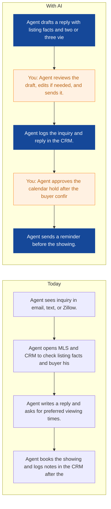
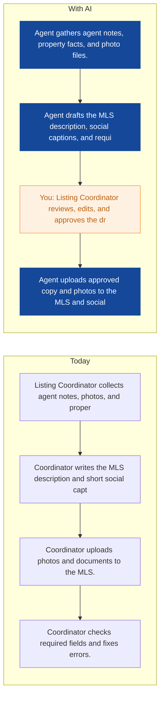
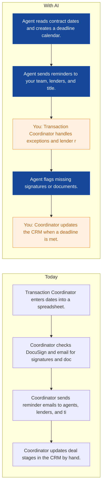
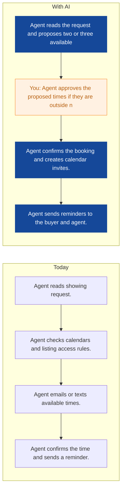
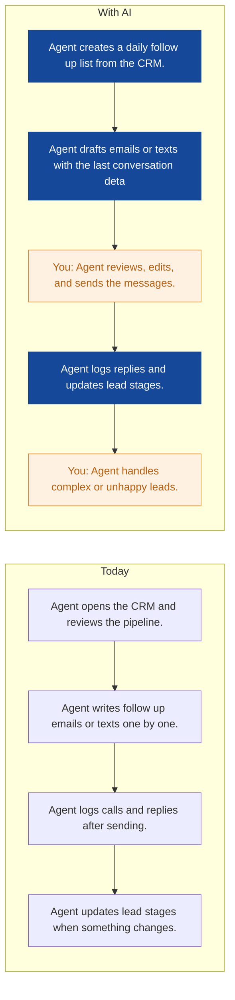
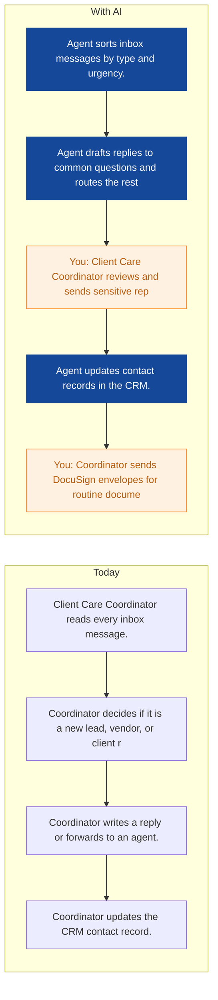
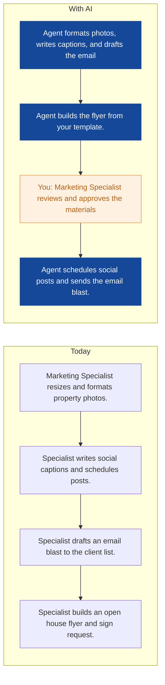
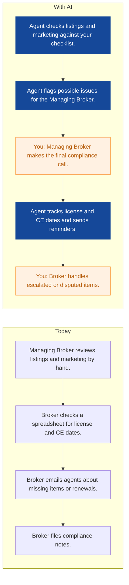

# AI Strategy for Northpeak Realty

> **Example report for a fictional company.** Generated by [CompleteAIStrategy](https://completeaistrategy.com) with the same research, strategy and pricing rules as a real report.
> **[Open the interactive report with charts →](https://completeaistrategy.com/example/northpeak-realty)**

| Hours saved per week | Value per year | Roles freed up | Opportunities |
|---:|---:|---:|---:|
| **45h** | **$103,500** | **1.1 FTE** | **8** |

## Summary
Northpeak Realty has 22 people serving Denver buyers and sellers, with most work moving through your CRM, MLS, email, calendar, and DocuSign. Your team is early with AI today, so the best first step is to automate high volume tasks that already have clear steps. The plan below starts with buyer inquiry replies and listing descriptions, then moves into transaction deadlines and CRM follow up. It saves about 45 team hours a week, which is under 6 percent of your total weekly capacity. A consultant can set up and maintain each agent in your existing tools.

## Company snapshot
- **Industry:** Residential Real Estate Brokerage
- **What they do:** Northpeak Realty is a residential real estate agency in Denver with 22 people. Your team writes property listings, answers buyer inquiries, books viewings, and handles offer paperwork for home buyers and sellers across the metro area.
- **Customers:** Home buyers and sellers in the Denver metro area, including first-time buyers and move-up sellers
- **Team size:** 11-50 (estimate 22)
- **Tools:** Real estate CRM, Zillow listing feeds, DocuSign, MLS system, Email and calendar tools, Likely Google Workspace or Microsoft 365
- **AI maturity:** 2/5, Early. Your systems are standard real estate tools, but most handoffs are manual. There is no named AI owner, and automations are limited to basic email or CRM rules.

## Team and roles
| Department | People | Roles |
|---|---:|---|
| Sales and Agent Team | 13 | Licensed Real Estate Agent (9), Associate or Buyer's Agent (4) |
| Listings and Marketing | 4 | Listing Coordinator (1), Marketing Specialist (2), Content and Media Coordinator (1) |
| Client Services and Office Administration | 3 | Office Administrator (1), Client Care Coordinator (2) |
| Operations and Compliance | 2 | Transaction Coordinator (1), Managing Broker (1) |

## Opportunities
| # | Opportunity | Department | Hours/week | Impact | Effort |
|---:|---|---|---:|:-:|:-:|
| 1 | Buyer inquiries answered in minutes | Sales and Agent Team | 8 | 5/5 | 3/5 |
| 2 | MLS and social listing descriptions drafted for review | Listings and Marketing | 7 | 5/5 | 3/5 |
| 3 | Contract deadlines tracked automatically | Operations and Compliance | 6 | 5/5 | 4/5 |
| 4 | Showing requests booked with less back and forth | Sales and Agent Team | 6 | 4/5 | 2/5 |
| 5 | Lead follow up runs on time | Sales and Agent Team | 5 | 4/5 | 3/5 |
| 6 | Website and general inbox triaged | Client Services and Office Administration | 5 | 3/5 | 2/5 |
| 7 | Listing marketing posts prepared on schedule | Listings and Marketing | 5 | 3/5 | 3/5 |
| 8 | Compliance and license dates watched | Operations and Compliance | 3 | 4/5 | 3/5 |

### 1. Buyer inquiries answered in minutes
An agent watches website, Zillow, email, and text inquiries, pulls listing details, and drafts a reply that answers common questions and offers viewing times. It also logs the contact in your CRM and creates a calendar hold when the buyer picks a slot.

**Saves ~8h per week** · Roles: Licensed Real Estate Agent, Associate or Buyer's Agent · Tools: Real estate CRM, MLS system, Zillow listing feeds, Email, Calendar

### 2. MLS and social listing descriptions drafted for review
An agent turns agent notes, property facts, and photo details into an MLS ready description and short social highlights. It checks required fields and flags missing details before the listing goes live.

**Saves ~7h per week** · Roles: Listing Coordinator, Content and Media Coordinator · Tools: MLS system, Google Workspace or Microsoft 365, Real estate CRM, Social media scheduler

### 3. Contract deadlines tracked automatically
An agent reads signed contracts and tracks every deadline, then sends reminders to your team, lenders, and title companies. It flags missing signatures or documents before they become a problem.

**Saves ~6h per week** · Roles: Transaction Coordinator, Managing Broker · Tools: DocuSign, Real estate CRM, Email, Calendar, Lender and title email

### 4. Showing requests booked with less back and forth
An agent reads showing requests from email, text, and website forms, checks agent calendars, and proposes available times. It confirms the booking and sends reminders to the buyer and agent.

**Saves ~6h per week** · Roles: Licensed Real Estate Agent, Associate or Buyer's Agent · Tools: Calendar, Real estate CRM, Email, Text messaging

### 5. Lead follow up runs on time
An agent reviews your CRM each morning, finds leads that need follow up, and drafts personal emails or texts based on the last conversation. It logs replies and updates lead stages so your pipeline stays clean.

**Saves ~5h per week** · Roles: Licensed Real Estate Agent, Associate or Buyer's Agent · Tools: Real estate CRM, Email, Text messaging, Calendar

### 6. Website and general inbox triaged
An agent reads general website and office email, answers common questions, and routes messages to the right agent. It updates contact records and sends standard DocuSign envelopes when a form is ready.

**Saves ~5h per week** · Roles: Client Care Coordinator, Office Administrator · Tools: Email, Website forms, Real estate CRM, DocuSign

### 7. Listing marketing posts prepared on schedule
An agent formats property photos, writes captions, and drafts email blasts and open house flyers from your templates. It schedules approved posts and sends the email blast to your client list.

**Saves ~5h per week** · Roles: Marketing Specialist, Content and Media Coordinator · Tools: Social media scheduler, Email marketing, Google Workspace or Microsoft 365, Photo library

### 8. Compliance and license dates watched
An agent checks new listings and marketing materials against your compliance checklist and tracks agent license and continuing education dates. It sends reminders before a date is missed and flags items for your review.

**Saves ~3h per week** · Roles: Managing Broker · Tools: Compliance checklists, Real estate CRM, License and CE records, Email

## Roadmap
**Phase 1 (Weeks 1-4): Set up the foundation and quick wins**
- Choose one owner for each agent and one backup in your office.
- Connect email, calendar, CRM, and MLS accounts for the first two agents.
- Launch buyer inquiry replies and showing scheduling in Sales and Agent Team.
- Train agents on reviewing drafts and approving sends.
- Track hours saved and reply times weekly.

**Phase 2 (Weeks 5-10): Add listing and transaction work**
- Launch MLS and social listing description agent with Listings and Marketing.
- Launch contract deadline tracker with Operations and Compliance.
- Connect DocuSign and title or lender email to the deadline tracker.
- Set review rules for compliance and client sensitive messages.
- Review errors and adjust prompts and templates weekly.

**Phase 3 (Weeks 11-16): Expand follow up and reporting**
- Launch lead follow up and website inbox triage.
- Launch listing marketing scheduling and compliance date tracking.
- Add a simple dashboard for hours saved, response times, and pipeline health.
- Document who maintains each agent and when it is reviewed.
- Plan next quarter based on measured results.

## Risks
- **Agents send drafts without review and a wrong detail reaches a client.**: Keep human approval on all outbound client messages for the first 90 days. Audit a sample every week.
- **CRM or MLS data is messy, so agents give bad answers.**: Clean contact and listing fields before each launch. Start with one data source at a time.
- **Compliance rules change and the agent uses old language.**: Managing Broker owns the compliance checklist. Review it monthly and update the agent.
- **Team does not trust or use the agents.**: Start with two volunteers. Show time saved and reply speed. Train in short sessions.
- **Vendor lock in or cost creep.**: Track monthly cost per agent. Keep setup in tools you already pay for where possible.

## KPIs
- Average first response time to buyer inquiries, target under 10 minutes during business hours.
- Showing requests booked without manual back and forth, target 60 percent.
- Listing description draft time, target under 30 minutes from agent notes.
- Contract deadlines missed, target zero.
- CRM leads with follow up in the last 7 days, target 95 percent.
- Team hours saved per week, target 45 to 50 by week 16.

## Quote: phase 1
| Agent | Saves | Setup | Monthly |
|---|---:|---:|---:|
| Buyer inquiries answered in minutes | 8h/wk | $1,290 | $520 |
| Showing requests booked with less back and forth | 6h/wk | $790 | $390 |
| MLS and social listing descriptions drafted for review | 7h/wk | $1,290 | $450 |
| **Total** | **21h/wk** | **$3,370** | **$1,360** |

Setup is free when the agents run for 4 months. Full rollout of all 8 opportunities: $9,920 setup, $3,000/month.

---
Want this for your own company? **[Get your free AI strategy →](https://completeaistrategy.com)**
