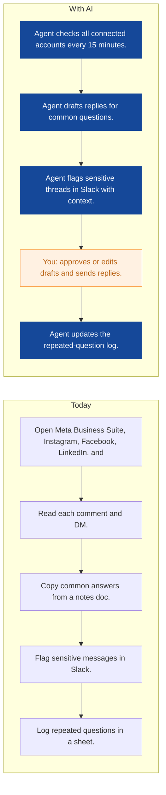
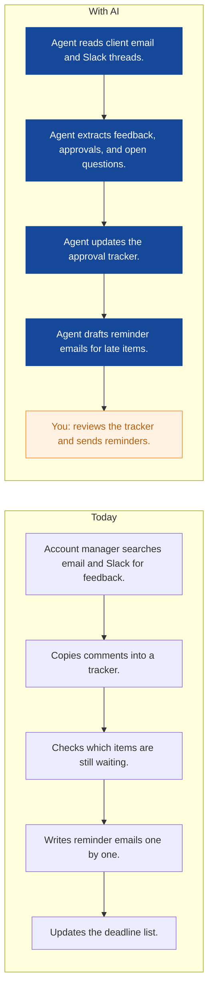
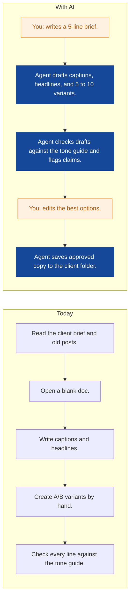
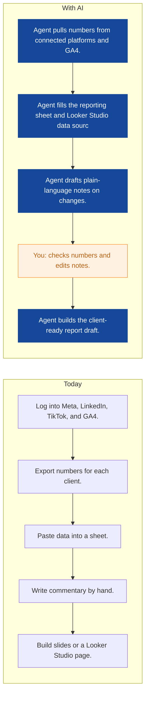
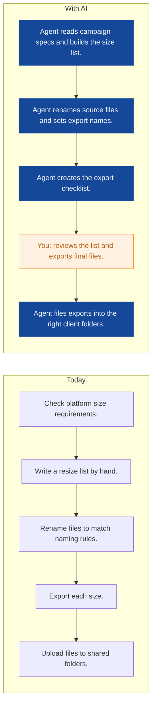
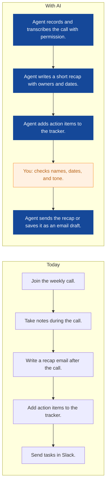
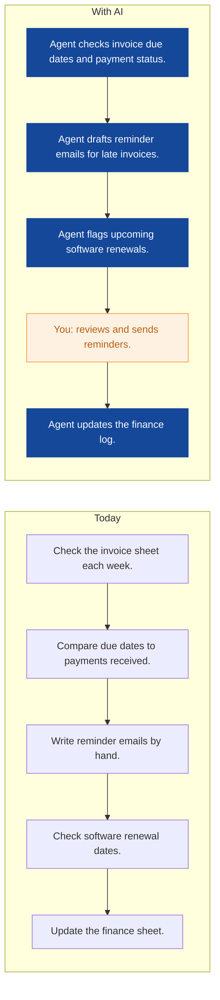
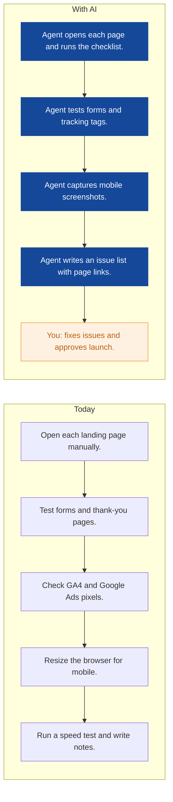
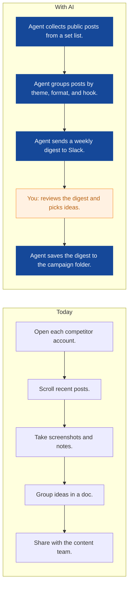

# AI Strategy for Pixelhive Studio

> **Example report for a fictional company.** Generated by [CompleteAIStrategy](https://completeaistrategy.com) with the same research, strategy and pricing rules as a real report.
> **[Open the interactive report with charts →](https://completeaistrategy.com/example/pixelhive-studio)**

| Hours saved per week | Value per year | Roles freed up | Opportunities |
|---:|---:|---:|---:|
| **46h** | **$105,800** | **1.2 FTE** | **9** |

## Summary
Pixelhive Studio is an 18-person Berlin agency with five designers, three copy and content people, four social media managers, four account managers, one developer, and one operations manager. Most of your current work runs through Meta Business Suite, Instagram, Facebook, LinkedIn, TikTok, Google Ads, GA4, Looker Studio, Google Workspace, and Slack, with little automation between them. The best near-term gains are in comment and DM triage, client approval chasing, first-draft copy, monthly report data pulls, and ad resize prep. Start with low-effort agents that keep a human in the loop for public replies, client emails, and final numbers.

## Company snapshot
- **Industry:** Creative and digital marketing agency
- **What they do:** You run an 18-person creative and digital marketing agency in Berlin. Your team includes designers, copywriters, social media managers, account managers, and one developer. You sell ongoing social campaigns, ad creative, and monthly reporting to clients, with many revision rounds along the way.
- **Customers:** Small and mid-sized consumer brands, local Berlin businesses, ecommerce shops, and startups that need regular marketing execution.
- **Team size:** 11-50 (estimate 18)
- **Tools:** Meta Business Suite, Instagram, Facebook, LinkedIn, TikTok, Google Ads, Google Analytics 4, Looker Studio, Google Workspace, Slack
- **AI maturity:** 2/5, Early stage. You have the tools in place but the work is still manual. No agents are running, data lives in separate platforms and sheets, and team time is spent on repetition rather than strategy.

## Team and roles
| Department | People | Roles |
|---|---:|---|
| Creative and Design | 5 | Graphic Designer (3), Art Director (1), Motion Designer (1) |
| Copywriting and Content | 3 | Copywriter (2), Content Strategist (1) |
| Social Media Management | 4 | Social Media Manager (3), Community Manager (1) |
| Account Management and Client Services | 4 | Account Manager (3), Project Coordinator (1) |
| Development | 1 | Web Developer (1) |
| Operations and Finance | 1 | Operations Manager (1) |

## Opportunities
| # | Opportunity | Department | Hours/week | Impact | Effort |
|---:|---|---|---:|:-:|:-:|
| 1 | Comments and DMs answered in minutes | Social Media Management | 8 | 5/5 | 3/5 |
| 2 | Client approvals chased automatically | Account Management and Client Services | 6 | 5/5 | 3/5 |
| 3 | First drafts for captions and ad variants | Copywriting and Content | 8 | 4/5 | 2/5 |
| 4 | Monthly report data pull and first notes | Social Media Management | 6 | 4/5 | 3/5 |
| 5 | Ad resize prep and export names | Creative and Design | 5 | 4/5 | 4/5 |
| 6 | Weekly call recaps and action items | Account Management and Client Services | 4 | 3/5 | 2/5 |
| 7 | Invoice reminders and subscription renewals | Operations and Finance | 3 | 3/5 | 2/5 |
| 8 | Landing page checks before launch | Development | 3 | 3/5 | 3/5 |
| 9 | Competitor post digest for content planning | Copywriting and Content | 3 | 2/5 | 2/5 |

### 1. Comments and DMs answered in minutes
An agent watches comments and direct messages across client accounts, drafts replies from approved FAQs, and flags sensitive or buying-intent threads to the right person. It logs repeated questions so your team can update the FAQ bank.

**Saves ~8h per week** · Roles: Social Media Manager, Community Manager · Tools: Meta Business Suite, Instagram, Facebook, LinkedIn, Slack

### 2. Client approvals chased automatically
An agent reads client email and Slack threads, pulls out feedback and approvals, and keeps a shared approval tracker current. It sends polite reminders when a client is holding up a deadline.

**Saves ~6h per week** · Roles: Account Manager, Project Coordinator · Tools: Google Workspace, Slack, Google Sheets

### 3. First drafts for captions and ad variants
An agent turns a short brief and brand tone guide into first drafts for social captions, headlines, and A/B variants. It marks claims or phrases that need human checking before client delivery.

**Saves ~8h per week** · Roles: Copywriter, Content Strategist · Tools: Google Workspace, Meta Business Suite, Google Ads

### 4. Monthly report data pull and first notes
An agent pulls numbers from each platform and GA4 into a reporting sheet, then writes plain-language notes about what changed. Your team checks the numbers and edits the story before it goes to the client.

**Saves ~6h per week** · Roles: Social Media Manager, Account Manager · Tools: Google Analytics 4, Looker Studio, Meta Business Suite, Google Sheets

### 5. Ad resize prep and export names
An agent reads campaign specs and prepares the resize list, file names, and export checklist for each platform. It reduces the manual admin around exports and gives designers a clean queue.

**Saves ~5h per week** · Roles: Graphic Designer, Motion Designer · Tools: Google Workspace, Meta Business Suite, LinkedIn

### 6. Weekly call recaps and action items
An agent turns recorded weekly status calls into a short recap with owners and due dates. It posts the recap in the client Slack channel or drafts the follow-up email for the account manager.

**Saves ~4h per week** · Roles: Account Manager, Project Coordinator · Tools: Google Workspace, Slack, Google Sheets

### 7. Invoice reminders and subscription renewals
An agent watches invoice due dates and software renewal dates in your finance sheet and inbox. It drafts reminder emails and flags subscriptions that are close to renewal.

**Saves ~3h per week** · Roles: Operations Manager · Tools: Google Workspace, Google Sheets, Slack

### 8. Landing page checks before launch
An agent runs a launch checklist on campaign pages, checking forms, tracking pixels, mobile layout, and speed. It sends a screenshot-based issue list to the developer so fixes are clear.

**Saves ~3h per week** · Roles: Web Developer · Tools: Google Analytics 4, Google Ads, Google Workspace

### 9. Competitor post digest for content planning
An agent collects public posts from chosen competitor accounts and groups them by theme, format, and hook. It sends a weekly digest to help your team plan, without copying claims or creative.

**Saves ~3h per week** · Roles: Content Strategist, Copywriter · Tools: Instagram, LinkedIn, TikTok, Slack

## Roadmap
**Phase 1 (Weeks 1 to 4): Low-effort agents with human review**
- Build an approved FAQ bank for common comments and DMs.
- Connect Slack, Google Workspace, and Meta Business Suite to the first agents.
- Start the comments and DMs agent with human approval for all public replies.
- Start the copy drafting agent for social captions and ad variants.
- Start the monthly report data pull agent for one or two friendly clients.

**Phase 2 (Months 2 to 3): Client workflows and finance**
- Add the client approval tracker and reminder agent.
- Add weekly call recaps with human review before sending.
- Add invoice reminders and subscription renewal flags.
- Add landing page launch checks for the developer.
- Train account managers and social managers on review steps and escalation rules.

**Phase 3 (Months 4 to 6): Creative and planning support**
- Add ad resize prep and export naming for the design team.
- Add the competitor post digest for content planning.
- Expand agents to more client accounts after privacy checks.
- Review hours saved, error rates, and client feedback every month.
- Refine FAQ banks, tone guides, and report templates from agent logs.

## Risks
- **Client data privacy and platform rules are not followed.**: Only connect approved client accounts, get written consent, limit agent access to what is needed, and review DMs before replies go out.
- **An AI reply or client email damages a brand or relationship.**: Keep human approval for all public replies and client emails. Use an approved FAQ bank and escalate sensitive topics to an account manager.
- **Integrations break or become hard to maintain.**: Start with Google Workspace, Slack, and Meta. Add one tool at a time. Document each connection and assign one owner per agent.
- **The team does not adopt the agents or sees them as extra work.**: Assign an owner per agent, hold a 30-minute weekly review, and show hours saved per role. Start with the tasks people dislike most.
- **Report numbers are wrong before they reach a client.**: Have the agent pull raw data, then require a human check against platform dashboards before any client report is sent.

## KPIs
- Hours saved per week from agents, target 40 to 50 after phase 2
- Average first reply time to comments and DMs
- Percentage of client approvals collected before the deadline
- Monthly reports delivered on time and without corrections
- Number of revision rounds per campaign
- Invoice reminders sent before due date and overdue invoice count

## Quote: phase 1
| Agent | Saves | Setup | Monthly |
|---|---:|---:|---:|
| First drafts for captions and ad variants | 8h/wk | $790 | $520 |
| Comments and DMs answered in minutes | 8h/wk | $1,290 | $520 |
| Client approvals chased automatically | 6h/wk | $1,290 | $390 |
| **Total** | **22h/wk** | **$3,370** | **$1,430** |

Setup is free when the agents run for 4 months. Full rollout of all 9 opportunities: $10,210 setup, $3,300/month.

---
Want this for your own company? **[Get your free AI strategy →](https://completeaistrategy.com)**
