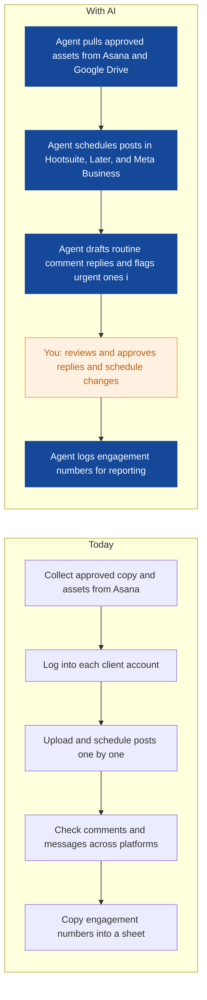
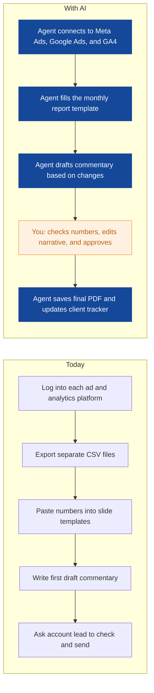
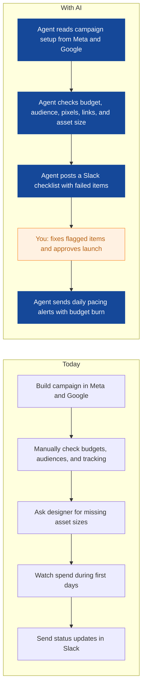
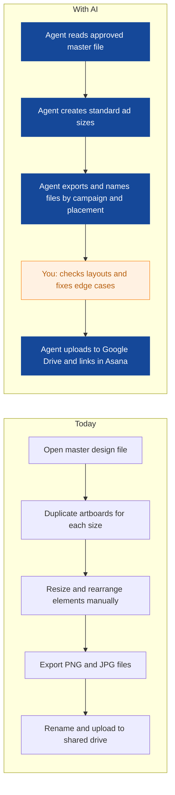
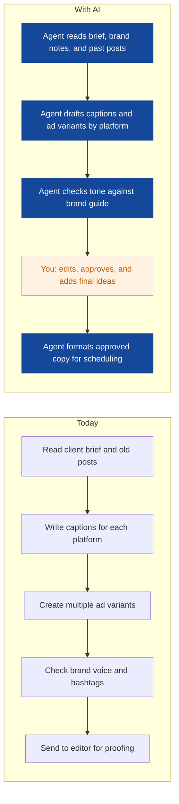
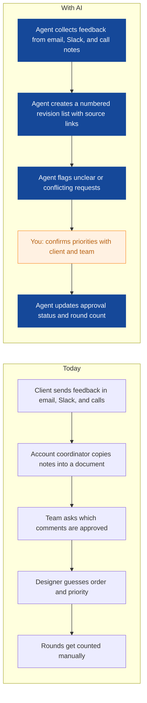
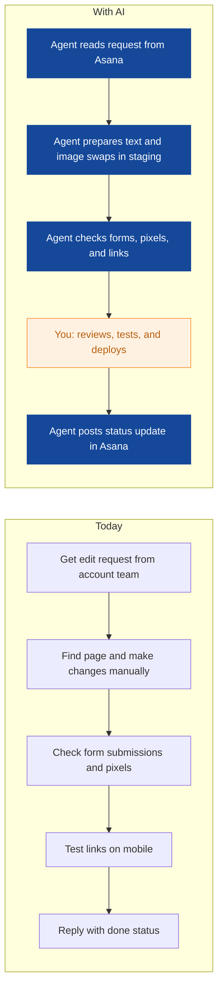
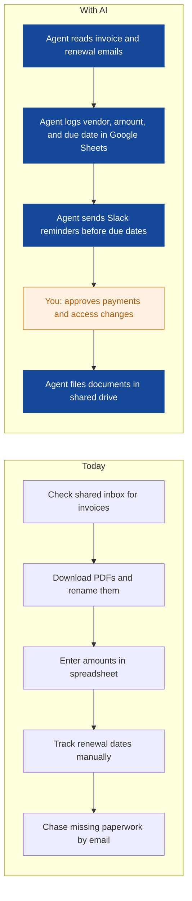

# AI Strategy for Pixelhive Studio

> **Example report for a fictional company.** Generated by [CompleteAIStrategy](https://completeaistrategy.com) with the same research, strategy and pricing rules as a real report.
> **[Open the interactive report with charts →](https://completeaistrategy.com/example/pixelhive-studio)**

| Hours saved per week | Value per year | Roles freed up | Opportunities |
|---:|---:|---:|---:|
| **53h** | **$121,900** | **1.3 FTE** | **8** |

## Our recommendation
**Start with three agents for social scheduling and comment triage, monthly client reporting, and campaign setup QA to reduce missed messages, produce cleaner reports, and speed campaign launches.**

Pixelhive Studio is an 18-person Berlin agency running social campaigns, ad creative, copy, and monthly reporting for many clients. Most work moves through Slack, Asana or Trello, Google Workspace, Adobe Creative Cloud, Figma, and platform ad tools. Your team repeats the same setup, scheduling, metric pulling, feedback chasing, and file prep across every client, so deadlines slip when volume rises. Client reporting and campaign checks depend on busy people remembering manual steps, which creates errors and slow responses.

1. **Social, account, and creative teams carry most repeated client work** Social managers and community managers repeat scheduling, comment checks, and metric pulls for every client. Account teams chase feedback, build monthly reports, and track revision rounds by hand. Creative teams spend hours resizing, exporting, and renaming files after each approval.
2. **The first three agents target frequent, low-risk work with clear inputs** Social scheduling and comment triage use tools you already have and affect every client account. Monthly reporting pulls from known platforms into a template your account team already owns. Campaign setup QA catches costly mistakes before spend starts. These three show proof quickly without touching sensitive creative decisions.
3. **Pilot each agent with one owner, human approval, and weekly checks** Run a four-week pilot per agent with one process owner and human approval on client-facing output. Review errors and time saved weekly, then scale to all clients once the workflow is stable. Keep manual fallbacks for platform access issues and unclear briefs.

**Phase 1 at a glance:** Social posts scheduled and routine comments triaged · Monthly client reports built from live metrics · Ad campaigns checked before launch and pacing alerts sent daily. About 26 hours a week back for $1,680/month (setup $3,370, free on a 4-month run).

## 1. Social, account, and creative teams carry most repeated client work
Social managers and community managers repeat scheduling, comment checks, and metric pulls for every client. Account teams chase feedback, build monthly reports, and track revision rounds by hand. Creative teams spend hours resizing, exporting, and renaming files after each approval.

| Department | Hours saved / week | Share |
|---|---:|---:|
| Social Media & Campaigns | 17 | 32% |
| Account Management | 14 | 26% |
| Creative & Design | 8 | 15% |
| Copy & Content | 7 | 13% |
| Operations & Leadership | 4 | 8% |
| Web Development | 3 | 6% |

## 2. The first three agents target frequent, low-risk work with clear inputs
Social scheduling and comment triage use tools you already have and affect every client account. Monthly reporting pulls from known platforms into a template your account team already owns. Campaign setup QA catches costly mistakes before spend starts. These three show proof quickly without touching sensitive creative decisions.

| # | Opportunity | Department | Hours/week | Impact | Effort | Phase |
|---:|---|---|---:|:-:|:-:|:-:|
| 1 | Social posts scheduled and routine comments triaged | Social Media & Campaigns | 11 | 5/5 | 2/5 | 1 |
| 2 | Monthly client reports built from live metrics | Account Management | 9 | 5/5 | 3/5 | 1 |
| 3 | Ad campaigns checked before launch and pacing alerts sent daily | Social Media & Campaigns | 6 | 4/5 | 3/5 | 1 |
| 4 | Ad creative resized and exported for every placement | Creative & Design | 8 | 4/5 | 3/5 | later |
| 5 | First-draft ad copy and captions ready for editing | Copy & Content | 7 | 4/5 | 3/5 | later |
| 6 | Revision rounds tracked and client feedback collected in one place | Account Management | 5 | 4/5 | 2/5 | later |
| 7 | Small landing page edits and tracking checks handled faster | Web Development | 3 | 3/5 | 4/5 | later |
| 8 | Contractor invoices and tool renewals tracked automatically | Operations & Leadership | 4 | 3/5 | 3/5 | later |

### 1. Social posts scheduled and routine comments triaged (phase 1)
An agent schedules approved posts across client accounts and drafts replies to routine comments for human review. It flags urgent or negative messages in Slack with context.

**Saves ~11h per week** · Roles: Social Media Manager, Community Manager · Tools: Hootsuite, Later, Meta Business Suite, Slack, Asana, Google Sheets

### 2. Monthly client reports built from live metrics (phase 1)
An agent pulls metrics from Meta, Google Ads, and GA4 into a client-ready draft with commentary prompts. It updates the same report template each month.

**Saves ~9h per week** · Roles: Account Manager, Account Coordinator · Tools: Meta Ads Manager, Google Ads, Google Analytics 4, Google Slides, Google Sheets, Asana

### 3. Ad campaigns checked before launch and pacing alerts sent daily (phase 1)
An agent runs a pre-launch checklist on new Meta and Google campaigns and posts daily pacing alerts. It catches missing pixels, wrong budgets, and broken links before spend starts.

**Saves ~6h per week** · Roles: Campaign Manager · Tools: Meta Ads Manager, Google Ads, Slack, Asana, Google Sheets

### 4. Ad creative resized and exported for every placement
An agent prepares common ad sizes from approved Figma or Photoshop files and names files to your convention. Designers review and adjust only where the layout breaks.

**Saves ~8h per week** · Roles: Graphic Designer, Senior Designer · Tools: Figma, Adobe Photoshop, Adobe Illustrator, Google Drive, Asana

### 5. First-draft ad copy and captions ready for editing
An agent drafts ad copy and social captions from a brief, brand voice notes, and past top performers. It gives writers a clear starting point instead of a blank page.

**Saves ~7h per week** · Roles: Copywriter, Content Strategist, Editor · Tools: Google Docs, Google Workspace, Slack, Asana

### 6. Revision rounds tracked and client feedback collected in one place
An agent gathers feedback from email, Slack, and calls into a numbered revision list. It tracks rounds and approvals so nothing gets lost between client and creative.

**Saves ~5h per week** · Roles: Account Manager, Account Coordinator · Tools: Google Workspace, Slack, Asana, Trello

### 7. Small landing page edits and tracking checks handled faster
An agent prepares routine landing page text and image swaps and checks forms, pixels, and links. The developer reviews and deploys changes.

**Saves ~3h per week** · Roles: Web Developer · Tools: Webflow, WordPress, Google Analytics 4, Google Tag Manager, Asana

### 8. Contractor invoices and tool renewals tracked automatically
An agent reads invoice emails and renewal notices, logs amounts and due dates, and sends reminders. It keeps contractor paperwork and tool access notes in one place.

**Saves ~4h per week** · Roles: Operations Manager · Tools: Gmail, Google Sheets, Google Drive, Slack, Asana

## 3. Pilot each agent with one owner, human approval, and weekly checks
Run a four-week pilot per agent with one process owner and human approval on client-facing output. Review errors and time saved weekly, then scale to all clients once the workflow is stable. Keep manual fallbacks for platform access issues and unclear briefs.

**Phase 1 (Weeks 1-4): Prove three agents on daily client work**
- Set up social scheduling and comment triage with two client accounts
- Connect Meta, Google Ads, and GA4 for monthly reporting draft
- Run campaign setup QA and pacing alerts for new campaigns
- Keep human approval on all client-facing messages and reports
- Review time saved and errors weekly

**Phase 2 (Weeks 5-10): Add creative and copy support**
- Pilot ad resize agent with three standard placements
- Pilot copy variant agent with two copywriters
- Connect revision tracking to Asana and Slack
- Train team on review and approval steps

**Phase 3 (Weeks 11-16): Extend to web and operations, then scale**
- Add landing page edit and tracking check agent
- Add invoice and renewal tracking for operations
- Document each agent owner and backup
- Review KPIs and expand to all clients

**Risks**
- **Client-facing errors from automated drafts**: Human approval before send and weekly sample checks
- **Platform API limits or access changes**: Start with exports and scheduled checks where APIs are limited, and keep manual fallbacks
- **Team adoption stalls because process is unclear**: Name one owner per agent and train in short sessions
- **Data privacy or client confidentiality**: Limit access to need-to-know accounts, use client-specific workspaces, and review permissions quarterly
- **Too many tools at once**: Limit phase 1 to three agents and existing tools

**KPIs**
- Hours saved per week across phase 1 agents
- Average first response time to client comments and messages
- Monthly reports delivered by target date
- Campaign setup errors caught before launch
- Revision rounds completed within agreed turnaround
- Team adoption rate for each agent

## Investment: phase 1 costs $1,680 a month and gives back $5,629 a month in time
| Agent | Saves | Setup | Monthly |
|---|---:|---:|---:|
| Social posts scheduled and routine comments triaged | 11h/wk | $790 | $710 |
| Monthly client reports built from live metrics | 9h/wk | $1,290 | $580 |
| Ad campaigns checked before launch and pacing alerts sent daily | 6h/wk | $1,290 | $390 |
| **Total** | **26h/wk** | **$3,370** | **$1,680** |

Setup is free when the agents run for 4 months. Full rollout of all 8 opportunities: $9,920 setup, $3,550/month.

## Appendix: background
- **Industry:** Creative and digital marketing agency
- **What they do:** Pixelhive Studio is a Berlin creative and digital marketing agency with 18 people. You and your team run social campaigns, create ads, produce design and copy, report monthly results to clients, and manage many revision rounds.
- **Customers:** Small and mid-sized brands, consumer companies and local businesses that need ongoing marketing creative and campaign support. Likely B2C clients plus some B2B clients in Berlin, Germany and nearby markets.
- **Team size:** 11-50 (estimate 18)
- **Tools:** Adobe Creative Cloud (Photoshop, Illustrator, InDesign), Figma, Canva, Meta Business Suite and Ads Manager, Google Ads, Google Analytics 4, Google Workspace, Slack, Asana or Trello, Hootsuite or Later
- **AI maturity:** 2/5, Early. AI use is ad hoc, mostly writing help and simple automations, and no agent owns a recurring workflow yet.

| Department | People | Roles |
|---|---:|---|
| Creative & Design | 5 | Graphic Designer (3), Senior Designer (1), Art Director (1) |
| Copy & Content | 4 | Copywriter (2), Content Strategist (1), Editor (1) |
| Social Media & Campaigns | 4 | Social Media Manager (2), Campaign Manager (1), Community Manager (1) |
| Account Management | 3 | Account Manager (2), Account Coordinator (1) |
| Web Development | 1 | Web Developer (1) |
| Operations & Leadership | 1 | Operations Manager (1) |

---
Want this for your own company? **[Get your free AI strategy →](https://completeaistrategy.com)**
