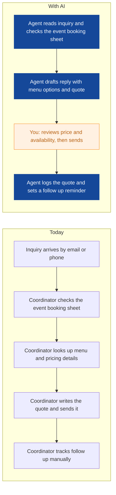
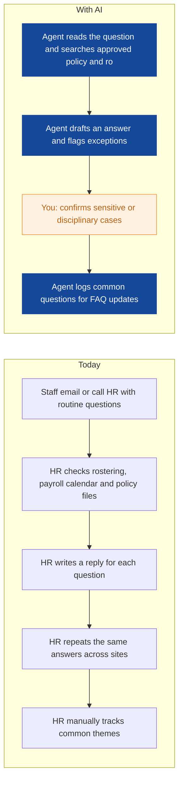
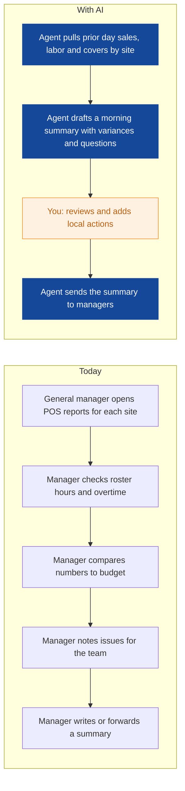
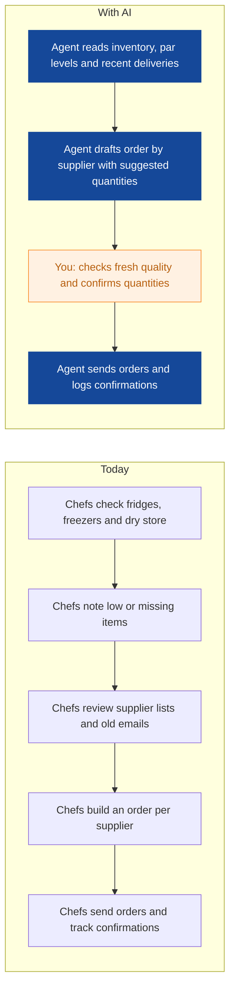
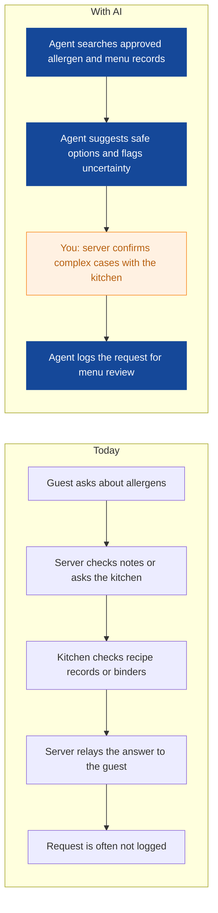
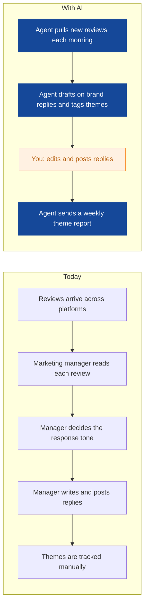
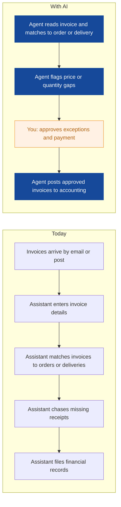
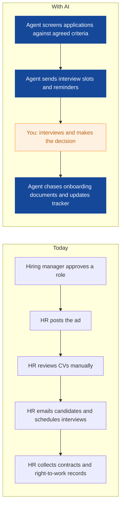

# AI Strategy for Saffron Table Group

> **Example report for a fictional company.** Generated by [CompleteAIStrategy](https://completeaistrategy.com) with the same research, strategy and pricing rules as a real report.
> **[Open the interactive report with charts →](https://completeaistrategy.com/example/saffron-table-group)**

| Hours saved per week | Value per year | Roles freed up | Opportunities |
|---:|---:|---:|---:|
| **109h** | **$250,700** | **2.7 FTE** | **8** |

## Our recommendation
**Start with event quote drafting, routine HR roster answers, and daily sales and labor summaries to cut administrative drag, speed guest response, and prove value across your five restaurants.**

Saffron Table Group runs five Amsterdam restaurants with about 120 staff and a six person office. Daily work depends on reservations, rosters, supplier orders, allergen checks, event quotes and guest feedback across separate systems. Managers and office staff spend too much time retyping information, answering routine questions and chasing approvals. As sites get busier, these manual steps slow guest response, risk errors and hide where the real bottlenecks sit.

1. **Event, kitchen, and finance admin consume the most repeatable management time** Your five sites create daily reports, rosters, supplier orders, allergen checks and event quotes. Office and management roles touch these most, while front line staff handle guest facing steps. The repeatable work sits in email, spreadsheets and system checks rather than in cooking or serving.
2. **Event quotes, HR roster answers, and daily trading summaries offer the fastest proof** These three areas use information you already have: event menus and prices, approved HR policies, and POS plus roster data. Each agent can start with email and spreadsheet inputs before deeper system work. They affect coordinators, HR and general managers, so success is visible quickly.
3. **Run a four week pilot, measure weekly, then scale to all five sites** Set up each agent with a named owner, approved source documents and a human approval step. Review weekly hours saved, response times and error flags. After the pilot, extend the same pattern to supplier orders, allergen checks, finance and marketing, then scale across all five restaurants.

**Phase 1 at a glance:** Event inquiries answered with draft quotes · Routine HR questions answered from policies and rosters · Daily sales and labor summary ready before opening. About 37 hours a week back for $2,400/month (setup $2,870, free on a 4-month run).

## 1. Event, kitchen, and finance admin consume the most repeatable management time
Your five sites create daily reports, rosters, supplier orders, allergen checks and event quotes. Office and management roles touch these most, while front line staff handle guest facing steps. The repeatable work sits in email, spreadsheets and system checks rather than in cooking or serving.

| Department | Hours saved / week | Share |
|---|---:|---:|
| HR | 20 | 18% |
| Front of House | 20 | 18% |
| Kitchen and Back of House | 18 | 17% |
| Finance | 16 | 15% |
| Restaurant Operations | 15 | 14% |
| Events and Catering | 12 | 11% |
| Marketing | 8 | 7% |

## 2. Event quotes, HR roster answers, and daily trading summaries offer the fastest proof
These three areas use information you already have: event menus and prices, approved HR policies, and POS plus roster data. Each agent can start with email and spreadsheet inputs before deeper system work. They affect coordinators, HR and general managers, so success is visible quickly.

| # | Opportunity | Department | Hours/week | Impact | Effort | Phase |
|---:|---|---|---:|:-:|:-:|:-:|
| 1 | Event inquiries answered with draft quotes | Events and Catering | 12 | 4/5 | 2/5 | 1 |
| 2 | Routine HR questions answered from policies and rosters | HR | 10 | 3/5 | 2/5 | 1 |
| 3 | Daily sales and labor summary ready before opening | Restaurant Operations | 15 | 4/5 | 3/5 | 1 |
| 4 | Supplier orders drafted from stock and par levels | Kitchen and Back of House | 18 | 4/5 | 3/5 | later |
| 5 | Allergen questions checked against menu records | Front of House | 20 | 5/5 | 4/5 | later |
| 6 | Guest review replies drafted for approval | Marketing | 8 | 3/5 | 2/5 | later |
| 7 | Supplier invoices entered and matched | Finance | 16 | 4/5 | 3/5 | later |
| 8 | Interviews scheduled and onboarding paperwork chased | HR | 10 | 3/5 | 2/5 | later |

### 1. Event inquiries answered with draft quotes (phase 1)
The agent reads event inquiries, checks availability and drafts a reply with menu options and quote details. It logs the inquiry and sets a follow up reminder so coordinators focus on closing and logistics.

**Saves ~12h per week** · Roles: Events Coordinator · Tools: Email, Event booking spreadsheet, Menu and price list, Reservation and table management software

### 2. Routine HR questions answered from policies and rosters (phase 1)
The agent answers common staff questions about shifts, pay dates, leave and uniforms using approved HR documents and roster data. It flags sensitive cases for a human and records repeated questions for FAQ updates.

**Saves ~10h per week** · Roles: HR Manager, HR or Payroll Assistant · Tools: Email, Staff rostering and time tracking tools, HR policy documents, Payroll calendar

### 3. Daily sales and labor summary ready before opening (phase 1)
The agent pulls prior day sales, labor hours and covers for each site and drafts a short morning summary. Managers see variances and open questions before the shift rather than building the report themselves.

**Saves ~15h per week** · Roles: General Manager, Assistant Manager · Tools: Point-of-sale (POS) systems, Staff rostering and time tracking tools, Accounting and payroll software, Email

### 4. Supplier orders drafted from stock and par levels
The agent reads inventory, par levels and recent deliveries to draft supplier orders by category. Chefs still check fresh quality and confirm quantities before anything is sent.

**Saves ~18h per week** · Roles: Head Chef, Sous Chef · Tools: Supplier ordering or inventory tools, Email, Supplier price lists, Spreadsheets

### 5. Allergen questions checked against menu records
The agent searches approved allergen and menu records to suggest safe options and flag uncertainty. Servers still confirm complex cases with the kitchen before advising guests.

**Saves ~20h per week** · Roles: Server, Host or Reservationist · Tools: Allergen and menu management records, Point-of-sale (POS) systems, Kitchen display or email, Menu database

### 6. Guest review replies drafted for approval
The agent collects new reviews, drafts on brand replies and tags common themes by site. Marketing edits and posts replies, then receives a weekly theme report.

**Saves ~8h per week** · Roles: Marketing Manager, Marketing Assistant · Tools: Review and feedback platforms, Email, Social media tools, Spreadsheets

### 7. Supplier invoices entered and matched
The agent reads supplier invoices and matches them to purchase orders or delivery notes. It flags price and quantity gaps so finance only reviews exceptions before payment.

**Saves ~16h per week** · Roles: Finance Manager, Accounts Assistant · Tools: Accounting and payroll software, Supplier ordering or inventory tools, Email, Invoice folder

### 8. Interviews scheduled and onboarding paperwork chased
The agent screens applications against agreed criteria and sends interview slots and reminders. It chases contracts and right-to-work documents, updating a simple tracker.

**Saves ~10h per week** · Roles: HR Manager, HR or Payroll Assistant · Tools: Email, Calendar, HR files, Applicant tracking or spreadsheet

## 3. Run a four week pilot, measure weekly, then scale to all five sites
Set up each agent with a named owner, approved source documents and a human approval step. Review weekly hours saved, response times and error flags. After the pilot, extend the same pattern to supplier orders, allergen checks, finance and marketing, then scale across all five restaurants.

**Phase 1 (Weeks 1 to 4): Prove three agents in daily work**
- Set up event quote drafting with one shared inbox
- Connect HR policy answers to approved documents and roster data
- Build daily sales and labor summary from POS and rosters
- Review results weekly with named owners

**Phase 2 (Months 2 to 3): Extend to kitchen, allergen and finance admin**
- Draft supplier orders from inventory and par levels
- Check allergen questions against approved menu records
- Match supplier invoices to orders and deliveries
- Train site teams on approval steps and exceptions

**Phase 3 (Months 4 to 6): Scale and improve across five sites**
- Draft guest review replies for marketing approval
- Schedule interviews and chase onboarding paperwork
- Review weekly KPIs by site and department
- Refine agents and expand to catering logistics

**Risks**
- **An agent gives wrong allergen, price or policy information**: Use approved source documents, keep human approval for guest facing answers, and log every exception for weekly review.
- **Staff do not use the new agents or revert to old habits**: Start with simple email and spreadsheet inputs, name an owner per agent, and show time saved in weekly manager meetings.
- **Data quality is inconsistent across POS, rosters and menus**: Begin with one trusted data source per agent and clean key records before connecting more systems.
- **Guest or staff data is mishandled**: Limit access by role, keep sensitive HR cases with humans, and set clear retention rules for logs and drafts.
- **Too many changes at once across five restaurants**: Follow the three phase rollout, review weekly, and only scale an agent after it meets agreed response time and accuracy checks.

**KPIs**
- Hours saved per week in event, HR and operations admin
- Event inquiry response time
- Roster question reply time
- Daily sales and labor summaries sent before opening
- Allergen questions resolved without a kitchen visit
- Supplier invoice matching accuracy

## Investment: phase 1 costs $2,400 a month and gives back $8,011 a month in time
| Agent | Saves | Setup | Monthly |
|---|---:|---:|---:|
| Event inquiries answered with draft quotes | 12h/wk | $790 | $780 |
| Routine HR questions answered from policies and rosters | 10h/wk | $790 | $650 |
| Daily sales and labor summary ready before opening | 15h/wk | $1,290 | $970 |
| **Total** | **37h/wk** | **$2,870** | **$2,400** |

Setup is free when the agents run for 4 months. Full rollout of all 8 opportunities: $8,920 setup, $7,080/month.

## Appendix: background
- **Industry:** Restaurants and hospitality
- **What they do:** You run five restaurants in Amsterdam and serve daily diners plus small events and catering clients. Your team of about 120 includes part-time staff, with a 6-person office covering HR, finance and marketing. The business depends on reservations, rosters, supplier orders, allergen information and review management.
- **Customers:** Local diners, tourists, private event hosts, and nearby businesses booking catering or group events.
- **Team size:** 51-200 (estimate 120)
- **Tools:** Point-of-sale (POS) systems, Reservation and table management software, Staff rostering and time tracking tools, Accounting and payroll software, Supplier ordering or inventory tools, Review and feedback platforms, Allergen and menu management records
- **AI maturity:** 2/5, Early. You have core restaurant systems such as POS, reservations and rostering, but most follow up, reporting and admin work is still manual. AI use is limited and not yet part of daily routines.

| Department | People | Roles |
|---|---:|---|
| Restaurant Operations | 18 | General Manager (5), Assistant Manager (5), Shift Supervisor (8) |
| Front of House | 52 | Server (28), Host or Reservationist (8), Bartender (8), Runner or Busser (8) |
| Kitchen and Back of House | 36 | Head Chef (5), Sous Chef (5), Line Cook (18), Kitchen Porter (8) |
| Events and Catering | 8 | Events Coordinator (3), Catering Chef (2), Event Server (3) |
| HR | 2 | HR Manager (1), HR or Payroll Assistant (1) |
| Finance | 2 | Finance Manager (1), Accounts Assistant (1) |
| Marketing | 2 | Marketing Manager (1), Marketing Assistant (1) |

---
Want this for your own company? **[Get your free AI strategy →](https://completeaistrategy.com)**
