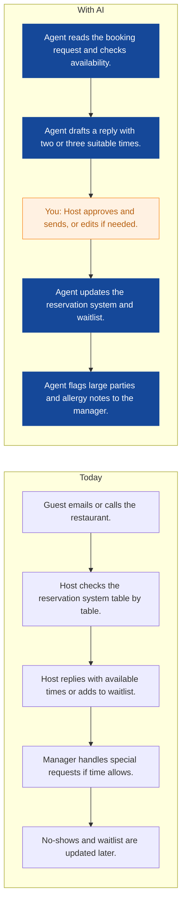
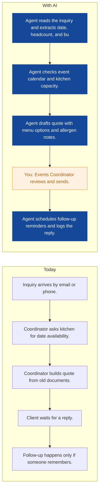
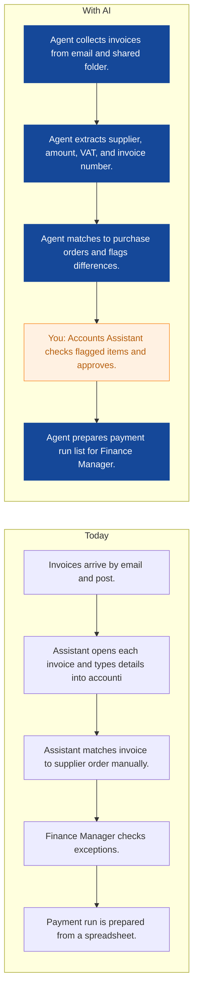
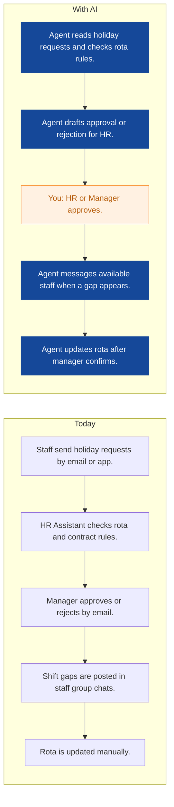
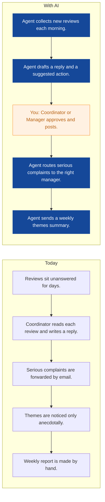
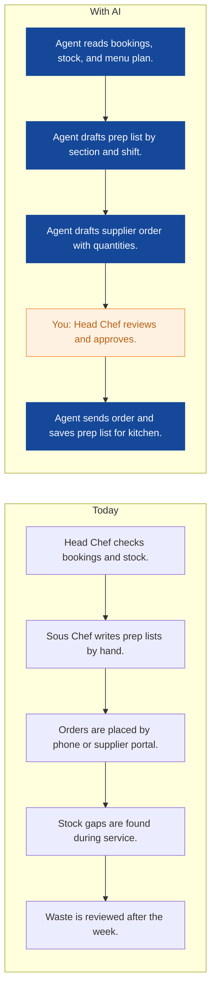
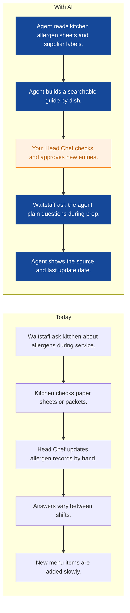
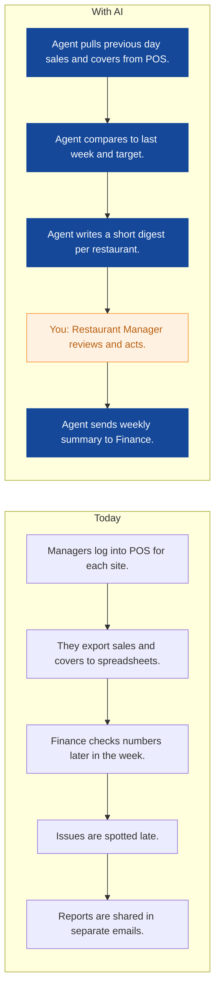
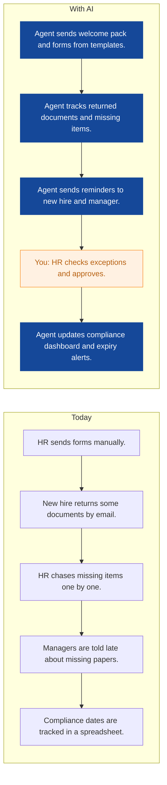

# AI Strategy for Saffron Table Group

> **Example report for a fictional company.** Generated by [CompleteAIStrategy](https://completeaistrategy.com) with the same research, strategy and pricing rules as a real report.
> **[Open the interactive report with charts →](https://completeaistrategy.com/example/saffron-table-group)**

| Hours saved per week | Value per year | Roles freed up | Opportunities |
|---:|---:|---:|---:|
| **92h** | **$211,600** | **2.3 FTE** | **9** |

## Summary
Saffron Table Group runs five full-service restaurants in Amsterdam with about 120 staff and a six-person office team covering HR, finance, and marketing. Your teams already use digital tools for reservations, point of sale, rota planning, supplier ordering, accounting, and reviews, but most follow-up, reporting, and admin work is still manual. The best first wins are in reservations, event quotes, supplier invoices, and rota admin, where small agents can save your team time without changing how the restaurants run. We suggest starting with a few focused agents and keeping humans in control of guest-facing and money decisions. Total realistic savings from the plan below are about 92 staff hours per week across 120 employees.

## Company snapshot
- **Industry:** Restaurant and hospitality
- **What they do:** Saffron Table Group runs five restaurants in Amsterdam. You serve diners, private event hosts, and catering clients with about 120 staff including part-timers. Your office team of six covers HR, finance, and marketing.
- **Customers:** Local diners, tourists, private event hosts, and corporate catering clients in Amsterdam
- **Team size:** 51-200 (estimate 120)
- **Tools:** Reservation system (for example OpenTable or SevenRooms), Point-of-sale system (for example Lightspeed or Toast), Staff rota and scheduling software (for example Planday or D, Supplier ordering and stock tools (for example MarketMan), Accounting software (for example Xero or QuickBooks), Review platforms such as Google Business Profile and TripAdv, Payroll and HR records tools
- **AI maturity:** 2/5, Early stage. You have core systems in place but no AI agents in daily use. Most guest replies, quotes, roster changes, invoice entry, and reporting are handled by hand, so gains depend on clean data and simple approvals.

## Team and roles
| Department | People | Roles |
|---|---:|---|
| Front of House and Restaurant Operations | 60 | Restaurant Manager (5), Assistant Manager (5), Waiter or Waitstaff (35), Host or Reservations Coordinator (15) |
| Kitchen and Back of House | 46 | Head Chef (5), Sous Chef (5), Line Cook (25), Kitchen Porter (11) |
| Events and Catering | 8 | Events Coordinator (3), Catering Chef (3), Event Server (2) |
| HR and People | 2 | HR Manager (1), HR and Admin Assistant (1) |
| Finance and Admin | 2 | Finance Manager (1), Accounts Assistant (1) |
| Marketing and Reviews | 2 | Marketing Manager (1), Marketing and Reviews Coordinator (1) |

## Opportunities
| # | Opportunity | Department | Hours/week | Impact | Effort |
|---:|---|---|---:|:-:|:-:|
| 1 | Reservation emails and phone requests handled faster | Front of House and Restaurant Operations | 18 | 5/5 | 3/5 |
| 2 | Event quotes prepared in under an hour | Events and Catering | 10 | 5/5 | 3/5 |
| 3 | Supplier invoices entered and matched | Finance and Admin | 12 | 4/5 | 3/5 |
| 4 | Rota gaps filled and holiday requests processed | HR and People | 14 | 4/5 | 3/5 |
| 5 | Guest reviews answered within one day | Marketing and Reviews | 8 | 4/5 | 2/5 |
| 6 | Prep lists and supplier orders drafted overnight | Kitchen and Back of House | 10 | 4/5 | 3/5 |
| 7 | Allergen answers ready for waitstaff | Kitchen and Back of House | 8 | 4/5 | 3/5 |
| 8 | Daily sales and covers report ready by 9am | Front of House and Restaurant Operations | 6 | 3/5 | 2/5 |
| 9 | New hire onboarding paperwork chased automatically | HR and People | 6 | 3/5 | 2/5 |

### 1. Reservation emails and phone requests handled faster
An agent reads booking emails and web forms, checks table availability in your reservation system, and drafts replies with options or waitlist offers. It sends routine confirmations and flags special requests, large parties, and allergy notes to the right manager.

**Saves ~18h per week** · Roles: Host or Reservations Coordinator, Restaurant Manager · Tools: OpenTable or SevenRooms, Email inbox, Web booking forms

### 2. Event quotes prepared in under an hour
An agent turns event inquiry emails into a first draft quote using your menu, minimum spend, and staffing rules. It checks kitchen availability, adds allergen notes, and follows up on quotes that have not been answered.

**Saves ~10h per week** · Roles: Events Coordinator, Catering Chef, Event Server · Tools: Email, Reservation or event calendar, Menu and price documents, Accounting software

### 3. Supplier invoices entered and matched
An agent reads supplier invoices from email or PDF, codes them to the right restaurant and supplier, and checks them against orders in your stock or accounting system. It prepares the payment run list and flags price changes or missing delivery notes.

**Saves ~12h per week** · Roles: Accounts Assistant, Finance Manager · Tools: Xero or QuickBooks, MarketMan or supplier ordering tool, Email, Shared drive

### 4. Rota gaps filled and holiday requests processed
An agent tracks holiday requests, checks rota rules, and drafts approval replies. When a shift gap appears, it messages available staff by role and updates the rota once a manager approves.

**Saves ~14h per week** · Roles: HR and Admin Assistant, Restaurant Manager, Assistant Manager · Tools: Planday or similar rota tool, Email, Staff messaging app, HR records

### 5. Guest reviews answered within one day
An agent drafts replies to Google and TripAdvisor reviews in your brand voice and routes serious complaints to the right restaurant manager. It tracks common themes such as waiting times, noise, or menu requests and sends a weekly summary.

**Saves ~8h per week** · Roles: Marketing and Reviews Coordinator, Restaurant Manager · Tools: Google Business Profile, TripAdvisor, Email, Spreadsheets

### 6. Prep lists and supplier orders drafted overnight
An agent reviews upcoming bookings, current stock, and menu plans to draft prep lists and supplier orders. It flags low stock and waste risks, then sends the draft to the Head Chef for approval.

**Saves ~10h per week** · Roles: Head Chef, Sous Chef, Line Cook · Tools: MarketMan or stock tool, Reservation system, Supplier portal, Spreadsheets

### 7. Allergen answers ready for waitstaff
An agent keeps a searchable allergen and menu guide updated from kitchen sheets and supplier labels. Waitstaff can ask it plain questions and get an answer with the source and date.

**Saves ~8h per week** · Roles: Head Chef, Sous Chef, Waiter or Waitstaff · Tools: Allergen sheets, Supplier labels, Menu documents, Staff messaging app

### 8. Daily sales and covers report ready by 9am
An agent pulls sales, covers, and average spend from the POS and sends a short morning digest for each restaurant. It highlights unusual drops, busy periods, and staff cost against sales.

**Saves ~6h per week** · Roles: Restaurant Manager, Finance Manager · Tools: Lightspeed or Toast, Spreadsheets, Email

### 9. New hire onboarding paperwork chased automatically
An agent sends new hires the right forms, tracks what is missing, and reminds managers about expiring documents. It keeps a simple dashboard of who is ready to work and what is still outstanding.

**Saves ~6h per week** · Roles: HR Manager, HR and Admin Assistant · Tools: HR records, Email, E-sign or forms tool, Spreadsheets

## Roadmap
**Phase 1 (Days 1 to 30): Start with reservation and review agents**
- Pick one restaurant as the pilot site.
- Connect the reservation system, shared inbox, and review accounts.
- Set rules for when a human must approve guest replies.
- Train hosts and managers on the approval step.
- Measure time saved and reply speed each week.

**Phase 2 (Days 31 to 90): Add finance and events agents**
- Launch supplier invoice entry and matching for one accounting system.
- Launch event quote drafts with the Events Coordinator.
- Add holiday request and rota gap support for HR and managers.
- Send weekly review themes to Marketing and Restaurant Managers.
- Review accuracy and adjust approval rules.

**Phase 3 (Days 91 to 180): Expand to kitchen and HR, then improve**
- Add prep list and supplier order drafts for the kitchen.
- Add the allergen and menu guide for waitstaff.
- Add onboarding and compliance chase for HR.
- Run a monthly check on hours saved, errors, and staff feedback.
- Decide which agents to keep, change, or stop.

## Risks
- **The agent sends an incorrect reply to a guest.**: Keep human approval for all guest-facing messages and set clear escalation rules for complaints and allergies.
- **Staff do not use the agents because they add extra steps.**: Start with one team, keep the approval step simple, and ask managers to name a champion for each agent.
- **Data privacy or GDPR issues with guest, staff, or supplier data.**: Keep data inside approved systems, limit access by role, and review supplier terms before connecting any tool.
- **Integration problems with POS, reservation, rota, or accounting systems.**: Connect one system at a time, keep a manual fallback, and test with real data before going live.
- **The team relies on the agent and misses exceptions.**: Set review thresholds, run weekly accuracy checks, and keep a named person responsible for each agent.

## KPIs
- Staff hours saved per week by agent, target 90 by month 6.
- Average reply time to booking emails, target under 2 hours.
- Event quote turnaround, target under 24 hours.
- Supplier invoices processed per hour, target 2 times current rate.
- Guest review response rate, target 90 percent within 24 hours.
- Rota gaps filled without manager overtime, target 80 percent within 4 hours.

## Quote: phase 1
| Agent | Saves | Setup | Monthly |
|---|---:|---:|---:|
| Reservation emails and phone requests handled faster | 18h/wk | $1,290 | $1,170 |
| Rota gaps filled and holiday requests processed | 14h/wk | $1,290 | $910 |
| Event quotes prepared in under an hour | 10h/wk | $1,290 | $650 |
| **Total** | **42h/wk** | **$3,870** | **$2,730** |

Setup is free when the agents run for 4 months. Full rollout of all 9 opportunities: $10,110 setup, $5,980/month.

---
Want this for your own company? **[Get your free AI strategy →](https://completeaistrategy.com)**
