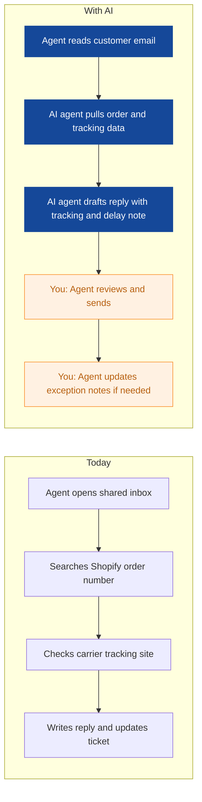
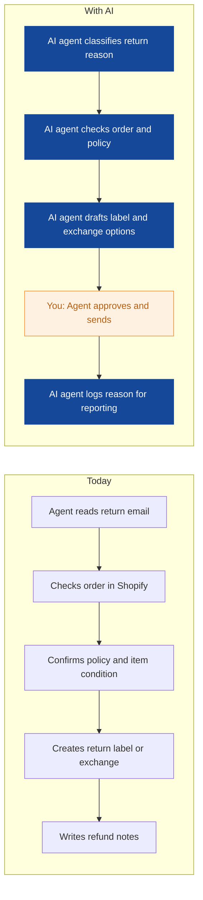
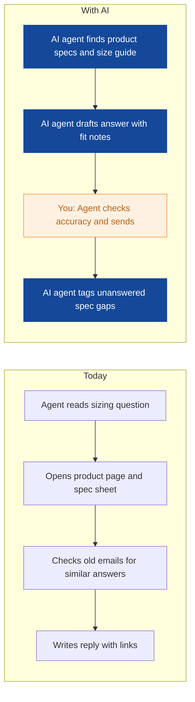
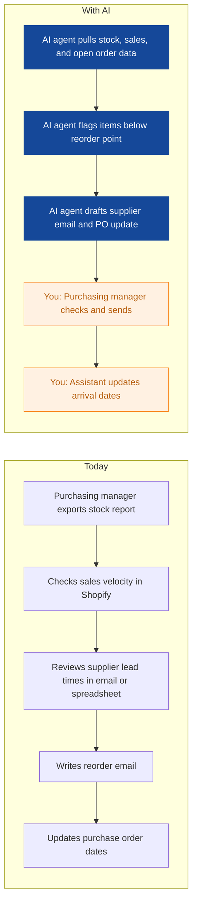
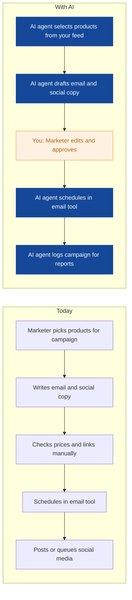
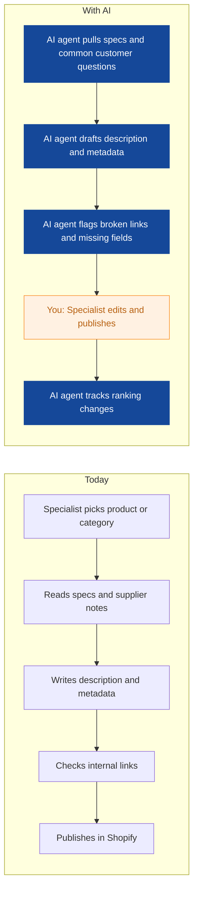
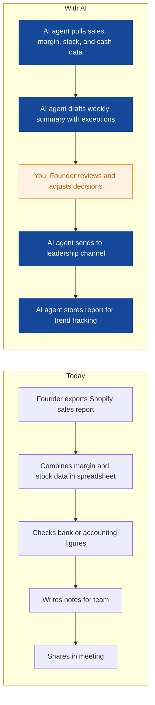
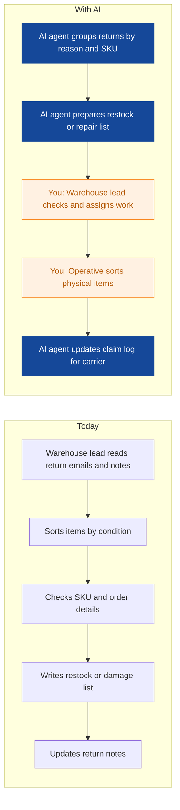
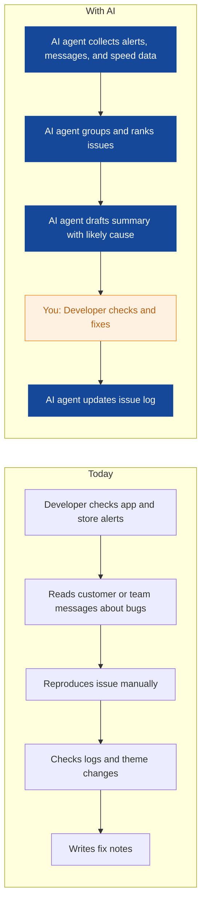

# AI Strategy for Tidewell Outdoor

> **Example report for a fictional company.** Generated by [CompleteAIStrategy](https://completeaistrategy.com) with the same research, strategy and pricing rules as a real report.
> **[Open the interactive report with charts →](https://completeaistrategy.com/example/tidewell-outdoor)**

| Hours saved per week | Value per year | Roles freed up | Opportunities |
|---:|---:|---:|---:|
| **39h** | **$89,700** | **1 FTE** | **9** |

## Summary
Tidewell Outdoor runs a 3,000 product Shopify store from Gothenburg with 15 people and a steady flow of order, return, sizing, and stock questions. Your team already has the core systems in place, but most work still moves through shared inboxes, spreadsheets, and manual checks. We estimate your current AI maturity at 2 out of 5: basic tools are connected, but agents are not yet doing routine work. A focused first program can save about 39 hours per week, roughly 6.5 percent of your team's 600 weekly hours, without changing your storefront or warehouse process. Start with customer service replies and stock reorder checks, then expand into marketing and reporting.

## Company snapshot
- **Industry:** Outdoor and camping gear retail (e-commerce)
- **What they do:** You sell outdoor and camping gear online from Gothenburg, Sweden. Your 15 person team runs a Shopify store with about 3,000 products and handles many customer emails about orders, returns, and sizing. Your customers are mainly Swedish and Nordic outdoor shoppers, from casual campers to serious hikers.
- **Customers:** You sell direct to consumers in Sweden and nearby Nordic countries. Typical buyers are campers, hikers, families, and outdoor hobbyists. A small share may be clubs or local resellers.
- **Team size:** 11-50 (estimate 15)
- **Tools:** Shopify, Shared email inbox or helpdesk, Inventory or order management software, Shipping label and returns tools, Google Analytics or similar web analytics, Email marketing tool
- **AI maturity:** 2/5, Early automation. You have Shopify, a shared inbox or helpdesk, inventory tools, and analytics. The next step is small agents that draft routine replies, check stock, and prepare reports for human approval.

## Team and roles
| Department | People | Roles |
|---|---:|---|
| Customer Service | 4 | Customer Service Agent (4) |
| Marketing | 3 | Marketing Specialist (2), Content and SEO Specialist (1) |
| Purchasing | 2 | Purchasing Manager (1), Purchasing Assistant (1) |
| Warehouse and Fulfilment | 4 | Warehouse Lead (1), Warehouse Operative (3) |
| IT and Development | 1 | E-commerce Developer (1) |
| Leadership and Admin | 1 | Founder or General Manager (1) |

## Opportunities
| # | Opportunity | Department | Hours/week | Impact | Effort |
|---:|---|---|---:|:-:|:-:|
| 1 | Order status and delay replies handled in minutes | Customer Service | 7 | 5/5 | 2/5 |
| 2 | Returns and exchanges processed with less back and forth | Customer Service | 6 | 5/5 | 3/5 |
| 3 | Sizing and fit questions answered from product data | Customer Service | 4 | 4/5 | 2/5 |
| 4 | Reorder suggestions before stock runs out | Purchasing | 5 | 4/5 | 3/5 |
| 5 | Seasonal emails and social posts prepared from your product feed | Marketing | 4 | 3/5 | 2/5 |
| 6 | Product descriptions and buying guides kept up to date | Marketing | 5 | 4/5 | 2/5 |
| 7 | Weekly sales, margin, and cashflow summary ready on Monday | Leadership and Admin | 3 | 4/5 | 3/5 |
| 8 | Return and damage reports sorted for the warehouse | Warehouse and Fulfilment | 3 | 3/5 | 3/5 |
| 9 | Shopify and integration issues triaged before they grow | IT and Development | 2 | 3/5 | 4/5 |

### 1. Order status and delay replies handled in minutes
An agent checks Shopify, carrier tracking, and your helpdesk for order status questions and delivery delays. It drafts a reply with the current tracking link, delay reason if known, and next step for the customer.

**Saves ~7h per week** · Roles: Customer Service Agent · Tools: Shopify, Shared email inbox or helpdesk, Carrier tracking, Shipping label tool

### 2. Returns and exchanges processed with less back and forth
An agent reads return requests, checks the order and return policy, and prepares the return label, refund or exchange options. It flags damaged or late items for the warehouse.

**Saves ~6h per week** · Roles: Customer Service Agent · Tools: Shopify, Returns tool, Shared email inbox or helpdesk, Shipping label tool

### 3. Sizing and fit questions answered from product data
An agent answers common sizing, weight, and compatibility questions using product pages, specs, and past replies. It sends a draft with links to size guides and similar products.

**Saves ~4h per week** · Roles: Customer Service Agent · Tools: Shopify, Shared email inbox or helpdesk, Product spec sheets, Google Analytics

### 4. Reorder suggestions before stock runs out
An agent checks stock levels, sales velocity, supplier lead times, and open purchase orders each morning. It drafts reorder requests for items likely to run out and notes late or partial deliveries.

**Saves ~5h per week** · Roles: Purchasing Manager, Purchasing Assistant · Tools: Inventory or order management software, Shopify, Supplier email, Spreadsheets

### 5. Seasonal emails and social posts prepared from your product feed
An agent drafts product emails and social posts from new stock, best sellers, and seasonal themes. It schedules them in your email tool and keeps product links and prices correct.

**Saves ~4h per week** · Roles: Marketing Specialist · Tools: Shopify, Email marketing tool, Social media scheduler, Google Analytics

### 6. Product descriptions and buying guides kept up to date
An agent writes first drafts for product descriptions, category pages, and buying guides from your specs and customer questions. It also flags broken links, missing metadata, and outdated pages.

**Saves ~5h per week** · Roles: Content and SEO Specialist · Tools: Shopify, Google Analytics, Search Console, Product spec sheets

### 7. Weekly sales, margin, and cashflow summary ready on Monday
An agent pulls sales, margin, stock, and cashflow data into a short weekly report. It highlights changes, slow sellers, and cash risks so you can decide faster.

**Saves ~3h per week** · Roles: Founder or General Manager · Tools: Shopify, Google Analytics, Spreadsheets, Accounting software, Inventory or order management software

### 8. Return and damage reports sorted for the warehouse
An agent groups return and damage reports by reason, SKU, and carrier. It prepares a daily list for restock, repair, or claim so your team does less sorting and paperwork.

**Saves ~3h per week** · Roles: Warehouse Lead, Warehouse Operative · Tools: Returns tool, Inventory or order management software, Shopify, Carrier claim portal

### 9. Shopify and integration issues triaged before they grow
An agent watches checkout errors, app alerts, and site speed reports, then writes a short issue summary with steps tried and likely cause. It routes urgent problems to you and keeps a log.

**Saves ~2h per week** · Roles: E-commerce Developer · Tools: Shopify, Google Analytics, Error monitoring, Shared email inbox or helpdesk, Spreadsheets

## Roadmap
**Phase 1 (Weeks 1-4): Fix the highest volume work in Customer Service and Purchasing**
- Connect helpdesk, Shopify, and carrier tracking to an order status agent.
- Set up return and exchange drafting with human approval.
- Add sizing and fit answer drafts from product specs.
- Build daily reorder and late delivery alerts for Purchasing.
- Define approval rules and escalation contacts.

**Phase 2 (Weeks 5-10): Add marketing content and leadership reporting**
- Launch product email and social post drafting from your Shopify feed.
- Start product description and buying guide drafts with SEO checks.
- Build weekly sales, margin, and cashflow summary for the founder.
- Train the team on review steps and tone of voice.
- Track hours saved and error rates weekly.

**Phase 3 (Weeks 11-16): Cover warehouse, IT, and ongoing improvement**
- Add return and damage sorting lists for the warehouse.
- Set up Shopify and integration issue triage for IT.
- Connect carrier claim logs and stock count exceptions.
- Review agents monthly and retire low value ones.
- Expand to Nordic language replies where quality holds.

## Risks
- **Wrong order or return information sent to customers.**: Keep human approval before sending, and set clear escalation for delayed or damaged orders.
- **Product specs and stock data are incomplete.**: Start with your top 200 SKUs, add missing fields, and review data quality weekly.
- **The team is busy and skips review steps.**: Assign owners, keep daily review under 30 minutes, and measure time saved.
- **Customer data privacy and GDPR concerns.**: Limit access, use approved tools, keep logs, and avoid putting customer data into public AI tools.
- **Agent costs or complexity grow without clear return.**: Start with three agents, review monthly, and cancel any agent that does not show clear hours saved.

## KPIs
- Hours saved per week by department from agent logs.
- First reply time for customer service emails.
- Return processing time from request to label.
- Stockouts on your top 200 SKUs.
- Email campaign preparation time and click rate.
- Weekly report delivery on Monday before 9:00.

## Quote: phase 1
| Agent | Saves | Setup | Monthly |
|---|---:|---:|---:|
| Order status and delay replies handled in minutes | 7h/wk | $790 | $450 |
| Returns and exchanges processed with less back and forth | 6h/wk | $1,290 | $390 |
| Product descriptions and buying guides kept up to date | 5h/wk | $790 | $320 |
| **Total** | **18h/wk** | **$2,870** | **$1,160** |

Setup is free when the agents run for 4 months. Full rollout of all 9 opportunities: $10,210 setup, $2,930/month.

---
Want this for your own company? **[Get your free AI strategy →](https://completeaistrategy.com)**
