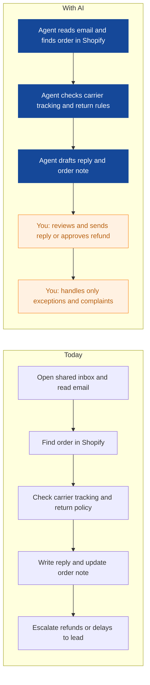
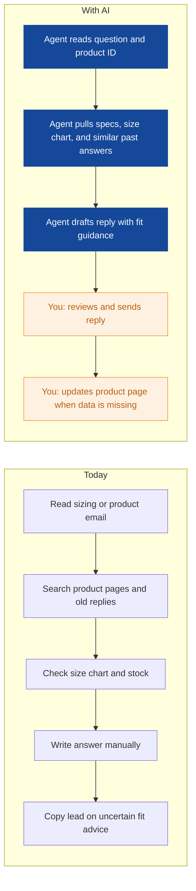
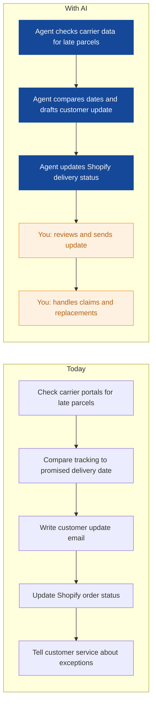
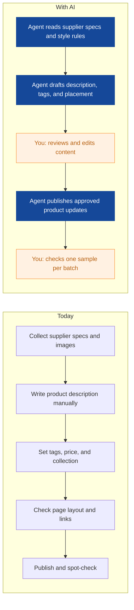
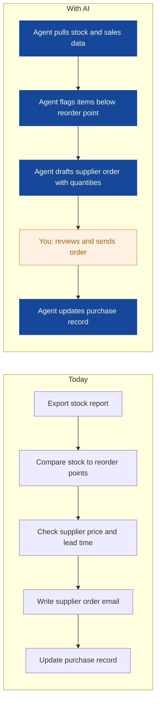
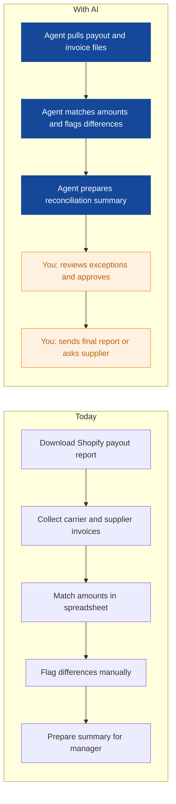
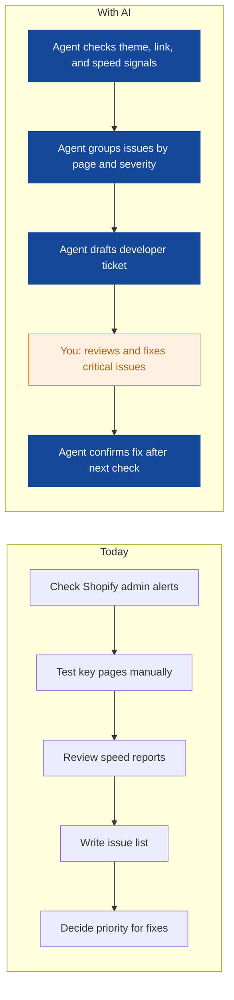
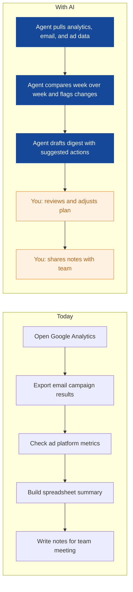

# AI Strategy for Tidewell Outdoor

> **Example report for a fictional company.** Generated by [CompleteAIStrategy](https://completeaistrategy.com) with the same research, strategy and pricing rules as a real report.
> **[Open the interactive report with charts →](https://completeaistrategy.com/example/tidewell-outdoor)**

| Hours saved per week | Value per year | Roles freed up | Opportunities |
|---:|---:|---:|---:|
| **47h** | **$108,100** | **1.2 FTE** | **8** |

## Our recommendation
**Start with three agents for order status and returns, sizing advice, and late parcel tracking; they cut your team’s repetitive email and parcel work and prove value fast.**

Tidewell Outdoor sells about 3,000 outdoor products online with a 15-person team in Gothenburg. Most customer questions, returns, stock checks, and reporting still run through email and manual Shopify work. Order and sizing emails arrive faster than your team can answer, and late parcels create repeat contacts that cost time and trust. As sales grow, the same manual steps will absorb more hours without adding capacity.

1. **Customer service and logistics absorb most of the repetitive email and parcel work** Your four-person customer service team spends much of each day on order status, returns, exchanges, and sizing questions. The logistics coordinator also spends hours tracking late parcels and updating delivery status. Marketing and purchasing have recurring listing, stock, and reporting chores, but they are smaller and less urgent.
2. **Order status, sizing advice, and late parcel tracking are the best first agents** These three tasks are high volume, rules-based, and already supported by Shopify, your shared inbox, and carrier tools. They affect customers directly, so fast replies and fewer mistakes are easy to see. Each agent can start with a human approval step before sending anything.
3. **Run a four-week pilot, keep humans in the loop, then scale proven agents** Connect one shared inbox and one carrier account first, then review every drafted reply or update for the first two weeks. Use simple exception rules so refunds, replacements, and unusual cases still go to a person. After the pilot, extend the same agents to more inboxes, carriers, and product categories.

**Phase 1 at a glance:** Order status and returns triage · Sizing and product advice replies · Late parcel tracking and delivery updates. About 26 hours a week back for $1,690/month (setup $2,870, free on a 4-month run).

## 1. Customer service and logistics absorb most of the repetitive email and parcel work
Your four-person customer service team spends much of each day on order status, returns, exchanges, and sizing questions. The logistics coordinator also spends hours tracking late parcels and updating delivery status. Marketing and purchasing have recurring listing, stock, and reporting chores, but they are smaller and less urgent.

| Department | Hours saved / week | Share |
|---|---:|---:|
| Customer Service | 20 | 43% |
| Marketing | 10 | 21% |
| Warehouse and Logistics | 6 | 13% |
| Purchasing and Merchandising | 5 | 11% |
| Finance and Admin | 4 | 9% |
| Technology and Web | 2 | 4% |

## 2. Order status, sizing advice, and late parcel tracking are the best first agents
These three tasks are high volume, rules-based, and already supported by Shopify, your shared inbox, and carrier tools. They affect customers directly, so fast replies and fewer mistakes are easy to see. Each agent can start with a human approval step before sending anything.

| # | Opportunity | Department | Hours/week | Impact | Effort | Phase |
|---:|---|---|---:|:-:|:-:|:-:|
| 1 | Order status and returns triage | Customer Service | 12 | 5/5 | 2/5 | 1 |
| 2 | Sizing and product advice replies | Customer Service | 8 | 5/5 | 3/5 | 1 |
| 3 | Late parcel tracking and delivery updates | Warehouse and Logistics | 6 | 4/5 | 2/5 | 1 |
| 4 | Product listing and collection updates | Marketing | 7 | 4/5 | 3/5 | later |
| 5 | Stock reorder alerts and supplier order drafts | Purchasing and Merchandising | 5 | 4/5 | 3/5 | later |
| 6 | Invoice and payout reconciliation | Finance and Admin | 4 | 3/5 | 3/5 | later |
| 7 | Site error and speed monitoring | Technology and Web | 2 | 3/5 | 2/5 | later |
| 8 | Weekly campaign and traffic digest | Marketing | 3 | 3/5 | 2/5 | later |

### 1. Order status and returns triage (phase 1)
An agent reads incoming order, return, and exchange emails, checks Shopify and carrier status, and drafts a reply with the right next step. It routes refunds, replacements, and complaints to a human for approval. Pilot: first shared inbox and Shopify order data.

**Saves ~12h per week** · Roles: Customer Service Agent, Customer Service Lead · Tools: Shopify, Shared inbox or helpdesk, Shipping carrier tools

### 2. Sizing and product advice replies (phase 1)
An agent matches customer questions to product specs, size charts, and past answers, then drafts a helpful reply. It flags missing or unclear product data for your content writer to fix.

**Saves ~8h per week** · Roles: Customer Service Agent, Content Writer · Tools: Shopify, Shared inbox or helpdesk, Product data feed

### 3. Late parcel tracking and delivery updates (phase 1)
An agent checks carrier tracking for delayed or lost parcels and drafts customer updates or internal alerts, then updates Shopify delivery status. It tells customer service when a claim or replacement is needed.

**Saves ~6h per week** · Roles: Logistics Coordinator, Customer Service Agent · Tools: Shipping carrier tools, Shopify, Shared inbox or helpdesk

### 4. Product listing and collection updates
An agent drafts product descriptions, tags, and collection placements from supplier specs and your style rules. It prepares changes in Shopify for a human to approve before publishing. Pilot: one seasonal camping collection.

**Saves ~7h per week** · Roles: Ecommerce Marketing Specialist, Content Writer · Tools: Shopify, Supplier spreadsheets, Product image library

### 5. Stock reorder alerts and supplier order drafts
An agent checks stock levels against reorder points and drafts supplier orders for low items. It highlights lead times and price changes for the purchasing manager to approve. Pilot: top 100 selling products.

**Saves ~5h per week** · Roles: Purchasing Manager, Merchandising Assistant · Tools: Inventory management, Shopify, Supplier email

### 6. Invoice and payout reconciliation
An agent matches Shopify payouts, carrier invoices, and supplier receipts, then flags mismatches for review. It prepares a simple weekly reconciliation summary for the finance assistant. Pilot: one month of payouts and carrier invoices.

**Saves ~4h per week** · Roles: Finance and Admin Assistant, General Manager · Tools: Shopify, Accounting or spreadsheets, Invoice email

### 7. Site error and speed monitoring
An agent checks Shopify theme errors, broken links, and page speed daily, then writes a short issue list. It creates a draft ticket or fix note for your developer. Pilot: checkout, product, and home pages.

**Saves ~2h per week** · Roles: Ecommerce Developer · Tools: Shopify, Site monitoring tools, Issue tracker or email

### 8. Weekly campaign and traffic digest
An agent pulls Google Analytics, email, and ad data into a short weekly digest with what changed and what needs attention. It drafts the summary and suggested follow-ups for the marketing team. Pilot: one email campaign and one ad channel.

**Saves ~3h per week** · Roles: Ecommerce Marketing Specialist · Tools: Google Analytics, Email marketing platform, Ad platforms

## 3. Run a four-week pilot, keep humans in the loop, then scale proven agents
Connect one shared inbox and one carrier account first, then review every drafted reply or update for the first two weeks. Use simple exception rules so refunds, replacements, and unusual cases still go to a person. After the pilot, extend the same agents to more inboxes, carriers, and product categories.

**Phase 1 (Weeks 1-4): Prove three agents with human review**
- Connect one shared inbox, Shopify order data, and one carrier account
- Launch order status and returns triage agent with human approval
- Launch sizing and product advice agent using top 50 questions
- Launch late parcel tracking agent for one Nordic carrier lane
- Review drafts daily and track response time, accuracy, and exceptions

**Phase 2 (Weeks 5-10): Extend to marketing, purchasing, and finance**
- Add product listing and collection update agent for one seasonal collection
- Add stock reorder and supplier order draft agent for top 100 products
- Add invoice and payout reconciliation agent for one month of data
- Keep human approval on all customer-facing and spending actions

**Phase 3 (Weeks 11-16): Scale, measure, and add new agents**
- Extend agents to more inboxes, carriers, and product categories
- Add site error monitoring and weekly campaign digest agents
- Set a weekly review of hours saved, errors, and customer feedback
- Train team on exception handling and agent maintenance

**Risks**
- **An agent sends a wrong reply or updates an order incorrectly**: Require human approval for customer replies during the pilot and keep refunds, replacements, and complaints human-controlled.
- **Product data is incomplete, so sizing advice is unreliable**: Start with the top 50 questions, flag missing specs to the content writer, and block answers when key size or fit data is absent.
- **The team does not trust or adopt the agents**: Involve customer service and logistics in weekly reviews, show their edits, and adjust drafts based on their feedback.
- **Carrier or Shopify connections break or hit limits**: Pilot one carrier and one inbox first, monitor failed checks, and keep a manual fallback process documented.
- **Saved hours are not redirected to higher-value work**: Track weekly hours saved and assign that time to product content, supplier negotiations, or customer retention tasks.

**KPIs**
- First response time for order and sizing emails
- Return and exchange processing time
- Late parcel customer updates sent before the customer asks
- Manual hours spent on order emails per week
- Product listing update cycle time
- Reconciliation exceptions found and closed within three days

## Investment: phase 1 costs $1,690 a month and gives back $5,629 a month in time
| Agent | Saves | Setup | Monthly |
|---|---:|---:|---:|
| Order status and returns triage | 12h/wk | $790 | $780 |
| Sizing and product advice replies | 8h/wk | $1,290 | $520 |
| Late parcel tracking and delivery updates | 6h/wk | $790 | $390 |
| **Total** | **26h/wk** | **$2,870** | **$1,690** |

Setup is free when the agents run for 4 months. Full rollout of all 8 opportunities: $8,320 setup, $3,330/month.

## Appendix: background
- **Industry:** Outdoor and camping ecommerce retail
- **What they do:** Tidewell Outdoor is an online shop for outdoor and camping gear based in Gothenburg, Sweden. You sell about 3,000 products to consumers and handle many order, return, and sizing questions by email. Your team of 15 covers customer service, marketing, purchasing, warehouse, and one developer.
- **Customers:** Consumers in Sweden and nearby Nordic and EU markets who buy outdoor and camping gear online.
- **Team size:** 11-50 (estimate 15)
- **Tools:** Shopify, Customer email inbox, Order and returns management, Inventory management, Shipping carrier tools, Google Analytics, Email marketing platform, Helpdesk or shared inbox
- **AI maturity:** 2/5, Early. You use Shopify and a shared inbox, but most repetitive work is still manual and AI use is limited to occasional experiments.

| Department | People | Roles |
|---|---:|---|
| Customer Service | 4 | Customer Service Agent (3), Customer Service Lead (1) |
| Marketing | 3 | Ecommerce Marketing Specialist (2), Content Writer (1) |
| Purchasing and Merchandising | 2 | Purchasing Manager (1), Merchandising Assistant (1) |
| Warehouse and Logistics | 3 | Warehouse Associate (2), Logistics Coordinator (1) |
| Technology and Web | 1 | Ecommerce Developer (1) |
| Finance and Admin | 2 | General Manager (1), Finance and Admin Assistant (1) |

---
Want this for your own company? **[Get your free AI strategy →](https://completeaistrategy.com)**
