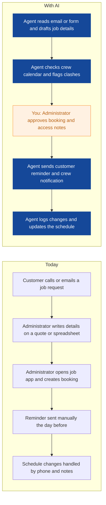
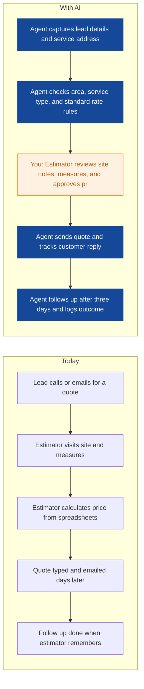
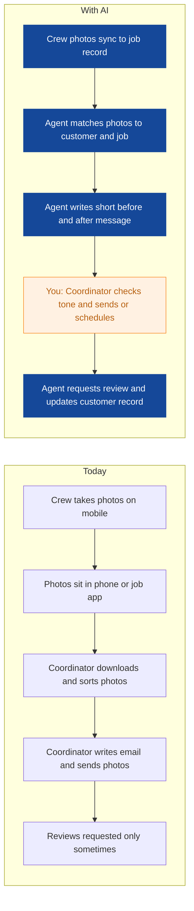
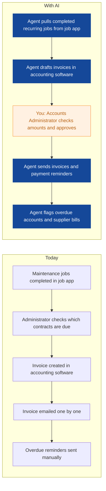
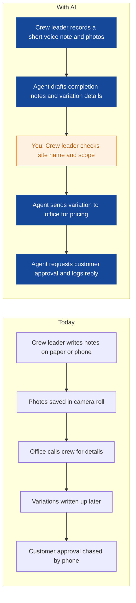
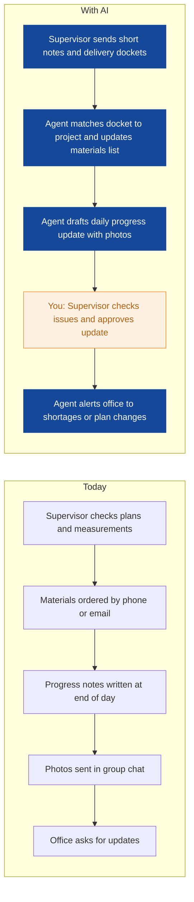
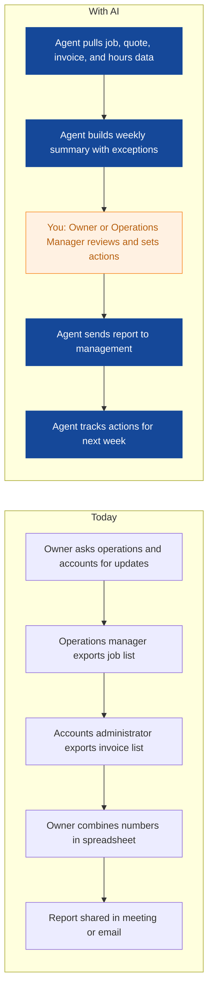
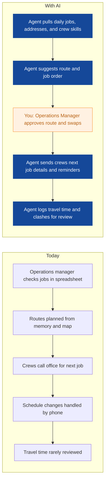

# AI Strategy for Verdant Roots Landscaping

> **Example report for a fictional company.** Generated by [CompleteAIStrategy](https://completeaistrategy.com) with the same research, strategy and pricing rules as a real report.
> **[Open the interactive report with charts →](https://completeaistrategy.com/example/verdant-roots-landscaping)**

| Hours saved per week | Value per year | Roles freed up | Opportunities |
|---:|---:|---:|---:|
| **36h** | **$82,800** | **0.9 FTE** | **8** |

## Our recommendation
**Start with agents for job booking and reminders, quote follow up, and before and after photo updates, so your office team stops retyping and chasing and can handle more jobs.**

Verdant Roots Landscaping runs 30 people across field maintenance, project installation, and a small office team near Brisbane. You already use a job app, accounting software, and shared files, but much of the daily coordination still runs on phone calls, email, and spreadsheets. Job details, quotes, photos, and invoices still move by hand, so admin work grows with every new contract and quote follow up gets missed. As your recurring maintenance base grows, the same small office team cannot keep up without adding costly admin hours.

1. **Repetitive work sits in scheduling, quoting, invoicing, and photo updates** Your field teams generate job notes, photos, and variation requests every day. Those details then land on two administrators, one estimator, one accounts administrator, and one customer service coordinator who retype and chase them. The work is necessary, but most of it follows the same steps each time.
2. **The first three agents target scheduling, quote follow up, and photo updates for fast proof** These areas are high volume, low effort to connect, and easy for one person to check before anything reaches a customer. They touch the job app, email, and shared files you already use, so you do not need a deep system rebuild. They also remove the daily friction your office team feels most.
3. **A staged rollout with human checks proves returns before you add more agents** Start with one agent and one office owner for each area, run it for two weeks, and check every customer-facing message before it sends. Once the numbers hold, add finance and field reporting agents. The rollout stays safe because your team approves exceptions, not every routine step.

**Phase 1 at a glance:** Job bookings and reminders handled by an agent · Quote requests answered in minutes · Before and after photos sent without chasing. About 14 hours a week back for $1,030/month (setup $2,370, free on a 4-month run).

## 1. Repetitive work sits in scheduling, quoting, invoicing, and photo updates
Your field teams generate job notes, photos, and variation requests every day. Those details then land on two administrators, one estimator, one accounts administrator, and one customer service coordinator who retype and chase them. The work is necessary, but most of it follows the same steps each time.

| Department | Hours saved / week | Share |
|---|---:|---:|
| Scheduling and Administration | 7 | 19% |
| Management | 7 | 19% |
| Field Maintenance | 6 | 17% |
| Finance and Invoicing | 5 | 14% |
| Sales and Quoting | 4 | 11% |
| Project Installation | 4 | 11% |
| Customer Care and Photos | 3 | 8% |

## 2. The first three agents target scheduling, quote follow up, and photo updates for fast proof
These areas are high volume, low effort to connect, and easy for one person to check before anything reaches a customer. They touch the job app, email, and shared files you already use, so you do not need a deep system rebuild. They also remove the daily friction your office team feels most.

| # | Opportunity | Department | Hours/week | Impact | Effort | Phase |
|---:|---|---|---:|:-:|:-:|:-:|
| 1 | Job bookings and reminders handled by an agent | Scheduling and Administration | 7 | 5/5 | 2/5 | 1 |
| 2 | Quote requests answered in minutes | Sales and Quoting | 4 | 5/5 | 2/5 | 1 |
| 3 | Before and after photos sent without chasing | Customer Care and Photos | 3 | 4/5 | 2/5 | 1 |
| 4 | Recurring invoices and payment reminders run on time | Finance and Invoicing | 5 | 4/5 | 3/5 | later |
| 5 | Crew notes and variations captured from the field | Field Maintenance | 6 | 4/5 | 3/5 | later |
| 6 | Project progress and material updates shared daily | Project Installation | 4 | 3/5 | 3/5 | later |
| 7 | Weekly cash, quote, and job report for the owner | Management | 3 | 3/5 | 3/5 | later |
| 8 | Smarter crew routes and job reminders | Management | 4 | 3/5 | 4/5 | later |

### 1. Job bookings and reminders handled by an agent (phase 1)
The agent reads booking emails and forms, creates jobs in your job app, and sends appointment reminders. It flags clashes and access notes for the office administrator to confirm.

**Saves ~7h per week** · Roles: Office Administrator · Tools: Email, Job management app, Google Calendar or Microsoft 365, Mobile phone SMS

### 2. Quote requests answered in minutes (phase 1)
The agent collects quote request details, checks your service area and standard rates, and drafts a quote for the estimator. It follows up open quotes by email or SMS and records the outcome.

**Saves ~4h per week** · Roles: Estimator and Salesperson · Tools: Email, Spreadsheets, Job management app, Xero or QuickBooks, Mobile phone SMS

### 3. Before and after photos sent without chasing (phase 1)
The agent pulls job photos from the job app or shared drive, adds the customer name and job details, and sends a before and after update. It asks for a review after completion and updates the customer record.

**Saves ~3h per week** · Roles: Customer Service Coordinator · Tools: Job management app, Google Workspace or Microsoft 365, Email, Review platform

### 4. Recurring invoices and payment reminders run on time
The agent creates recurring maintenance invoices from completed job records and sends polite payment reminders. It flags unpaid accounts and supplier bill details for the accounts administrator.

**Saves ~5h per week** · Roles: Accounts Administrator · Tools: Job management app, Xero or QuickBooks, Email

### 5. Crew notes and variations captured from the field
The agent turns short voice notes and photos from crews into job completion notes and variation requests. It sends extra work details to the office for pricing and customer approval.

**Saves ~6h per week** · Roles: Crew Leader, Garden Maintenance Technician · Tools: Job management app, Mobile phone, Email, Spreadsheets

### 6. Project progress and material updates shared daily
The agent collects supervisor notes, delivery dockets, and photos into a daily project update. It highlights material shortages and plan changes for the supervisor to review.

**Saves ~4h per week** · Roles: Project Supervisor, Garden Project Installer · Tools: Google Workspace or Microsoft 365, Job management app, Spreadsheets, Email

### 7. Weekly cash, quote, and job report for the owner
The agent pulls quote outcomes, job completion, invoice status, and crew hours into one weekly report. It flags late quotes, overdue invoices, and jobs running over budget for the owner.

**Saves ~3h per week** · Roles: Owner or Director, Operations Manager · Tools: Job management app, Xero or QuickBooks, Spreadsheets, Email

### 8. Smarter crew routes and job reminders
The agent reviews daily jobs, locations, and crew skills to suggest a route and job order for the operations manager. It sends crews their next job details and checks for schedule clashes.

**Saves ~4h per week** · Roles: Operations Manager · Tools: Job management app, GPS or vehicle tracking, Google Maps, Mobile phone

## 3. A staged rollout with human checks proves returns before you add more agents
Start with one agent and one office owner for each area, run it for two weeks, and check every customer-facing message before it sends. Once the numbers hold, add finance and field reporting agents. The rollout stays safe because your team approves exceptions, not every routine step.

**Phase 1 (Weeks 1 to 4): Prove value with scheduling, quotes, and photo updates**
- Connect the job app, shared inbox, and calendar for the booking agent
- Set standard quote rules for service area and common garden jobs
- Run photo update agent with coordinator approval before sending
- Review time saved, mistakes, and customer replies each Friday

**Phase 2 (Weeks 5 to 12): Add finance and field reporting agents**
- Connect accounting software for recurring invoices and payment reminders
- Test voice note and photo capture with one maintenance crew
- Add project progress updates for one installation supervisor
- Give accounts and operations managers a weekly exception review

**Phase 3 (Months 4 to 6): Scale to project and management reporting**
- Extend field note agent to all maintenance crews
- Add route suggestions and crew reminders for daily jobs
- Build weekly owner report with quote, cash, and job exceptions
- Review hours saved and decide which agents to keep or adjust

**Risks**
- **An agent sends the wrong booking, quote, or message to a customer**: Keep human approval on all customer-facing messages for the first 30 days. Use clear templates and a daily error review.
- **Job app and spreadsheet data is incomplete or inconsistent**: Clean the key fields first: customer name, site address, service type, price, and job status. Start with one job type before adding others.
- **Field crews and office staff do not trust or use the new agents**: Involve crew leaders and administrators in testing. Show them the time saved each week and keep a simple way to flag bad output.
- **Customer photos are shared without proper permission**: Check consent at job booking and keep photo sharing limited to the customer and your team. Store photos only in approved folders.
- **Your team relies on agents and misses exceptions**: Use a weekly exception log and assign one owner for each agent. Review late quotes, overdue invoices, and missed job notes every Monday.

**KPIs**
- Quote response time under one business day
- Invoices sent within two days of job completion
- Share of jobs with before and after photos sent same day
- Admin hours spent on bookings and reminders each week
- Overdue invoices older than 30 days
- Crew note completion rate by end of shift

## Investment: phase 1 costs $1,030 a month and gives back $3,031 a month in time
| Agent | Saves | Setup | Monthly |
|---|---:|---:|---:|
| Job bookings and reminders handled by an agent | 7h/wk | $790 | $450 |
| Quote requests answered in minutes | 4h/wk | $790 | $290 |
| Before and after photos sent without chasing | 3h/wk | $790 | $290 |
| **Total** | **14h/wk** | **$2,370** | **$1,030** |

Setup is free when the agents run for 4 months. Full rollout of all 8 opportunities: $9,420 setup, $2,610/month.

## Appendix: background
- **Industry:** Gardening and grounds maintenance
- **What they do:** Verdant Roots Landscaping is a 30-person gardening and grounds maintenance company near Brisbane, Australia. You quote new garden projects, run recurring maintenance contracts, schedule field crews, and handle invoicing and customer photos. Your customers are mainly homeowners, property managers, and small commercial sites in the Brisbane area.
- **Customers:** Homeowners, landlords, property managers, real estate agents, body corporates, and small commercial sites in Brisbane and nearby suburbs.
- **Team size:** 11-50 (estimate 30)
- **Tools:** Job management app such as ServiceM8, Jobber, or similar, Accounting software such as Xero or QuickBooks, Google Workspace or Microsoft 365, Mobile phones for job notes and customer photos, Spreadsheets for quotes and crew schedules, GPS or vehicle tracking for field crews
- **AI maturity:** 2/5, Early and mostly manual. You have solid job management and accounting tools, but AI is not yet part of daily work. The quickest gains come from connecting existing tools, not replacing them.

| Department | People | Roles |
|---|---:|---|
| Field Maintenance | 15 | Garden Maintenance Technician (10), Crew Leader (5) |
| Project Installation | 8 | Garden Project Installer (5), Project Supervisor (3) |
| Scheduling and Administration | 2 | Office Administrator (2) |
| Sales and Quoting | 1 | Estimator and Salesperson (1) |
| Finance and Invoicing | 1 | Accounts Administrator (1) |
| Customer Care and Photos | 1 | Customer Service Coordinator (1) |
| Management | 2 | Owner or Director (1), Operations Manager (1) |

---
Want this for your own company? **[Get your free AI strategy →](https://completeaistrategy.com)**
