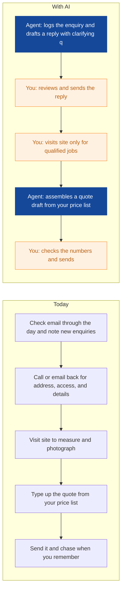
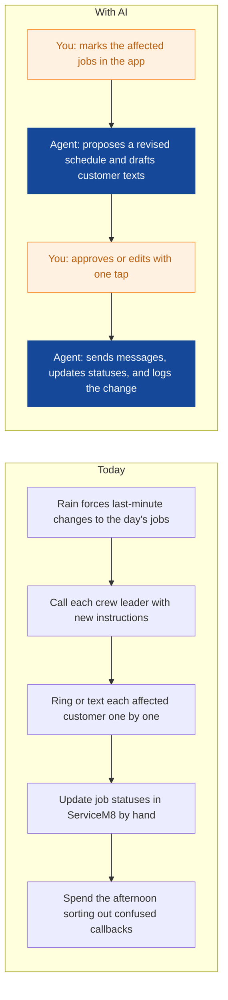
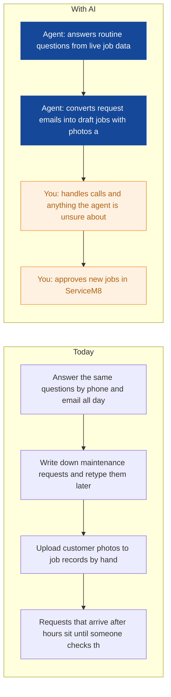
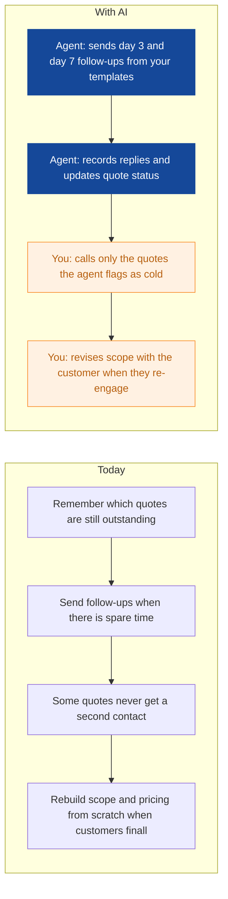
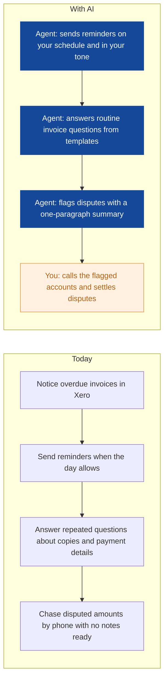
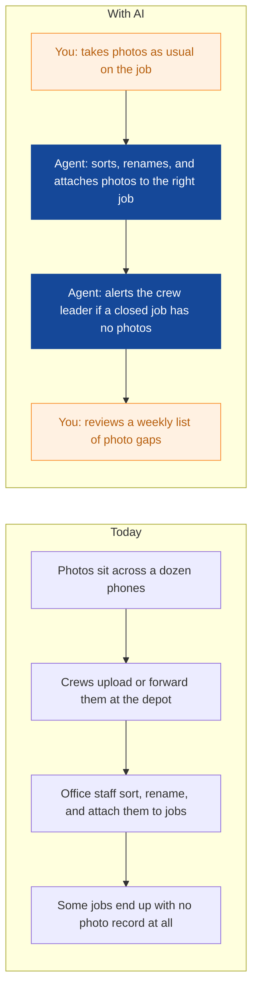
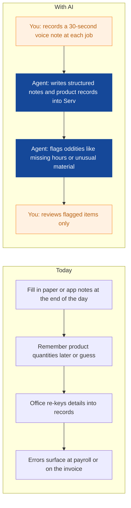
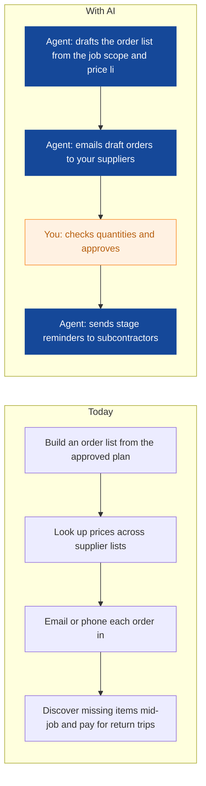
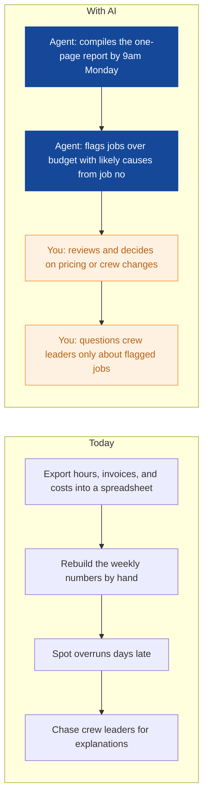

# AI Strategy for Verdant Roots Landscaping

> **Example report for a fictional company.** Generated by [CompleteAIStrategy](https://completeaistrategy.com) with the same research, strategy and pricing rules as a real report.
> **[Open the interactive report with charts →](https://completeaistrategy.com/example/verdant-roots-landscaping)**

| Hours saved per week | Value per year | Roles freed up | Opportunities |
|---:|---:|---:|---:|
| **29h** | **$66,700** | **0.7 FTE** | **9** |

## Summary
Most of your 30 staff are on tools, so the real AI wins sit with your five office staff and four crew leaders, who currently move every enquiry, quote, and schedule change by hand. Agents can triage enquiries, draft quotes from your price list, chase sent quotes, handle wet-weather rescheduling, and send invoice reminders, all inside ServiceM8, Xero, and the email you already use. Start with quote handling and reminders, which are low risk and should save about 11 hours a week in the first month. Across all three phases, expect roughly 25 to 30 hours back per week, worth around $30,000 a year in loaded wages, without changing how your crews work on site.

## Company snapshot
- **Industry:** Gardening and grounds maintenance
- **What they do:** Verdant Roots Landscaping is a gardening and grounds maintenance company near Brisbane, Australia. You quote new garden projects, schedule field crews, run recurring maintenance contracts, invoice customers, and collect job photos. Your team is mostly field crews with a small office group handling sales, scheduling, and accounts.
- **Customers:** Homeowners, property managers, body corporates, schools, and small commercial sites around Brisbane and nearby suburbs.
- **Team size:** 11-50 (estimate 30)
- **Tools:** No public website or software list found, Job scheduling and crew dispatch software such as ServiceM8 , Quoting and invoicing tools such as Xero or QuickBooks, Mobile phones and tablets for job notes, checklists, and cus, Cloud photo storage such as Google Drive or Dropbox, Microsoft 365 or Google Workspace for office documents and e
- **AI maturity:** 2/5, Digitised but manual. You already run ServiceM8, Xero, and mobile job apps, but the connections between them are people re-typing and forwarding. That makes your first automations cheap to set up, because the data is already in the cloud, it just never moves by itself.

## Team and roles
| Department | People | Roles |
|---|---:|---|
| Field Maintenance | 16 | Maintenance Crew Leader (4), Gardener / Grounds Worker (8), Lawn Care Technician (4) |
| Garden Projects | 8 | Project Supervisor (2), Garden Installer (5), Irrigation Technician (1) |
| Sales and Estimating | 2 | Estimator / Salesperson (2) |
| Scheduling and Customer Service | 2 | Scheduler / Admin (1), Customer Service Admin (1) |
| Finance and Admin | 1 | Bookkeeper / Admin (1) |
| Management | 1 | Owner / Manager (1) |

## Opportunities
| # | Opportunity | Department | Hours/week | Impact | Effort |
|---:|---|---|---:|:-:|:-:|
| 1 | Quote enquiries answered in minutes | Sales and Estimating | 5 | 5/5 | 2/5 |
| 2 | Wet-weather rescheduling without phone tag | Scheduling and Customer Service | 4 | 4/5 | 3/5 |
| 3 | Routine customer questions handled without the phone | Scheduling and Customer Service | 4 | 4/5 | 3/5 |
| 4 | No quote goes cold | Sales and Estimating | 3 | 4/5 | 2/5 |
| 5 | Invoice reminders sent and queries answered | Finance and Admin | 3 | 3/5 | 2/5 |
| 6 | Job photos filed and attached automatically | Field Maintenance | 3 | 3/5 | 3/5 |
| 7 | Voice notes become job notes and timesheet checks | Field Maintenance | 3 | 3/5 | 3/5 |
| 8 | Plant and material orders drafted for you | Garden Projects | 2 | 3/5 | 3/5 |
| 9 | Monday morning job profitability report | Management | 2 | 3/5 | 3/5 |

### 1. Quote enquiries answered in minutes
An agent reads each new email or web enquiry, pulls out the address, job type, and photos, and creates a draft job in ServiceM8. It replies within minutes with your standard questions and an indicative price range, so your estimators spend time only on serious leads.

**Saves ~5h per week** · Roles: Estimator / Salesperson, Customer Service Admin · Tools: Email (Microsoft 365 or Google Workspace), ServiceM8, Price list spreadsheet, Xero

### 2. Wet-weather rescheduling without phone tag
When rain stops work or a job runs long, the agent drafts a revised crew schedule, writes customer texts with new arrival windows, and updates job statuses in ServiceM8 for one-tap approval. A wet Brisbane week stops being a full day of phone calls.

**Saves ~4h per week** · Roles: Scheduler / Admin, Customer Service Admin, Maintenance Crew Leader · Tools: ServiceM8, SMS, Email, Weather feed

### 3. Routine customer questions handled without the phone
An agent answers routine email and SMS questions like next visit date, rain delays, and invoice copies using live job data from ServiceM8. It also turns maintenance request emails, including customer photos, into draft jobs so nothing sits in the inbox overnight.

**Saves ~4h per week** · Roles: Customer Service Admin, Scheduler / Admin · Tools: Email, SMS, ServiceM8, Google Drive

### 4. No quote goes cold
The agent tracks every quote you send, sends polite follow-ups on day 3 and day 7 using your templates, and flags anything silent after two weeks for a phone call. Your estimator gets a short weekly list of who to call instead of guessing.

**Saves ~3h per week** · Roles: Estimator / Salesperson · Tools: ServiceM8, Xero, Email

### 5. Invoice reminders sent and queries answered
The agent sends scheduled payment reminders from Xero and answers routine questions like invoice copies and bank details from your templates. Genuine disputes get flagged to you with a short summary so your bookkeeper only touches accounts that need a person.

**Saves ~3h per week** · Roles: Bookkeeper / Admin, Customer Service Admin · Tools: Xero, Email, ServiceM8

### 6. Job photos filed and attached automatically
Crews keep taking photos on their phones as they do now, but an agent sorts them into the right job folder and attaches them to the ServiceM8 record, named by site and date. It checks each closed job and alerts the crew leader on the spot if before or after photos are missing.

**Saves ~3h per week** · Roles: Maintenance Crew Leader, Gardener / Grounds Worker, Lawn Care Technician · Tools: ServiceM8, Google Drive or Dropbox, Mobile phone cameras

### 7. Voice notes become job notes and timesheet checks
Crew leaders send a 30-second voice note at the end of each job and the agent turns it into structured job notes, product use records, and flags such as a broken sprinkler or a customer complaint. Timesheet oddities get flagged to the scheduler before payroll, not after.

**Saves ~3h per week** · Roles: Maintenance Crew Leader, Lawn Care Technician, Gardener / Grounds Worker · Tools: ServiceM8, Voice notes on mobile, Xero payroll

### 8. Plant and material orders drafted for you
From each approved project the agent drafts a plant and material order against your supplier price lists, checks it for common misses like soil and mulch, and emails a draft to the nursery for your approval. Stage reminders to subcontractors for paving and irrigation go out automatically.

**Saves ~2h per week** · Roles: Project Supervisor · Tools: ServiceM8, Supplier price lists, Email, Xero

### 9. Monday morning job profitability report
The agent pulls invoiced amounts, labour hours, and material costs from Xero and ServiceM8 and writes a one-page Monday report ranking jobs by margin and flagging any that ran over estimate. You spend your review time on decisions instead of pulling numbers.

**Saves ~2h per week** · Roles: Owner / Manager, Bookkeeper / Admin · Tools: Xero, ServiceM8, Google Sheets or Excel

## Roadmap
**Phase 1 (Weeks 1-4): Office quick wins**
- Set up enquiry triage with quote drafts in ServiceM8, linked to your Xero price lists
- Turn on quote follow-ups using your approved email templates
- Start scheduled invoice reminders and routine query replies from Xero
- Record baseline response and follow-up times so you can prove the saving

**Phase 2 (Weeks 5-10): Crews and customers in sync**
- Launch the weather and schedule change assistant with one-tap approvals
- Deploy the customer service inbox agent for routine questions and request logging
- Pilot automatic photo filing with two crews, then extend to all field teams
- Train crew leaders on voice notes in a 30-minute session

**Phase 3 (Months 4-6): Tighten the numbers**
- Roll out voice job notes and timesheet checks across all crews
- Start the Monday profitability report to the owner
- Draft plant and material orders for Garden Projects
- Review results, retire whatever is not earning its keep, and pick the next automation

## Risks
- **A quote goes out with wrong prices or scope.**: The agent drafts, a person checks and sends. Your price list stays the single source of truth and any price change needs approval.
- **Field crews ignore new steps and data quality suffers.**: Crew-facing steps stay inside tools they already use, ServiceM8 and voice notes. Pilot with one crew leader and fix the friction before rolling out to everyone.
- **Customer photos, addresses, and payment details are exposed or misused.**: Use Australian data hosting, restrict access to office roles, and set a written rule that customer data is never pasted into personal AI accounts.
- **Automated messages annoy customers or carry wrong information.**: Every customer-facing schedule change and quote needs one-tap human approval. The agent drafts, your team sends.
- **Automations quietly break as prices, staff, or seasons change.**: Book a monthly one-hour check with the consultant who set it up to update price lists, templates, and message rules.

## KPIs
- Median response time to new quote enquiries under 2 business hours, down from same-day or worse
- 100% of sent quotes followed up within 5 days
- Days sales outstanding on invoices down 5 days within 90 days
- 95% of completed jobs with before and after photos attached within 24 hours
- 20 or more admin hours saved per week by month 3, measured against the Phase 1 baseline
- Monday profitability report delivered by 9am every week

## Quote: phase 1
| Agent | Saves | Setup | Monthly |
|---|---:|---:|---:|
| Quote enquiries answered in minutes | 5h/wk | $790 | $320 |
| No quote goes cold | 3h/wk | $790 | $290 |
| Wet-weather rescheduling without phone tag | 4h/wk | $1,290 | $290 |
| **Total** | **12h/wk** | **$2,870** | **$900** |

Setup is free when the agents run for 4 months. Full rollout of all 9 opportunities: $10,110 setup, $2,640/month.

---
Want this for your own company? **[Get your free AI strategy →](https://completeaistrategy.com)**
